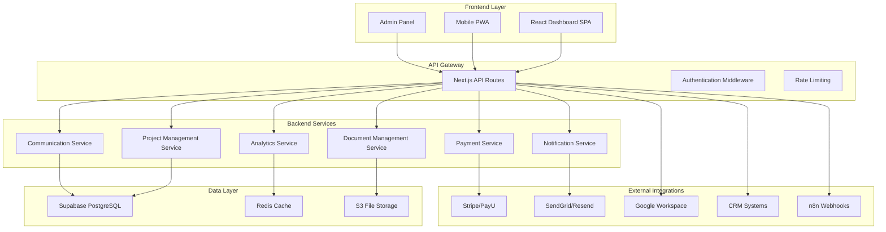
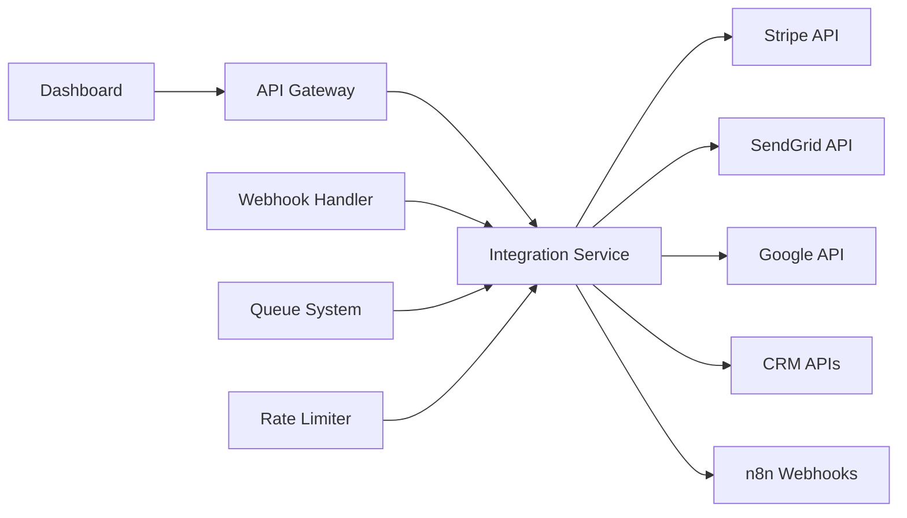

# Design Dokumentu - Dashboard Klienta ECM Digital

## Przegląd

Dashboard klienta ECM Digital to zaawansowana platforma SaaS zaprojektowana do zarządzania projektami cyfrowymi i komunikacji z klientami. System będzie obsługiwać pełny cykl życia projektów - od inicjacji, przez realizację, aż po rozliczenia i wsparcie posprzedażowe.

## Architektura Systemu

### Architektura Wysokiego Poziomu



### Stack Technologiczny

**Frontend:**
- **Framework:** Next.js 14 z App Router
- **UI Library:** React 18 z TypeScript
- **Styling:** Tailwind CSS + Shadcn/ui
- **State Management:** Zustand + React Query
- **Charts:** Recharts + D3.js
- **Real-time:** Socket.io Client

**Backend:**
- **Runtime:** Node.js 20 LTS
- **Framework:** Next.js API Routes
- **Database:** Supabase (PostgreSQL + Real-time)
- **Cache:** Redis (Upstash)
- **File Storage:** AWS S3 / Supabase Storage
- **Authentication:** Supabase Auth

**DevOps:**
- **Hosting:** Vercel (Frontend) + Railway (Backend Services)
- **CI/CD:** GitHub Actions
- **Monitoring:** Sentry + Vercel Analytics
- **CDN:** Vercel Edge Network

## Komponenty i Interfejsy

### 1. System Zarządzania Projektami

#### Interfejs ProjectManager
```typescript
interface Project {
  id: string;
  name: string;
  type: 'website' | 'shopify' | 'mvp' | 'ux-audit' | 'automation' | 'social-media';
  status: 'discovery' | 'design' | 'development' | 'testing' | 'completed' | 'on-hold';
  client_id: string;
  team_members: TeamMember[];
  timeline: Timeline;
  budget: Budget;
  milestones: Milestone[];
  created_at: Date;
  updated_at: Date;
}

interface Timeline {
  start_date: Date;
  end_date: Date;
  phases: Phase[];
}

interface Phase {
  id: string;
  name: string;
  description: string;
  start_date: Date;
  end_date: Date;
  status: 'not-started' | 'in-progress' | 'completed' | 'delayed';
  deliverables: Deliverable[];
}
```

#### Komponenty UI
- **ProjectCard:** Karta projektu z podstawowymi informacjami
- **ProjectTimeline:** Interaktywny timeline z fazami projektu
- **MilestoneTracker:** Śledzenie kamieni milowych
- **TeamCollaboration:** Panel współpracy z zespołem

### 2. System Komunikacji

#### Interfejs CommunicationHub
```typescript
interface Message {
  id: string;
  project_id: string;
  sender_id: string;
  sender_type: 'client' | 'team_member';
  content: string;
  attachments: Attachment[];
  thread_id?: string;
  created_at: Date;
  read_at?: Date;
}

interface VideoCall {
  id: string;
  project_id: string;
  scheduled_at: Date;
  duration: number;
  participants: Participant[];
  recording_url?: string;
  meeting_notes?: string;
}
```

#### Komponenty UI
- **MessageThread:** Wątek konwersacji z real-time updates
- **FileUpload:** Drag & drop upload z progress bar
- **VideoCallScheduler:** Planowanie spotkań z integracją kalendarza
- **NotificationCenter:** Centrum powiadomień z filtrami

### 3. Zarządzanie Dokumentami

#### Interfejs DocumentManager
```typescript
interface Document {
  id: string;
  project_id: string;
  name: string;
  type: 'design' | 'specification' | 'report' | 'contract' | 'invoice';
  file_url: string;
  file_size: number;
  mime_type: string;
  version: number;
  uploaded_by: string;
  created_at: Date;
  tags: string[];
}

interface DocumentVersion {
  id: string;
  document_id: string;
  version: number;
  file_url: string;
  changes_summary: string;
  created_at: Date;
}
```

#### Komponenty UI
- **DocumentLibrary:** Biblioteka dokumentów z wyszukiwaniem
- **DocumentViewer:** Podgląd dokumentów (PDF, obrazy, video)
- **VersionHistory:** Historia wersji z diff view
- **TagManager:** System tagowania i kategoryzacji

### 4. System Płatności i Fakturowania

#### Interfejs PaymentSystem
```typescript
interface Invoice {
  id: string;
  project_id: string;
  invoice_number: string;
  amount: number;
  currency: 'PLN' | 'EUR' | 'USD';
  status: 'draft' | 'sent' | 'paid' | 'overdue' | 'cancelled';
  due_date: Date;
  line_items: LineItem[];
  payment_method?: PaymentMethod;
  paid_at?: Date;
}

interface PaymentMethod {
  id: string;
  type: 'card' | 'bank_transfer' | 'blik';
  provider: 'stripe' | 'payu';
  details: Record<string, any>;
}
```

#### Komponenty UI
- **InvoiceViewer:** Podgląd faktury z opcją płatności
- **PaymentForm:** Formularz płatności z walidacją
- **BudgetTracker:** Śledzenie budżetu projektu
- **FinancialDashboard:** Dashboard finansowy z wykresami

### 5. System Analityki i Monitoringu

#### Interfejs AnalyticsEngine
```typescript
interface ProjectMetrics {
  project_id: string;
  performance_score: number;
  completion_percentage: number;
  budget_utilization: number;
  timeline_adherence: number;
  client_satisfaction: number;
  team_productivity: number;
}

interface WebsiteMetrics {
  project_id: string;
  page_speed: number;
  seo_score: number;
  accessibility_score: number;
  conversion_rate?: number;
  traffic_data?: TrafficData;
}
```

#### Komponenty UI
- **MetricsDashboard:** Dashboard z kluczowymi metrykami
- **PerformanceCharts:** Wykresy wydajności projektu
- **SEOAnalytics:** Analityka SEO dla projektów webowych
- **ROICalculator:** Kalkulator zwrotu z inwestycji

## Modele Danych

### Schemat Bazy Danych

```sql
-- Tabela użytkowników (rozszerza Supabase auth.users)
CREATE TABLE profiles (
  id UUID REFERENCES auth.users PRIMARY KEY,
  company_name TEXT,
  contact_person TEXT,
  phone TEXT,
  address JSONB,
  preferences JSONB DEFAULT '{}',
  created_at TIMESTAMP WITH TIME ZONE DEFAULT NOW(),
  updated_at TIMESTAMP WITH TIME ZONE DEFAULT NOW()
);

-- Tabela projektów
CREATE TABLE projects (
  id UUID PRIMARY KEY DEFAULT gen_random_uuid(),
  name TEXT NOT NULL,
  description TEXT,
  type project_type NOT NULL,
  status project_status DEFAULT 'discovery',
  client_id UUID REFERENCES profiles(id),
  budget_total DECIMAL(10,2),
  budget_used DECIMAL(10,2) DEFAULT 0,
  start_date DATE,
  end_date DATE,
  metadata JSONB DEFAULT '{}',
  created_at TIMESTAMP WITH TIME ZONE DEFAULT NOW(),
  updated_at TIMESTAMP WITH TIME ZONE DEFAULT NOW()
);

-- Tabela wiadomości
CREATE TABLE messages (
  id UUID PRIMARY KEY DEFAULT gen_random_uuid(),
  project_id UUID REFERENCES projects(id),
  sender_id UUID REFERENCES profiles(id),
  content TEXT NOT NULL,
  attachments JSONB DEFAULT '[]',
  thread_id UUID,
  created_at TIMESTAMP WITH TIME ZONE DEFAULT NOW(),
  read_at TIMESTAMP WITH TIME ZONE
);

-- Tabela dokumentów
CREATE TABLE documents (
  id UUID PRIMARY KEY DEFAULT gen_random_uuid(),
  project_id UUID REFERENCES projects(id),
  name TEXT NOT NULL,
  file_path TEXT NOT NULL,
  file_size BIGINT,
  mime_type TEXT,
  version INTEGER DEFAULT 1,
  uploaded_by UUID REFERENCES profiles(id),
  tags TEXT[] DEFAULT '{}',
  created_at TIMESTAMP WITH TIME ZONE DEFAULT NOW()
);

-- Tabela faktur
CREATE TABLE invoices (
  id UUID PRIMARY KEY DEFAULT gen_random_uuid(),
  project_id UUID REFERENCES projects(id),
  invoice_number TEXT UNIQUE NOT NULL,
  amount DECIMAL(10,2) NOT NULL,
  currency TEXT DEFAULT 'PLN',
  status invoice_status DEFAULT 'draft',
  due_date DATE,
  line_items JSONB NOT NULL,
  payment_data JSONB,
  created_at TIMESTAMP WITH TIME ZONE DEFAULT NOW(),
  paid_at TIMESTAMP WITH TIME ZONE
);
```

### Typy Enum

```sql
CREATE TYPE project_type AS ENUM (
  'website',
  'shopify', 
  'mvp',
  'ux-audit',
  'automation',
  'social-media'
);

CREATE TYPE project_status AS ENUM (
  'discovery',
  'design', 
  'development',
  'testing',
  'completed',
  'on-hold'
);

CREATE TYPE invoice_status AS ENUM (
  'draft',
  'sent',
  'paid', 
  'overdue',
  'cancelled'
);
```

## Obsługa Błędów

### Strategia Error Handling

1. **Client-Side Errors:**
   - React Error Boundaries dla UI crashes
   - Toast notifications dla user errors
   - Retry mechanisms dla network failures
   - Offline mode z local storage fallback

2. **Server-Side Errors:**
   - Structured error responses z error codes
   - Logging do Sentry z context
   - Graceful degradation dla external services
   - Circuit breaker pattern dla integrations

3. **Database Errors:**
   - Connection pooling z retry logic
   - Transaction rollbacks dla data consistency
   - Backup strategies dla data recovery
   - Real-time sync conflict resolution

### Error Response Format

```typescript
interface ErrorResponse {
  error: {
    code: string;
    message: string;
    details?: Record<string, any>;
    timestamp: string;
    request_id: string;
  };
}
```

## Strategia Testowania

### Poziomy Testowania

1. **Unit Tests (Jest + Testing Library):**
   - Komponenty React
   - Utility functions
   - API route handlers
   - Database queries

2. **Integration Tests (Playwright):**
   - User workflows
   - API endpoints
   - Database operations
   - External integrations

3. **E2E Tests (Playwright):**
   - Critical user journeys
   - Payment flows
   - File upload/download
   - Real-time features

4. **Performance Tests:**
   - Load testing z Artillery
   - Core Web Vitals monitoring
   - Database query optimization
   - CDN performance

### Test Coverage Targets

- **Unit Tests:** 80%+ coverage
- **Integration Tests:** Critical paths covered
- **E2E Tests:** Happy path + error scenarios
- **Performance:** <2s initial load, <500ms interactions

## Bezpieczeństwo

### Security Measures

1. **Authentication & Authorization:**
   - Supabase Auth z MFA support
   - JWT tokens z refresh mechanism
   - Role-based access control (RBAC)
   - Session management z timeout

2. **Data Protection:**
   - Encryption at rest (AES-256)
   - Encryption in transit (TLS 1.3)
   - PII data anonymization
   - GDPR compliance tools

3. **API Security:**
   - Rate limiting per user/IP
   - Input validation & sanitization
   - SQL injection prevention
   - CORS configuration

4. **File Security:**
   - Virus scanning dla uploads
   - File type validation
   - Size limits enforcement
   - Secure signed URLs

### Compliance

- **GDPR:** Data portability, right to deletion, consent management
- **SOC 2:** Security controls documentation
- **ISO 27001:** Information security management
- **PCI DSS:** Payment data protection (via Stripe/PayU)

## Wydajność i Skalowanie

### Performance Optimizations

1. **Frontend:**
   - Code splitting z dynamic imports
   - Image optimization z Next.js Image
   - Caching strategies (SWR/React Query)
   - Bundle size optimization

2. **Backend:**
   - Database indexing strategy
   - Query optimization z EXPLAIN
   - Redis caching layer
   - CDN dla static assets

3. **Real-time Features:**
   - WebSocket connection pooling
   - Event debouncing
   - Selective data synchronization
   - Offline-first architecture

### Scaling Strategy

- **Horizontal Scaling:** Microservices architecture
- **Database Scaling:** Read replicas + connection pooling
- **CDN:** Global edge caching
- **Monitoring:** Real-time performance metrics

## Integracje Zewnętrzne

### API Integrations

1. **Payment Providers:**
   - Stripe API dla international payments
   - PayU API dla Polish market
   - Webhook handling dla payment events
   - Subscription management

2. **Communication:**
   - SendGrid/Resend dla email notifications
   - Twilio dla SMS notifications
   - Zoom/Google Meet API dla video calls
   - Slack/Teams webhooks

3. **Productivity Tools:**
   - Google Workspace API
   - Microsoft 365 integration
   - Calendly API dla scheduling
   - Zapier webhooks

4. **Analytics:**
   - Google Analytics 4
   - Mixpanel dla user behavior
   - Hotjar dla user experience
   - Custom analytics dashboard

### Integration Architecture



## Deployment i DevOps

### Deployment Strategy

1. **Environment Setup:**
   - Development (local)
   - Staging (Vercel Preview)
   - Production (Vercel + Railway)

2. **CI/CD Pipeline:**
   - GitHub Actions workflows
   - Automated testing
   - Security scanning
   - Performance monitoring

3. **Infrastructure:**
   - Vercel dla frontend hosting
   - Railway dla backend services
   - Supabase dla database
   - AWS S3 dla file storage

### Monitoring i Observability

- **Application Monitoring:** Sentry error tracking
- **Performance Monitoring:** Vercel Analytics + Core Web Vitals
- **Infrastructure Monitoring:** Railway metrics
- **User Analytics:** Custom dashboard z Mixpanel

## Roadmapa Rozwoju

### Faza 1: MVP (3 miesiące)
- Podstawowy dashboard z projektami
- System komunikacji
- Zarządzanie dokumentami
- Podstawowe płatności

### Faza 2: Enhancement (2 miesiące)
- Zaawansowana analityka
- Integracje zewnętrzne
- Mobile PWA
- Automatyzacje

### Faza 3: Scale (ongoing)
- AI-powered insights
- Advanced reporting
- Multi-tenant architecture
- Enterprise features