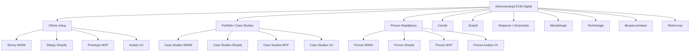
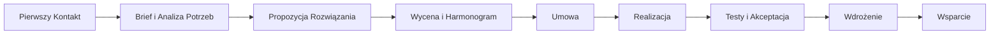
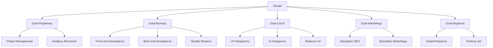

# Projekt Dokumentacji dla Agencji Interaktywnej ECM Digital

## Przegląd

Niniejszy dokument przedstawia kompleksowy projekt dokumentacji dla agencji interaktywnej ECM Digital, specjalizującej się w tworzeniu stron internetowych, sklepów na platformie Shopify, prototypów MVP aplikacji oraz audytach UX. Dokumentacja będzie służyć jako podstawa do prezentacji oferty, komunikacji z klientami oraz standaryzacji procesów wewnętrznych.

Projekt zakłada stworzenie spójnego systemu dokumentów, który będzie:
- Prezentował pełną ofertę usług agencji
- Demonstrował portfolio i case studies
- Opisywał procesy współpracy
- Przedstawiał modele cenowe
- Prezentował zespół i kompetencje
- Definiował zasady wsparcia i utrzymania
- Wyjaśniał metodologię pracy
- Opisywał wykorzystywane technologie
- Zapewniał zgodność z wymogami bezpieczeństwa i regulacjami
- Zawierał referencje i opinie klientów

## Architektura Dokumentacji

Dokumentacja będzie zorganizowana w modułową strukturę, umożliwiającą łatwe aktualizacje poszczególnych sekcji bez wpływu na całość. Poniżej przedstawiono architekturę dokumentacji:



## Komponenty i Interfejsy

### 1. Oferta Usług

#### 1.1 Struktura Sekcji Usług

Każda sekcja usługowa będzie zawierać:
- Nagłówek z nazwą usługi
- Krótki opis (max 200 słów)
- Kluczowe korzyści (3-5 punktów)
- Szczegółowy opis zakresu usługi
- Przykładowe realizacje (miniatury z linkami do case studies)
- Call-to-action

#### 1.2 Specyfikacja dla Stron WWW

- Rodzaje stron (korporacyjne, landing page, portale)
- Technologie (WordPress, Headless CMS, custom)
- Funkcjonalności (formularze, integracje, wielojęzyczność)
- Proces projektowy (UX/UI, prototypowanie, testy)
- Optymalizacja (SEO, wydajność, dostępność)

#### 1.3 Specyfikacja dla Sklepów Shopify

- Rodzaje sklepów (B2C, B2B, dropshipping)
- Customizacja (szablony, custom design)
- Integracje (płatności, logistyka, marketing)
- Optymalizacja konwersji
- Analityka i raportowanie

#### 1.4 Specyfikacja dla Prototypów MVP

- Definicja MVP w kontekście ECM Digital
- Proces walidacji pomysłu
- Technologie i stack
- Czas i koszty realizacji
- Ścieżka rozwoju po MVP

#### 1.5 Specyfikacja dla Audytów UX

- Metodologia badań
- Zakres analizy (heurystyki, testy użyteczności)
- Format raportowania
- Proces implementacji rekomendacji
- Mierzenie efektów

### 2. Portfolio i Case Studies

#### 2.1 Struktura Case Study

Każde case study będzie zawierać:
- Nagłówek z nazwą klienta/projektu
- Tło biznesowe i wyzwanie
- Cele projektu
- Zastosowane rozwiązanie
- Proces realizacji (z wizualizacjami)
- Rezultaty (mierzalne wskaźniki)
- Opinia klienta
- Galeria projektu

#### 2.2 Kategorie Case Studies

- Strony WWW (min. 5 przykładów)
- Sklepy Shopify (min. 5 przykładów)
- Prototypy MVP (min. 5 przykładów)
- Audyty UX (min. 5 przykładów)

#### 2.3 Filtry i Wyszukiwanie

- Filtrowanie po kategorii usługi
- Filtrowanie po branży klienta
- Filtrowanie po technologii
- Wyszukiwanie pełnotekstowe

### 3. Proces Współpracy

#### 3.1 Ogólny Schemat Współpracy



#### 3.2 Proces dla Stron WWW

Szczegółowy opis etapów:
- Brief i analiza potrzeb
- Architektura informacji
- Projektowanie UX/UI
- Akceptacja projektu
- Implementacja
- Testowanie
- Wdrożenie
- Szkolenie
- Wsparcie

#### 3.3 Proces dla Sklepów Shopify

Szczegółowy opis etapów:
- Analiza biznesowa
- Wybór szablonu/projekt custom
- Konfiguracja sklepu
- Implementacja funkcjonalności
- Integracje
- Testowanie
- Wdrożenie
- Szkolenie
- Wsparcie

#### 3.4 Proces dla Prototypów MVP

Szczegółowy opis etapów:
- Warsztat definicji produktu
- Priorytetyzacja funkcjonalności
- Projektowanie UX/UI
- Implementacja MVP
- Testy z użytkownikami
- Iteracja
- Wdrożenie
- Analiza metryk
- Planowanie rozwoju

#### 3.5 Proces dla Audytów UX

Szczegółowy opis etapów:
- Określenie celów audytu
- Analiza danych
- Badania z użytkownikami
- Analiza heurystyczna
- Raportowanie
- Prezentacja wyników
- Priorytetyzacja rekomendacji
- Plan implementacji
- Pomiar efektów

### 4. Cennik i Modele Rozliczeń

#### 4.1 Modele Wyceny

- Fixed Price (projekty o jasno określonym zakresie)
- Time & Material (projekty wymagające elastyczności)
- Retainer (długoterminowa współpraca)
- Success Fee (wynagrodzenie uzależnione od rezultatów)

#### 4.2 Struktura Cennika

Dla każdej usługi:
- Pakiety (Basic, Standard, Premium)
- Zakres prac w każdym pakiecie
- Widełki cenowe
- Opcjonalne dodatki
- Warunki płatności

#### 4.3 Kalkulator Wyceny

Interaktywne narzędzie pozwalające na:
- Wybór rodzaju usługi
- Określenie podstawowych parametrów
- Wybór opcji dodatkowych
- Otrzymanie przybliżonej wyceny

### 5. Zespół i Kompetencje

#### 5.1 Struktura Zespołu



#### 5.2 Profile Kluczowych Członków Zespołu

Dla każdego kluczowego członka:
- Zdjęcie
- Imię i nazwisko
- Stanowisko
- Doświadczenie
- Specjalizacja
- Certyfikaty
- Przykładowe projekty

#### 5.3 Kompetencje Technologiczne

- Front-end: HTML5, CSS3, JavaScript, React, Vue.js
- Back-end: PHP, Node.js, Python, Ruby
- CMS: WordPress, Drupal, Headless CMS
- E-commerce: Shopify, WooCommerce
- Bazy danych: MySQL, PostgreSQL, MongoDB
- DevOps: Docker, CI/CD, AWS, Azure
- UX/UI: Figma, Adobe XD, Sketch

### 6. Wsparcie i Utrzymanie

#### 6.1 Pakiety Wsparcia

- Basic (reakcja na zgłoszenia, aktualizacje)
- Standard (monitoring, backup, drobne modyfikacje)
- Premium (dedykowany opiekun, priorytetowe zgłoszenia)

#### 6.2 SLA (Service Level Agreement)

- Czasy reakcji
- Czasy rozwiązania
- Dostępność wsparcia
- Kanały komunikacji
- Procedura eskalacji

#### 6.3 Utrzymanie Techniczne

- Aktualizacje systemu
- Backup i odtwarzanie
- Monitoring wydajności
- Bezpieczeństwo
- Raportowanie

### 7. Metodologia Pracy

#### 7.1 Podejście Agile

- Organizacja sprintów
- Daily stand-ups
- Sprint review
- Retrospektywy
- Zarządzanie backlogiem

#### 7.2 Design Thinking

- Empatyzacja
- Definiowanie problemu
- Generowanie pomysłów
- Prototypowanie
- Testowanie

#### 7.3 Komunikacja i Raportowanie

- Narzędzia komunikacji
- Częstotliwość raportowania
- Format raportów
- Zarządzanie zmianą zakresu
- Eskalacja problemów

### 8. Technologie i Narzędzia

#### 8.1 Stack Technologiczny dla Stron WWW

- Front-end: HTML5, CSS3, JavaScript, React/Vue.js
- Back-end: PHP/Node.js
- CMS: WordPress, Headless CMS
- Hosting: AWS, Google Cloud
- CDN: Cloudflare
- Analityka: Google Analytics, Hotjar

#### 8.2 Stack Technologiczny dla Shopify

- Liquid
- Shopify CLI
- Shopify Apps
- Integracje API
- Systemy płatności
- Systemy logistyczne

#### 8.3 Stack Technologiczny dla MVP

- Front-end: React, Vue.js, Flutter
- Back-end: Node.js, Python, Ruby on Rails
- Bazy danych: MongoDB, PostgreSQL
- Hosting: AWS, Heroku
- CI/CD: GitHub Actions, Jenkins
- Monitoring: New Relic, Sentry

#### 8.4 Narzędzia do Audytów UX

- Badania: UserTesting, Lookback
- Analityka: Google Analytics, Hotjar, Mixpanel
- Testy A/B: Optimizely, VWO
- Prototypowanie: Figma, Adobe XD
- Mapy cieplne: Hotjar, Crazy Egg

### 9. Bezpieczeństwo i Zgodność

#### 9.1 Praktyki Bezpieczeństwa

- Szyfrowanie danych
- Bezpieczne API
- Ochrona przed OWASP Top 10
- Regularne audyty bezpieczeństwa
- Zarządzanie dostępem

#### 9.2 Zgodność z RODO/GDPR

- Polityka prywatności
- Zgody użytkowników
- Zarządzanie danymi osobowymi
- Procedury w przypadku naruszenia
- Prawo do bycia zapomnianym

#### 9.3 Zgodność z Przepisami E-commerce

- Regulaminy sklepów
- Polityka zwrotów
- Bezpieczeństwo płatności (PCI DSS)
- Informacje o produktach
- Prawa konsumenta

#### 9.4 Dostępność (WCAG)

- Zgodność z WCAG 2.1 AA
- Testowanie z czytnikami ekranowymi
- Alternatywy tekstowe
- Kontrast kolorów
- Nawigacja klawiaturą

### 10. Referencje i Opinie Klientów

#### 10.1 Struktura Referencji

Dla każdej referencji:
- Logo klienta
- Nazwa firmy
- Branża
- Zakres projektu
- Cytat przedstawiciela
- Rezultaty współpracy
- Dane kontaktowe (opcjonalnie)

#### 10.2 Wizualizacja Rezultatów

- Wykresy wzrostu
- Porównania przed/po
- Kluczowe wskaźniki efektywności
- Statystyki użytkowania
- ROI

## Modele Danych

### 1. Model Usługi

```json
{
  "id": "string",
  "name": "string",
  "shortDescription": "string",
  "fullDescription": "string",
  "benefits": ["string"],
  "process": ["string"],
  "technologies": ["string"],
  "caseStudies": ["reference_to_case_study"],
  "pricing": {
    "model": "string",
    "packages": [
      {
        "name": "string",
        "price": "number",
        "features": ["string"]
      }
    ]
  },
  "faq": [
    {
      "question": "string",
      "answer": "string"
    }
  ]
}
```

### 2. Model Case Study

```json
{
  "id": "string",
  "clientName": "string",
  "industry": "string",
  "serviceType": "string",
  "challenge": "string",
  "solution": "string",
  "process": ["string"],
  "technologies": ["string"],
  "results": [
    {
      "metric": "string",
      "value": "string",
      "improvement": "string"
    }
  ],
  "testimonial": {
    "quote": "string",
    "author": "string",
    "position": "string"
  },
  "images": ["string"],
  "videoUrl": "string",
  "liveUrl": "string"
}
```

### 3. Model Członka Zespołu

```json
{
  "id": "string",
  "name": "string",
  "position": "string",
  "photo": "string",
  "bio": "string",
  "expertise": ["string"],
  "certifications": ["string"],
  "projects": ["reference_to_case_study"],
  "socialMedia": {
    "linkedin": "string",
    "twitter": "string",
    "github": "string"
  }
}
```

### 4. Model Pakietu Wsparcia

```json
{
  "id": "string",
  "name": "string",
  "description": "string",
  "price": "number",
  "billingCycle": "string",
  "features": ["string"],
  "sla": {
    "responseTime": "string",
    "resolutionTime": "string",
    "availability": "string",
    "supportHours": "string"
  }
}
```

## Obsługa Błędów

### 1. Walidacja Formularzy

- Walidacja pól wymaganych
- Walidacja formatów (email, telefon)
- Komunikaty błędów inline
- Podświetlanie pól z błędami
- Sugestie poprawek

### 2. Obsługa Błędów Technicznych

- Strony błędów (404, 500)
- Logowanie błędów
- Automatyczne powiadomienia dla zespołu
- Fallback dla niedostępnych funkcjonalności
- Komunikaty przyjazne dla użytkownika

### 3. Obsługa Problemów Biznesowych

- Procedury eskalacji
- Matryca odpowiedzialności
- Ścieżki decyzyjne
- Komunikacja kryzysowa
- Plan naprawczy

## Strategia Testowania

### 1. Testy Użyteczności

- Testy z użytkownikami
- Testy A/B
- Analiza ścieżek użytkownika
- Badania eye-tracking
- Wywiady z użytkownikami

### 2. Testy Techniczne

- Testy jednostkowe
- Testy integracyjne
- Testy wydajnościowe
- Testy bezpieczeństwa
- Testy kompatybilności

### 3. Testy Akceptacyjne

- Scenariusze testowe oparte o wymagania
- Testy UAT z klientem
- Checklista wdrożeniowa
- Testy regresji
- Sign-off klienta

## Podsumowanie

Projekt dokumentacji dla agencji interaktywnej ECM Digital został zaprojektowany tak, aby kompleksowo prezentować ofertę, procesy i kompetencje firmy. Dokumentacja będzie służyć jako narzędzie komunikacji z klientami, standaryzacji procesów wewnętrznych oraz budowania wiarygodności marki.

Modułowa struktura dokumentacji pozwala na łatwe aktualizacje poszczególnych sekcji bez wpływu na całość, co jest kluczowe w dynamicznie zmieniającej się branży technologicznej. Każda sekcja została zaprojektowana z myślą o jasnym komunikowaniu wartości, procesów i rezultatów współpracy z ECM Digital.

Implementacja dokumentacji zgodnie z niniejszym projektem pozwoli na skuteczną prezentację oferty agencji, budowanie zaufania klientów oraz efektywną realizację projektów.