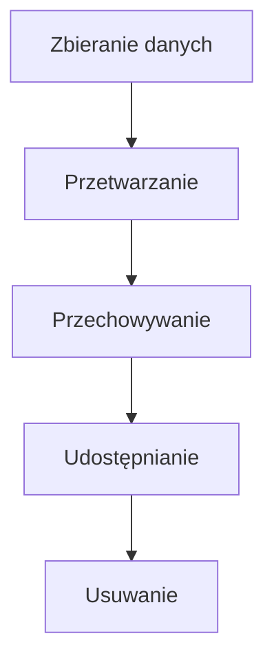

# Zgodność z RODO/GDPR - ECM Digital

## Wprowadzenie

ECM Digital w pełni przestrzega przepisów Rozporządzenia o Ochronie Danych Osobowych (RODO/GDPR). Nasze podejście do ochrony danych osobowych opiera się na zasadach privacy by design i privacy by default, co oznacza, że ochrona prywatności jest uwzględniana na każdym etapie projektowania i rozwoju systemów.

## Podstawy Prawne Przetwarzania

### Art. 6 RODO - Podstawy Prawne

**1. Zgoda (Art. 6 ust. 1 lit. a)**
- Dobrowolna, konkretna, świadoma i jednoznaczna
- Możliwość cofnięcia w dowolnym momencie
- Dokumentowana i weryfikowalna

**2. Wykonanie umowy (Art. 6 ust. 1 lit. b)**
- Realizacja zawartej umowy o świadczenie usług
- Działania przedumowne na żądanie osoby

**3. Obowiązek prawny (Art. 6 ust. 1 lit. c)**
- Wystawienie i przechowywanie faktur (6 lat)
- Archiwizacja dokumentów księgowych

**4. Żywotne interesy (Art. 6 ust. 1 lit. d)**
- Ochrona życia lub zdrowia (rzadko stosowane)

**5. Zadanie publiczne (Art. 6 ust. 1 lit. e)**
- Nie dotyczy działalności ECM Digital

**6. Prawnie uzasadniony interes (Art. 6 ust. 1 lit. f)**
- Marketing bezpośredni własnych usług
- Zabezpieczenie roszczeń
- Zapewnienie bezpieczeństwa IT

## Prawa Osób, Których Dane Dotyczą

### Implementacja Praw RODO

#### 1. Prawo Dostępu (Art. 15)
```javascript
// System obsługi prawa dostępu
class DataAccessHandler {
  async handleAccessRequest(userId, requestId) {
    try {
      // Weryfikacja tożsamości
      const identity = await this.verifyIdentity(userId, requestId);
      if (!identity.verified) {
        throw new Error('Identity verification failed');
      }

      // Zbieranie danych z wszystkich systemów
      const userData = await this.collectAllUserData(userId);
      
      // Przygotowanie raportu
      const accessReport = {
        personalData: userData.profile,
        processingPurposes: this.getProcessingPurposes(userId),
        legalBasis: this.getLegalBasis(userId),
        dataCategories: this.getDataCategories(userData),
        recipients: this.getDataRecipients(userId),
        retentionPeriod: this.getRetentionPeriods(userId),
        dataSource: userData.source,
        rights: this.getUserRights(),
        transfersToThirdCountries: this.getThirdCountryTransfers(userId)
      };

      // Logowanie żądania
      await this.logAccessRequest(userId, requestId, 'completed');
      
      return accessReport;
    } catch (error) {
      await this.logAccessRequest(userId, requestId, 'failed', error.message);
      throw error;
    }
  }

  async collectAllUserData(userId) {
    const [profile, orders, communications, analytics] = await Promise.all([
      this.getUserProfile(userId),
      this.getUserOrders(userId),
      this.getUserCommunications(userId),
      this.getUserAnalytics(userId)
    ]);

    return {
      profile,
      orders,
      communications,
      analytics,
      source: 'direct_collection'
    };
  }
}
```

#### 2. Prawo do Sprostowania (Art. 16)
```javascript
class DataRectificationHandler {
  async handleRectificationRequest(userId, corrections, requestId) {
    try {
      // Walidacja poprawek
      const validatedCorrections = await this.validateCorrections(corrections);
      
      // Sprawdzenie uprawnień do modyfikacji
      const canModify = await this.checkModificationRights(userId, Object.keys(corrections));
      if (!canModify.allowed) {
        throw new Error(`Cannot modify: ${canModify.reason}`);
      }

      // Wykonanie poprawek
      const updateResults = await this.updateUserData(userId, validatedCorrections);
      
      // Powiadomienie systemów trzecich
      await this.notifyThirdParties(userId, validatedCorrections);
      
      // Logowanie
      await this.logRectification(userId, requestId, validatedCorrections);
      
      return {
        status: 'completed',
        updatedFields: Object.keys(validatedCorrections),
        timestamp: new Date().toISOString(),
        affectedSystems: updateResults.systems
      };
    } catch (error) {
      await this.logRectification(userId, requestId, corrections, error.message);
      throw error;
    }
  }

  async validateCorrections(corrections) {
    const validated = {};
    
    for (const [field, value] of Object.entries(corrections)) {
      switch (field) {
        case 'email':
          validated.email = this.validateEmail(value);
          break;
        case 'firstName':
        case 'lastName':
          validated[field] = this.validateName(value);
          break;
        case 'phone':
          validated.phone = this.validatePhone(value);
          break;
        default:
          throw new Error(`Field ${field} cannot be modified`);
      }
    }
    
    return validated;
  }
}
```
#
### 3. Prawo do Usunięcia (Art. 17)
```javascript
class DataErasureHandler {
  async handleErasureRequest(userId, reason, requestId) {
    try {
      // Sprawdzenie warunków usunięcia
      const erasureCheck = await this.checkErasureConditions(userId, reason);
      
      if (!erasureCheck.allowed) {
        return {
          status: 'rejected',
          reason: erasureCheck.reason,
          legalBasis: erasureCheck.legalBasis
        };
      }

      // Identyfikacja danych do usunięcia
      const dataToErase = await this.identifyErasableData(userId);
      
      // Wykonanie usunięcia
      const erasureResults = await this.performErasure(userId, dataToErase);
      
      // Powiadomienie systemów trzecich
      await this.notifyThirdPartiesOfErasure(userId);
      
      // Logowanie (zachowanie minimalnych danych do celów prawnych)
      await this.logErasure(userId, requestId, reason, dataToErase.categories);
      
      return {
        status: 'completed',
        erasedDataCategories: dataToErase.categories,
        retainedData: erasureResults.retained,
        timestamp: new Date().toISOString()
      };
    } catch (error) {
      await this.logErasure(userId, requestId, reason, [], error.message);
      throw error;
    }
  }

  async checkErasureConditions(userId, reason) {
    const user = await this.getUserData(userId);
    
    // Sprawdzenie czy dane są nadal potrzebne
    const activeContracts = await this.checkActiveContracts(userId);
    if (activeContracts.length > 0) {
      return {
        allowed: false,
        reason: 'Active contracts exist',
        legalBasis: 'Art. 17 ust. 3 lit. b RODO'
      };
    }

    // Sprawdzenie obowiązków prawnych
    const legalObligations = await this.checkLegalObligations(userId);
    if (legalObligations.accounting || legalObligations.tax) {
      return {
        allowed: false,
        reason: 'Legal obligations require data retention',
        legalBasis: 'Art. 17 ust. 3 lit. b RODO'
      };
    }

    // Sprawdzenie roszczeń prawnych
    const legalClaims = await this.checkLegalClaims(userId);
    if (legalClaims.pending) {
      return {
        allowed: false,
        reason: 'Pending legal claims',
        legalBasis: 'Art. 17 ust. 3 lit. e RODO'
      };
    }

    return { allowed: true };
  }
}
```

## Polityka Prywatności

### Template Polityki Prywatności

```html
<!DOCTYPE html>
<html lang="pl">
<head>
    <meta charset="UTF-8">
    <title>Polityka Prywatności - ECM Digital</title>
</head>
<body>
    <div class="privacy-policy">
        <h1>Polityka Prywatności</h1>
        
        <section id="administrator">
            <h2>1. Administrator Danych Osobowych</h2>
            <p>Administratorem Państwa danych osobowych jest:</p>
            <address>
                <strong>ECM Digital</strong><br>
                ul. [Adres]<br>
                [Kod pocztowy] [Miasto]<br>
                NIP: [NIP]<br>
                Email: <a href="mailto:privacy@ecm-digital.com">privacy@ecm-digital.com</a><br>
                Telefon: <a href="tel:+48535330323">+48 535 330 323</a>
            </address>
        </section>

        <section id="purposes">
            <h2>2. Cele i Podstawy Prawne Przetwarzania</h2>
            <table class="data-processing-table">
                <thead>
                    <tr>
                        <th>Cel przetwarzania</th>
                        <th>Podstawa prawna</th>
                        <th>Okres przechowywania</th>
                        <th>Kategorie danych</th>
                    </tr>
                </thead>
                <tbody>
                    <tr>
                        <td>Realizacja umowy o świadczenie usług</td>
                        <td>Art. 6 ust. 1 lit. b RODO</td>
                        <td>Do zakończenia umowy + 3 lata</td>
                        <td>Dane kontaktowe, dane rozliczeniowe</td>
                    </tr>
                    <tr>
                        <td>Wystawienie i przechowywanie faktur</td>
                        <td>Art. 6 ust. 1 lit. c RODO</td>
                        <td>5 lat od końca roku podatkowego</td>
                        <td>Dane rozliczeniowe, NIP</td>
                    </tr>
                    <tr>
                        <td>Marketing bezpośredni</td>
                        <td>Art. 6 ust. 1 lit. f RODO</td>
                        <td>Do cofnięcia sprzeciwu</td>
                        <td>Email, preferencje</td>
                    </tr>
                    <tr>
                        <td>Analityka strony internetowej</td>
                        <td>Art. 6 ust. 1 lit. f RODO</td>
                        <td>26 miesięcy</td>
                        <td>Dane techniczne, behawioralne</td>
                    </tr>
                    <tr>
                        <td>Obsługa zapytań i reklamacji</td>
                        <td>Art. 6 ust. 1 lit. f RODO</td>
                        <td>3 lata od rozpatrzenia</td>
                        <td>Dane kontaktowe, treść zapytania</td>
                    </tr>
                </tbody>
            </table>
        </section>

        <section id="rights">
            <h2>3. Prawa Osoby, której Dane Dotyczą</h2>
            <p>Zgodnie z RODO przysługują Państwu następujące prawa:</p>
            
            <div class="rights-grid">
                <div class="right-item">
                    <h3>Prawo dostępu (Art. 15)</h3>
                    <p>Prawo do uzyskania informacji o przetwarzanych danych oraz otrzymania kopii danych.</p>
                    <a href="/data-access-request" class="btn-secondary">Złóż wniosek</a>
                </div>
                
                <div class="right-item">
                    <h3>Prawo do sprostowania (Art. 16)</h3>
                    <p>Prawo do poprawienia nieprawidłowych lub uzupełnienia niekompletnych danych.</p>
                    <a href="/data-rectification-request" class="btn-secondary">Złóż wniosek</a>
                </div>
                
                <div class="right-item">
                    <h3>Prawo do usunięcia (Art. 17)</h3>
                    <p>Prawo do usunięcia danych w określonych przypadkach.</p>
                    <a href="/data-erasure-request" class="btn-secondary">Złóż wniosek</a>
                </div>
                
                <div class="right-item">
                    <h3>Prawo do ograniczenia (Art. 18)</h3>
                    <p>Prawo do ograniczenia przetwarzania w określonych sytuacjach.</p>
                    <a href="/data-restriction-request" class="btn-secondary">Złóż wniosek</a>
                </div>
                
                <div class="right-item">
                    <h3>Prawo do przenoszenia (Art. 20)</h3>
                    <p>Prawo do otrzymania danych w formacie umożliwiającym przeniesienie.</p>
                    <a href="/data-portability-request" class="btn-secondary">Złóż wniosek</a>
                </div>
                
                <div class="right-item">
                    <h3>Prawo sprzeciwu (Art. 21)</h3>
                    <p>Prawo do wniesienia sprzeciwu wobec przetwarzania danych.</p>
                    <a href="/data-objection-request" class="btn-secondary">Złóż wniosek</a>
                </div>
            </div>
        </section>

        <section id="cookies">
            <h2>4. Pliki Cookies</h2>
            <p>Nasza strona wykorzystuje pliki cookies w następujących celach:</p>
            
            <div class="cookies-categories">
                <div class="cookie-category">
                    <h4>Niezbędne (Necessary)</h4>
                    <p>Umożliwiają podstawowe funkcjonowanie strony.</p>
                    <ul>
                        <li>Sesja użytkownika</li>
                        <li>Preferencje językowe</li>
                        <li>Bezpieczeństwo</li>
                    </ul>
                    <span class="cookie-status required">Wymagane</span>
                </div>
                
                <div class="cookie-category">
                    <h4>Analityczne (Analytics)</h4>
                    <p>Pomagają zrozumieć sposób korzystania ze strony.</p>
                    <ul>
                        <li>Google Analytics</li>
                        <li>Hotjar</li>
                    </ul>
                    <span class="cookie-status optional">Opcjonalne</span>
                </div>
                
                <div class="cookie-category">
                    <h4>Marketingowe (Marketing)</h4>
                    <p>Służą personalizacji reklam i treści.</p>
                    <ul>
                        <li>Facebook Pixel</li>
                        <li>Google Ads</li>
                    </ul>
                    <span class="cookie-status optional">Opcjonalne</span>
                </div>
            </div>
            
            <div class="cookie-controls">
                <button id="manage-cookies" class="btn-primary">Zarządzaj cookies</button>
                <button id="accept-all-cookies" class="btn-secondary">Akceptuj wszystkie</button>
            </div>
        </section>

        <section id="contact">
            <h2>5. Kontakt w Sprawach Ochrony Danych</h2>
            <p>W przypadku pytań dotyczących przetwarzania danych osobowych prosimy o kontakt:</p>
            <ul>
                <li>Email: <a href="mailto:privacy@ecm-digital.com">privacy@ecm-digital.com</a></li>
                <li>Telefon: <a href="tel:+48535330323">+48 535 330 323</a></li>
                <li>Adres: [Adres korespondencyjny]</li>
            </ul>
            
            <p><strong>Czas odpowiedzi:</strong> Do 30 dni od otrzymania wniosku</p>
            <p><strong>Prawo do skargi:</strong> Przysługuje Państwu prawo wniesienia skargi do Prezesa Urzędu Ochrony Danych Osobowych.</p>
        </section>

        <section id="updates">
            <h2>6. Zmiany Polityki Prywatności</h2>
            <p>Niniejsza polityka prywatności może być aktualizowana. O istotnych zmianach będziemy informować:</p>
            <ul>
                <li>Poprzez powiadomienie na stronie internetowej</li>
                <li>Poprzez email (jeśli posiadamy Państwa adres)</li>
                <li>Z co najmniej 14-dniowym wyprzedzeniem</li>
            </ul>
            
            <p><strong>Ostatnia aktualizacja:</strong> <time datetime="2025-01-15">15 stycznia 2025</time></p>
            <p><strong>Wersja:</strong> 2.0</p>
        </section>
    </div>
</body>
</html>
```

## Consent Management System

### Implementacja Zarządzania Zgodami

```javascript
class ConsentManagementSystem {
  constructor() {
    this.consentTypes = {
      necessary: {
        required: true,
        name: 'Niezbędne',
        description: 'Pliki cookies niezbędne do funkcjonowania strony',
        cookies: ['session_id', 'csrf_token', 'language_preference']
      },
      analytics: {
        required: false,
        name: 'Analityczne',
        description: 'Pliki cookies służące do analizy ruchu na stronie',
        cookies: ['_ga', '_gid', '_hjid', '_hjIncludedInSessionSample']
      },
      marketing: {
        required: false,
        name: 'Marketingowe',
        description: 'Pliki cookies służące do personalizacji reklam',
        cookies: ['_fbp', '_fbc', 'ads_preferences']
      },
      social: {
        required: false,
        name: 'Media społecznościowe',
        description: 'Pliki cookies od platform społecznościowych',
        cookies: ['facebook_connect', 'twitter_widget', 'linkedin_insights']
      }
    };
    
    this.init();
  }

  init() {
    this.loadStoredConsent();
    this.setupEventListeners();
    this.checkConsentStatus();
  }

  loadStoredConsent() {
    const stored = localStorage.getItem('gdpr_consent');
    if (stored) {
      try {
        this.currentConsent = JSON.parse(stored);
        this.applyConsent();
      } catch (error) {
        console.error('Error loading stored consent:', error);
        this.showConsentBanner();
      }
    } else {
      this.showConsentBanner();
    }
  }

  showConsentBanner() {
    const banner = this.createConsentBanner();
    document.body.appendChild(banner);
  }

  createConsentBanner() {
    const banner = document.createElement('div');
    banner.id = 'consent-banner';
    banner.className = 'consent-banner';
    banner.innerHTML = `
      <div class="consent-content">
        <h3>Szanujemy Twoją prywatność</h3>
        <p>Używamy plików cookies, aby zapewnić najlepsze doświadczenia na naszej stronie. Możesz zaakceptować wszystkie cookies lub dostosować swoje preferencje.</p>
        
        <div class="consent-actions">
          <button id="accept-all" class="btn-primary">Akceptuj wszystkie</button>
          <button id="reject-optional" class="btn-secondary">Tylko niezbędne</button>
          <button id="customize-consent" class="btn-link">Dostosuj preferencje</button>
        </div>
      </div>
    `;
    
    return banner;
  }

  createConsentModal() {
    const modal = document.createElement('div');
    modal.id = 'consent-modal';
    modal.className = 'consent-modal';
    
    const categoriesHtml = Object.entries(this.consentTypes).map(([key, category]) => `
      <div class="consent-category">
        <div class="category-header">
          <label class="toggle-switch">
            <input type="checkbox" 
                   id="consent-${key}" 
                   ${category.required ? 'checked disabled' : ''}
                   data-category="${key}">
            <span class="toggle-slider"></span>
          </label>
          <div class="category-info">
            <h4>${category.name} ${category.required ? '(Wymagane)' : ''}</h4>
            <p>${category.description}</p>
          </div>
        </div>
        
        <div class="category-details">
          <h5>Pliki cookies:</h5>
          <ul>
            ${category.cookies.map(cookie => `<li><code>${cookie}</code></li>`).join('')}
          </ul>
        </div>
      </div>
    `).join('');
    
    modal.innerHTML = `
      <div class="modal-content">
        <div class="modal-header">
          <h2>Preferencje prywatności</h2>
          <button class="modal-close">&times;</button>
        </div>
        
        <div class="modal-body">
          <p>Wybierz, które kategorie plików cookies chcesz zaakceptować:</p>
          <div class="consent-categories">
            ${categoriesHtml}
          </div>
        </div>
        
        <div class="modal-footer">
          <button id="save-preferences" class="btn-primary">Zapisz preferencje</button>
          <button id="accept-all-modal" class="btn-secondary">Akceptuj wszystkie</button>
        </div>
      </div>
    `;
    
    return modal;
  }

  setupEventListeners() {
    document.addEventListener('click', (e) => {
      switch (e.target.id) {
        case 'accept-all':
          this.acceptAllConsent();
          break;
        case 'reject-optional':
          this.acceptOnlyNecessary();
          break;
        case 'customize-consent':
          this.showConsentModal();
          break;
        case 'save-preferences':
          this.saveCustomPreferences();
          break;
        case 'accept-all-modal':
          this.acceptAllConsent();
          break;
      }
    });
  }

  acceptAllConsent() {
    const consent = {};
    Object.keys(this.consentTypes).forEach(key => {
      consent[key] = true;
    });
    
    this.saveConsent(consent);
    this.hideConsentUI();
  }

  acceptOnlyNecessary() {
    const consent = {};
    Object.keys(this.consentTypes).forEach(key => {
      consent[key] = this.consentTypes[key].required;
    });
    
    this.saveConsent(consent);
    this.hideConsentUI();
  }

  saveCustomPreferences() {
    const consent = {};
    Object.keys(this.consentTypes).forEach(key => {
      const checkbox = document.getElementById(`consent-${key}`);
      consent[key] = checkbox ? checkbox.checked : this.consentTypes[key].required;
    });
    
    this.saveConsent(consent);
    this.hideConsentUI();
  }

  saveConsent(consent) {
    const consentData = {
      ...consent,
      timestamp: new Date().toISOString(),
      version: '2.0'
    };
    
    localStorage.setItem('gdpr_consent', JSON.stringify(consentData));
    this.currentConsent = consentData;
    this.applyConsent();
    
    // Send consent to server
    this.sendConsentToServer(consentData);
  }

  applyConsent() {
    // Google Analytics
    if (this.currentConsent.analytics) {
      this.enableGoogleAnalytics();
    } else {
      this.disableGoogleAnalytics();
    }

    // Marketing cookies
    if (this.currentConsent.marketing) {
      this.enableMarketingCookies();
    } else {
      this.disableMarketingCookies();
    }

    // Social media cookies
    if (this.currentConsent.social) {
      this.enableSocialCookies();
    } else {
      this.disableSocialCookies();
    }
  }

  enableGoogleAnalytics() {
    if (typeof gtag !== 'undefined') {
      gtag('consent', 'update', {
        'analytics_storage': 'granted'
      });
    }
  }

  disableGoogleAnalytics() {
    if (typeof gtag !== 'undefined') {
      gtag('consent', 'update', {
        'analytics_storage': 'denied'
      });
    }
  }

  async sendConsentToServer(consentData) {
    try {
      await fetch('/api/consent', {
        method: 'POST',
        headers: {
          'Content-Type': 'application/json'
        },
        body: JSON.stringify(consentData)
      });
    } catch (error) {
      console.error('Error sending consent to server:', error);
    }
  }

  hideConsentUI() {
    const banner = document.getElementById('consent-banner');
    const modal = document.getElementById('consent-modal');
    
    if (banner) banner.remove();
    if (modal) modal.remove();
  }
}

// Initialize consent management
document.addEventListener('DOMContentLoaded', () => {
  new ConsentManagementSystem();
});
```

## Data Protection Impact Assessment (DPIA)

### Template DPIA

```markdown
# Ocena Skutków dla Ochrony Danych (DPIA)
**Projekt:** [Nazwa projektu]
**Data:** [Data przeprowadzenia]
**Wersja:** 1.0

## 1. Opis Przetwarzania Danych

### 1.1 Cel Przetwarzania
- **Główny cel:** [Opisz główny cel]
- **Cele szczegółowe:** [Lista celów szczegółowych]
- **Korzyści biznesowe:** [Opis korzyści]

### 1.2 Podstawa Prawna
- **Art. 6 RODO:** [Wskaż właściwą podstawę]
- **Art. 9 RODO:** [Jeśli dotyczy danych szczególnych kategorii]
- **Uzasadnienie:** [Dlaczego ta podstawa jest właściwa]

### 1.3 Opis Procesu


## 2. Dane Osobowe

### 2.1 Kategorie Danych
- [ ] Dane identyfikacyjne (imię, nazwisko, PESEL)
- [ ] Dane kontaktowe (email, telefon, adres)
- [ ] Dane finansowe (numer konta, historia płatności)
- [ ] Dane techniczne (IP, cookies, logi)
- [ ] Dane behawioralne (preferencje, historia aktywności)
- [ ] Dane szczególnych kategorii (zdrowie, przekonania)

### 2.2 Źródła Danych
- [ ] Bezpośrednio od osoby, której dane dotyczą
- [ ] Od stron trzecich (partnerzy, dostawcy)
- [ ] Z publicznie dostępnych źródeł
- [ ] Z systemów automatycznych (tracking, analytics)

### 2.3 Odbiorcy Danych
- [ ] Pracownicy organizacji
- [ ] Podwykonawcy (procesory)
- [ ] Partnerzy biznesowi
- [ ] Organy publiczne
- [ ] Podmioty w krajach trzecich

## 3. Analiza Ryzyka

### 3.1 Identyfikacja Zagrożeń

| Zagrożenie | Prawdopodobieństwo | Wpływ | Poziom Ryzyka |
|------------|-------------------|-------|---------------|
| Nieautoryzowany dostęp | Średnie | Wysokie | Wysokie |
| Utrata danych | Niskie | Wysokie | Średnie |
| Błędne przetwarzanie | Średnie | Średnie | Średnie |
| Naruszenie poufności | Niskie | Wysokie | Średnie |

### 3.2 Ocena Wpływu na Osoby

**Potencjalne skutki dla osób, których dane dotyczą:**
- [ ] Dyskryminacja
- [ ] Kradzież tożsamości
- [ ] Straty finansowe
- [ ] Naruszenie reputacji
- [ ] Utrata kontroli nad danymi
- [ ] Ograniczenie praw i wolności

## 4. Środki Zabezpieczające

### 4.1 Środki Techniczne
- [ ] Szyfrowanie danych
- [ ] Kontrola dostępu
- [ ] Monitoring i logowanie
- [ ] Backup i recovery
- [ ] Firewall i antywirus
- [ ] Pseudonimizacja

### 4.2 Środki Organizacyjne
- [ ] Polityki bezpieczeństwa
- [ ] Szkolenia pracowników
- [ ] Procedury incydentów
- [ ] Audyty wewnętrzne
- [ ] Umowy z procesorami
- [ ] Privacy by design

### 4.3 Środki Prawne
- [ ] Umowy przetwarzania
- [ ] Zgody użytkowników
- [ ] Polityki prywatności
- [ ] Procedury realizacji praw
- [ ] Umowy międzynarodowe

## 5. Konsultacje

### 5.1 Konsultacje Wewnętrzne
- **IOD (jeśli wyznaczony):** [Opinia IOD]
- **Zespół bezpieczeństwa:** [Opinia zespołu]
- **Zespół prawny:** [Opinia prawna]

### 5.2 Konsultacje z Osobami, których Dane Dotyczą
- **Metoda konsultacji:** [Ankieta/wywiad/forum]
- **Liczba uczestników:** [Liczba]
- **Główne uwagi:** [Podsumowanie uwag]

### 5.3 Konsultacje z Organem Nadzorczym
- **Czy wymagane:** [Tak/Nie]
- **Podstawa:** [Art. 36 RODO]
- **Status:** [Planowane/W trakcie/Zakończone]

## 6. Wnioski i Rekomendacje

### 6.1 Ocena Końcowa
**Poziom ryzyka po wdrożeniu środków:** [Niskie/Średnie/Wysokie]

### 6.2 Rekomendacje
1. [Rekomendacja 1]
2. [Rekomendacja 2]
3. [Rekomendacja 3]

### 6.3 Plan Działań
| Działanie | Odpowiedzialny | Termin | Status |
|-----------|----------------|--------|--------|
| [Działanie 1] | [Osoba] | [Data] | [Status] |
| [Działanie 2] | [Osoba] | [Data] | [Status] |

## 7. Monitoring i Przegląd

### 7.1 Wskaźniki Monitorowania
- Liczba incydentów bezpieczeństwa
- Czas odpowiedzi na żądania osób
- Skuteczność środków technicznych
- Poziom świadomości pracowników

### 7.2 Harmonogram Przeglądów
- **Przegląd kwartalny:** [Data]
- **Przegląd roczny:** [Data]
- **Przegląd po incydencie:** [W razie potrzeby]

---
**Zatwierdził:** [Imię i nazwisko]
**Stanowisko:** [Stanowisko]
**Data:** [Data zatwierdzenia]
```

---

*Ostatnia aktualizacja: Styczeń 2025*
*Wersja dokumentu: 1.0*