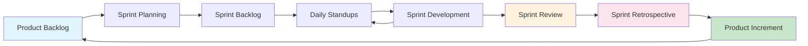
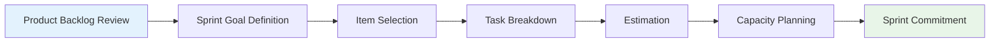
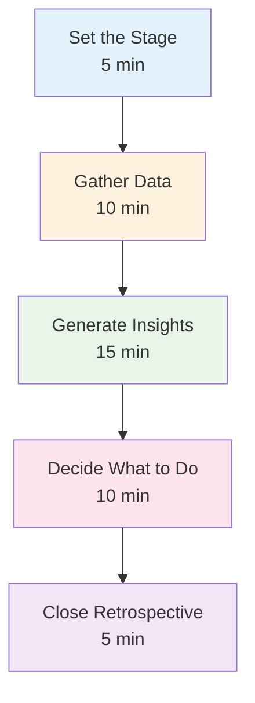
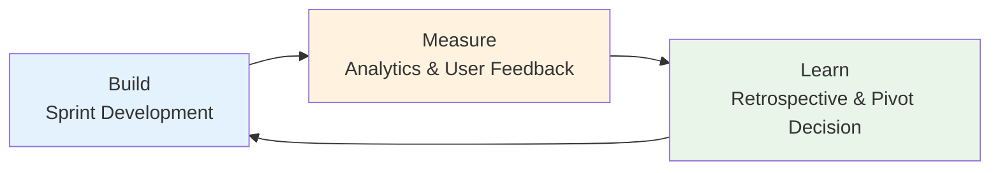
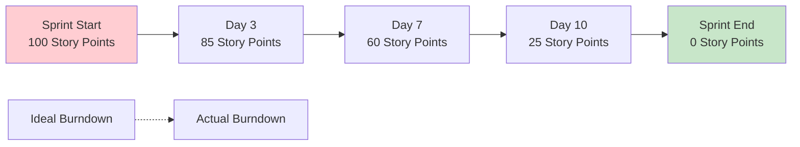
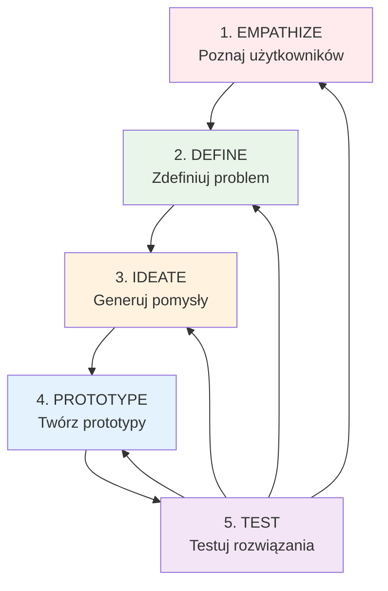
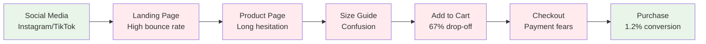
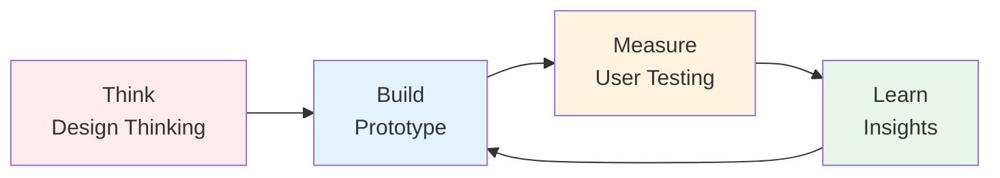
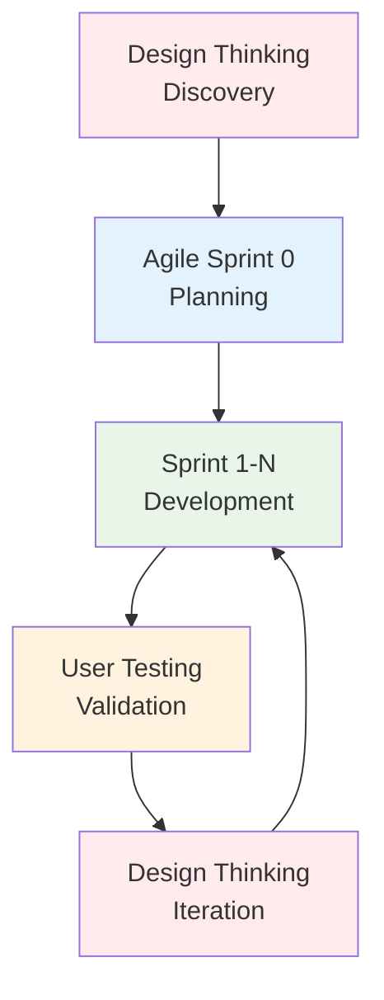
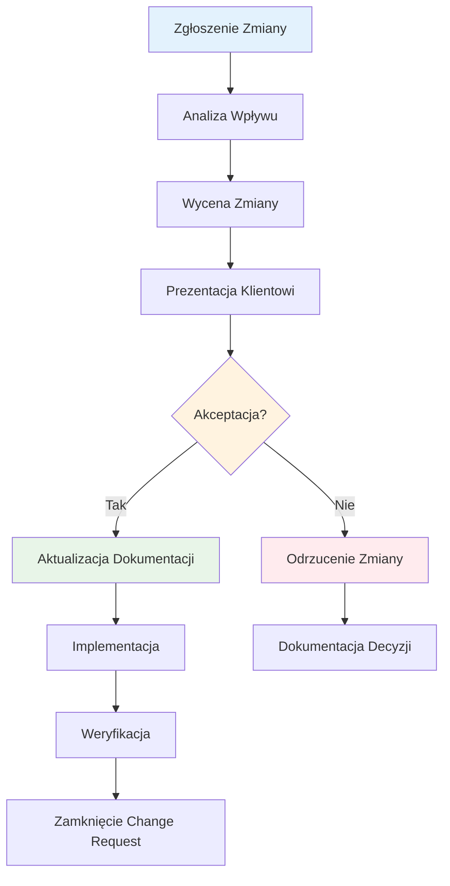

# Metodologia Pracy ECM Digital

## Wprowadzenie

W ECM Digital stosujemy sprawdzone metodologie pracy, które pozwalają nam efektywnie realizować projekty i dostarczać wysokiej jakości rozwiązania. Nasze podejście łączy elementy metodyk zwinnych (Agile) z Design Thinking, co pozwala nam elastycznie dostosowywać się do potrzeb klientów i specyfiki projektów.

Nasza metodologia opiera się na trzech filarach:
- **Podejście Agile** - zapewniające elastyczność i iteracyjne dostarczanie wartości
- **Design Thinking** - gwarantujące rozwiązania skoncentrowane na użytkowniku
- **Transparentna komunikacja** - budująca zaufanie i efektywną współpracę

## Przegląd Stosowanych Metodologii

### 🚀 Metodyki Zwinne (Agile)
Stosujemy sprawdzone praktyki Agile, w tym Scrum i Kanban, dostosowując je do specyfiki każdego projektu. Nasze zespoły pracują w krótkich iteracjach, co pozwala na szybkie reagowanie na zmiany i ciągłe dostarczanie wartości.

### 🎨 Design Thinking
W projektach UX/UI wykorzystujemy metodologię Design Thinking, która stawia użytkownika w centrum procesu projektowego. Dzięki temu tworzymy rozwiązania, które rzeczywiście odpowiadają na potrzeby użytkowników końcowych.

### 📊 Lean Startup
W projektach MVP stosujemy podejście Lean Startup, które pozwala na szybkie walidowanie hipotez biznesowych i minimalizowanie ryzyka inwestycyjnego.

### 🔄 DevOps
Integrujemy praktyki DevOps w celu automatyzacji procesów wdrożeniowych i zapewnienia wysokiej jakości kodu oraz stabilności systemów.

## Nawigacja

- [Podejście Agile](#podejście-agile) - Szczegółowy opis metodyk zwinnych
- [Design Thinking](#design-thinking) - Proces projektowania skoncentrowany na użytkowniku  
- [Komunikacja i Raportowanie](#komunikacja-i-raportowanie) - Narzędzia i procesy komunikacyjne
- [Zapewnienie Jakości](#zapewnienie-jakości) - Standardy i procedury QA

## Podejście Agile

### Filozofia Agile w ECM Digital

Realizujemy projekty w oparciu o metodyki zwinne, które stanowią fundament naszego podejścia do zarządzania projektami. Agile pozwala nam na:

- **Iteracyjne dostarczanie wartości** - Klient otrzymuje działające funkcjonalności już od pierwszych tygodni projektu
- **Szybkie reagowanie na zmiany** - Elastycznie dostosowujemy się do zmieniających się wymagań biznesowych
- **Transparentność procesu** - Klient ma pełny wgląd w postęp prac i może na bieżąco wpływać na kierunek rozwoju
- **Ciągłą komunikację z klientem** - Regularne konsultacje zapewniają zgodność z oczekiwaniami
- **Wysoką jakość produktu** - Ciągłe testowanie i feedback pozwalają na wczesne wykrywanie problemów

### Diagram Procesu Agile



### Organizacja Sprintów

**Długość Sprintów:** 1-2 tygodnie (dostosowujemy do specyfiki projektu)

#### Sprint Planning (Planowanie Sprintu)

**Czas trwania:** 2-4 godziny (w zależności od długości sprintu)
**Uczestnicy:** Product Owner, Scrum Master, Development Team

**Cele Sprint Planning:**
1. **Określenie Sprint Goal** - Jasno zdefiniowany cel sprintu
2. **Wybór Product Backlog Items** - Elementy do realizacji w sprincie
3. **Dekompozycja zadań** - Podział na mniejsze, wykonalne elementy
4. **Estymacja** - Ocena czasochłonności zadań
5. **Commitment** - Zobowiązanie zespołu do realizacji

**Proces:**


**Techniki estymacji:**
- **Planning Poker** - Zespołowa estymacja z użyciem kart
- **T-shirt sizing** - Estymacja względna (XS, S, M, L, XL)
- **Story Points** - Abstrakcyjna jednostka złożoności
- **Ideal Hours** - Estymacja w godzinach pracy

#### Sprint Execution (Realizacja Sprintu)

**Kluczowe praktyki:**
- **Daily Standups** - Codzienne synchronizacje zespołu
- **Pair Programming** - Programowanie w parach dla lepszej jakości
- **Code Reviews** - Przeglądy kodu przed mergem
- **Continuous Integration** - Automatyczne testy i buildy
- **Impediment Removal** - Szybkie rozwiązywanie przeszkód

**Monitoring postępu:**
- **Burndown Charts** - Wizualizacja pozostałej pracy
- **Task Board** - Kanban board z statusami zadań
- **Velocity Tracking** - Śledzenie produktywności zespołu

#### Sprint Review (Przegląd Sprintu)

**Czas trwania:** 1-2 godziny
**Uczestnicy:** Zespół projektowy + stakeholderzy

**Agenda:**
1. **Demo funkcjonalności** - Prezentacja działających features
2. **Feedback session** - Zbieranie opinii od stakeholderów
3. **Product Backlog refinement** - Aktualizacja priorytetów
4. **Metrics review** - Analiza velocity i innych wskaźników
5. **Next sprint preview** - Wstępne omówienie kolejnych planów

**Kryteria akceptacji demo:**
- Funkcjonalność musi być w pełni działająca
- Prezentacja w środowisku zbliżonym do produkcyjnego
- Możliwość interaktywnego testowania przez stakeholderów
- Dokumentacja zmian i nowych funkcji

### Daily Stand-ups

**Format spotkania:**
- Czas trwania: maksymalnie 15 minut
- Uczestnicy: zespół projektowy + opcjonalnie klient
- Częstotliwość: codziennie o stałej porze

**Agenda:**
1. Co zostało zrobione wczoraj?
2. Co będzie robione dzisiaj?
3. Jakie są przeszkody/impedimenty?

### Sprint Review

**Cele:**
- Prezentacja działających funkcjonalności
- Zbieranie feedback od klienta
- Walidacja zgodności z wymaganiami
- Planowanie kolejnych iteracji

**Format:**
- Demonstracja na żywo
- Interaktywne testowanie przez klienta
- Dyskusja nad kolejnymi priorytetami
- Aktualizacja roadmapy produktu

### Sprint Retrospective (Retrospektywa Sprintu)

**Czas trwania:** 45-90 minut
**Uczestnicy:** Development Team + Scrum Master
**Częstotliwość:** Po każdym sprincie

#### Cele Retrospektywy

1. **Inspect & Adapt** - Analiza procesu i wprowadzanie ulepszeń
2. **Team Building** - Wzmacnianie współpracy zespołowej
3. **Problem Solving** - Identyfikacja i rozwiązywanie problemów
4. **Continuous Learning** - Budowanie kultury uczenia się
5. **Process Optimization** - Optymalizacja sposobu pracy

#### Formaty Retrospektyw

**1. Start-Stop-Continue**
- **Start** - Co powinniśmy zacząć robić?
- **Stop** - Co powinniśmy przestać robić?
- **Continue** - Co robimy dobrze i powinniśmy kontynuować?

**2. What Went Well / What Could Be Improved**
- Pozytywne aspekty sprintu
- Obszary wymagające poprawy
- Konkretne action items

**3. 4Ls (Liked, Learned, Lacked, Longed For)**
- **Liked** - Co nam się podobało?
- **Learned** - Czego się nauczyliśmy?
- **Lacked** - Czego nam brakowało?
- **Longed For** - Za czym tęskniliśmy?

**4. Sailboat Retrospective**
- **Wind** - Co nas napędza?
- **Anchor** - Co nas spowalnia?
- **Rocks** - Jakie są zagrożenia?
- **Island** - Jaki jest nasz cel?

#### Proces Retrospektywy



#### Action Items Management

**Kryteria dobrego Action Item:**
- **Specific** - Konkretny i jasno zdefiniowany
- **Measurable** - Mierzalny
- **Achievable** - Osiągalny w ramach jednego sprintu
- **Relevant** - Istotny dla zespołu
- **Time-bound** - Z określonym terminem

**Tracking Action Items:**
- Dodanie do Sprint Backlog
- Wyznaczenie odpowiedzialnej osoby
- Regularne sprawdzanie postępu
- Ocena efektywności w kolejnej retrospektywie

#### Metryki Retrospektyw

**Wskaźniki efektywności:**
- Liczba zidentyfikowanych problemów
- Procent zrealizowanych action items
- Poprawa team satisfaction
- Redukcja impedimentów
- Wzrost velocity zespołu

### Przykłady Zastosowania Agile

#### Projekt: Sklep internetowy na Shopify dla marki fashion

**Kontekst projektu:**
- **Klient:** Marka odzieżowa z 50+ produktami
- **Timeline:** 8 tygodni (4 sprinty po 2 tygodnie)
- **Zespół:** 1 PM, 2 developerów, 1 designer, 1 QA
- **Budget:** 80,000 PLN

**Sprint 1 (2 tygodnie) - Foundation**
```
Sprint Goal: Utworzenie funkcjonalnej podstawy sklepu

User Stories:
- Jako klient chcę przeglądać produkty w kategorii "Kobieta"
- Jako klient chcę zobaczyć szczegóły produktu z galерią zdjęć
- Jako administrator chcę dodawać nowe produkty

Tasks:
✅ Konfiguracja Shopify store
✅ Instalacja i customizacja theme
✅ Import produktów z CSV
✅ Konfiguracja kategorii i kolekcji
✅ Podstawowa responsywność mobile
✅ Integracja z systemem płatności (Stripe)

Velocity: 23 story points
Burndown: Zadania ukończone zgodnie z planem
```

**Sprint 2 (2 tygodnie) - User Experience**
```
Sprint Goal: Optymalizacja doświadczenia zakupowego

User Stories:
- Jako klient chcę łatwo filtrować produkty po rozmiarze i kolorze
- Jako klient chcę dodawać produkty do koszyka i edytować zawartość
- Jako klient chcę otrzymać email potwierdzający zamówienie

Tasks:
✅ Implementacja filtrów produktów
✅ Customizacja strony produktu (size guide, reviews)
✅ Optymalizacja checkout process
✅ Konfiguracja email templates
✅ Implementacja search functionality
⚠️ Integracja z Instagram (przeniesiona do Sprint 3)

Velocity: 21 story points
Impediments: Opóźnienie w dostarczeniu content przez klienta
```

**Sprint 3 (2 tygodnie) - Advanced Features**
```
Sprint Goal: Dodanie zaawansowanych funkcjonalności e-commerce

User Stories:
- Jako klient chcę zobaczyć rekomendowane produkty
- Jako klient chcę zapisać produkty na liście życzeń
- Jako klient chcę otrzymać kod rabatowy za newsletter

Tasks:
✅ Implementacja related products
✅ Wishlist functionality
✅ Newsletter signup z kodem rabatowym
✅ Integracja z Instagram feed
✅ Implementacja reviews system
✅ Google Analytics i Facebook Pixel

Velocity: 25 story points
Retrospective insight: Lepsze planowanie dependencies
```

**Sprint 4 (2 tygodnie) - Launch Preparation**
```
Sprint Goal: Przygotowanie do launch i optymalizacja

User Stories:
- Jako administrator chcę mieć dashboard z kluczowymi metrykami
- Jako klient chcę szybko ładującą się stronę
- Jako klient chcę bezproblemowy proces zwrotu

Tasks:
✅ Performance optimization (PageSpeed 85+)
✅ SEO optimization (meta tags, structured data)
✅ Return/refund policy implementation
✅ Admin training materials
✅ Load testing
✅ Security audit
✅ Go-live checklist

Velocity: 22 story points
Results: 40% wzrost konwersji vs. poprzednia strona
```

#### Projekt: Aplikacja MVP dla startupu FinTech

**Kontekst projektu:**
- **Klient:** Startup w branży płatności mobilnych
- **Timeline:** 6 tygodni (6 sprintów po 1 tygodniu)
- **Zespół:** 1 PM, 1 full-stack developer, 1 UX designer
- **Metodologia:** Lean Startup + Agile

**Sprint 1 (1 tydzień) - Core Authentication**
```
Sprint Goal: Użytkownicy mogą się zarejestrować i zalogować

Hypothesis: Użytkownicy chcą prostego procesu rejestracji
Success Metrics: >80% completion rate rejestracji

Tasks:
✅ User registration flow
✅ Email verification
✅ Login/logout functionality
✅ Password reset
✅ Basic user profile

A/B Test: 2-step vs 1-step registration
Result: 1-step miał 23% wyższą konwersję
```

**Sprint 2 (1 tydzień) - Wallet Functionality**
```
Sprint Goal: Użytkownicy mogą dodać środki do portfela

Hypothesis: Użytkownicy preferują płatność kartą nad przelewem
Success Metrics: >70% użytkowników doda środki w ciągu 24h

Tasks:
✅ Wallet balance display
✅ Add funds via credit card (Stripe)
✅ Transaction history
✅ Basic security measures (2FA)

User Testing: 5 użytkowników testowało flow
Feedback: Potrzeba lepszego komunikowania bezpieczeństwa
```

**Sprint 3 (1 tydzień) - P2P Transfers**
```
Sprint Goal: Użytkownicy mogą wysyłać pieniądze do znajomych

Hypothesis: Kontakty z telefonu to preferowany sposób znajdowania odbiorców
Success Metrics: >60% transferów przez kontakty

Tasks:
✅ Contact list integration
✅ Send money flow
✅ Request money functionality
✅ Push notifications
✅ Transaction confirmations

Analytics: 73% użytkowników używa kontaktów
Pivot: Dodanie QR code jako alternatywy
```

**Sprint 4 (1 tydzień) - Social Features**
```
Sprint Goal: Dodanie elementów społecznościowych

Hypothesis: Użytkownicy chcą widzieć historię transakcji ze znajomymi
Success Metrics: >40% użytkowników sprawdza transaction feed

Tasks:
✅ Transaction feed (privacy-aware)
✅ Split bill functionality
✅ Group payments
✅ Social sharing options

User Feedback: Obawy o prywatność
Solution: Granular privacy controls
```

**Sprint 5 (1 tydzień) - Business Features**
```
Sprint Goal: Podstawowe funkcje dla małych biznesów

Hypothesis: Małe biznesy potrzebują prostego payment link
Success Metrics: >10 biznesów utworzy payment link

Tasks:
✅ Business account type
✅ Payment links generation
✅ QR codes for payments
✅ Basic analytics dashboard
✅ Invoice generation

Market Validation: 15 lokalnych biznesów zainteresowanych
Revenue Potential: 2% fee = 5000 PLN/miesiąc
```

**Sprint 6 (1 tydzień) - Launch Preparation**
```
Sprint Goal: Przygotowanie do beta launch

Success Metrics: 100 aktywnych użytkowników w pierwszym tygodniu

Tasks:
✅ Onboarding flow optimization
✅ Help center i FAQ
✅ Customer support chat
✅ App store optimization
✅ Beta user recruitment
✅ Analytics implementation (Mixpanel)

Launch Results:
- 127 rejestracji w pierwszym tygodniu
- 78% completion rate onboardingu
- 4.2/5 rating w App Store
- $2,300 transaction volume
```

#### Projekt: Audit UX dla platformy e-learning

**Kontekst projektu:**
- **Klient:** Platforma edukacyjna z 10,000+ użytkowników
- **Problem:** Niska completion rate kursów (23%)
- **Timeline:** 4 tygodnie (2 sprinty po 2 tygodnie)
- **Zespół:** 1 UX researcher, 1 UX designer, 1 data analyst

**Sprint 1 (2 tygodnie) - Research & Analysis**
```
Sprint Goal: Zidentyfikowanie głównych problemów UX

Research Methods:
✅ Analytics audit (Google Analytics, Hotjar)
✅ User interviews (15 uczestników)
✅ Heuristic evaluation (Nielsen's 10 principles)
✅ Competitive analysis (5 konkurentów)
✅ User journey mapping

Key Findings:
- 67% użytkowników opuszcza kurs po 2. lekcji
- Navigation jest myląca (SUS score: 42/100)
- Mobile experience znacznie gorsza (23% completion vs 45% desktop)
- Brak progress indicators demotywuje użytkowników

Prioritized Issues:
1. Confusing navigation structure
2. Poor mobile responsiveness  
3. Lack of progress visualization
4. Overwhelming course catalog
5. No social learning features
```

**Sprint 2 (2 tygodnie) - Recommendations & Prototyping**
```
Sprint Goal: Opracowanie actionable recommendations

Deliverables:
✅ UX Audit Report (45 stron)
✅ Redesign concepts (Figma prototypes)
✅ Implementation roadmap (3 fazy)
✅ A/B test scenarios
✅ Success metrics definition

Key Recommendations:
1. Simplified navigation (3-level max hierarchy)
2. Mobile-first redesign
3. Gamification elements (progress bars, badges)
4. Personalized learning paths
5. Social features (study groups, peer reviews)

Prototype Testing:
- 8 użytkowników testowało nowe prototypy
- SUS score wzrósł do 78/100
- Task completion rate: 89% vs 34% obecnie

ROI Projection:
- 40% wzrost completion rate = +$180k rocznego revenue
- 25% redukcja churn rate = +$95k rocznego revenue
- Implementation cost: $120k
- ROI: 129% w pierwszym roku
```

### Agile w Różnych Typach Projektów

#### Strony WWW - Waterfall-Agile Hybrid

**Charakterystyka:**
- Wyraźne fazy: Discovery → Design → Development → Launch
- Agile w ramach każdej fazy
- Większy nacisk na upfront planning

**Typowy Sprint Plan:**
```
Discovery Phase (2 sprinty):
- Sprint 1: Stakeholder interviews, competitive analysis
- Sprint 2: User research, requirements definition

Design Phase (3 sprinty):
- Sprint 1: Information architecture, wireframes
- Sprint 2: Visual design, style guide
- Sprint 3: Prototyping, user testing

Development Phase (4 sprinty):
- Sprint 1: Frontend foundation, CMS setup
- Sprint 2: Core pages implementation
- Sprint 3: Advanced features, integrations
- Sprint 4: Testing, optimization, launch prep
```

#### Sklepy E-commerce - Feature-Driven Development

**Charakterystyka:**
- Priorytetyzacja według business value
- Częste A/B testy
- Continuous deployment

**Epic Breakdown Example:**
```
Epic: Checkout Optimization
├── User Story: Guest checkout option
├── User Story: Multiple payment methods
├── User Story: Address autocomplete
├── User Story: Order summary optimization
└── User Story: Thank you page personalization

Each story = 1 sprint with immediate A/B testing
```

#### MVP Development - Build-Measure-Learn

**Charakterystyka:**
- Hypothesis-driven development
- Minimum viable features
- Rapid iteration based on user feedback

**Lean-Agile Process:**


### Narzędzia Agile w ECM Digital

#### Zarządzanie Projektami

**Jira Software**
- **Sprint Planning:** Backlog grooming, story estimation
- **Sprint Tracking:** Kanban boards, burndown charts
- **Reporting:** Velocity charts, sprint reports, release burndown
- **Integration:** Git, Slack, Confluence
- **Custom Fields:** Client priority, business value, technical debt

**Trello (dla mniejszych projektów)**
- **Boards:** To Do → In Progress → Review → Done
- **Power-Ups:** Calendar, time tracking, voting
- **Automation:** Butler rules dla powtarzalnych zadań
- **Client Collaboration:** Shared boards z ograniczonymi uprawnieniami

**Azure DevOps**
- **Work Items:** User stories, tasks, bugs
- **Boards:** Kanban i Scrum boards
- **Repos:** Git integration z work items
- **Pipelines:** CI/CD integration
- **Test Plans:** Manual i automated testing

#### Komunikacja i Współpraca

**Slack**
- **Kanały projektowe:** #projekt-nazwa-daily, #projekt-nazwa-general
- **Integracje:** Jira notifications, GitHub commits, deployment alerts
- **Huddles:** Szybkie voice calls dla daily standups
- **Workflow Builder:** Automatyzacja rutynowych procesów

**Microsoft Teams**
- **Sprint Ceremonies:** Planning, review, retrospective
- **Screen Sharing:** Code reviews, design presentations
- **Recording:** Nagrywanie ważnych spotkań
- **Breakout Rooms:** Parallel discussions w większych zespołach

**Miro/Mural**
- **Sprint Planning:** Story mapping, estimation poker
- **Retrospectives:** Interactive templates
- **User Story Mapping:** Visual backlog organization
- **Brainstorming:** Ideation sessions

#### Development Tools

**Git + GitHub/GitLab**
- **Branch Strategy:** Feature branches, pull requests
- **Integration:** Automatic linking z Jira tickets
- **Code Reviews:** Mandatory przed merge
- **Actions/CI:** Automated testing, deployment

**Docker + Kubernetes**
- **Containerization:** Consistent environments
- **Microservices:** Independent deployment
- **Scaling:** Automatic resource management
- **Monitoring:** Health checks, logging

#### Monitoring i Analytics

**Burndown Charts**


**Velocity Tracking**
- **Historical Data:** Ostatnie 6 sprintów
- **Trend Analysis:** Wzrost/spadek produktywności
- **Capacity Planning:** Przewidywanie delivery dates
- **Team Comparison:** Benchmarking między zespołami

**Quality Metrics**
- **Code Coverage:** Minimum 80% dla nowego kodu
- **Bug Density:** Bugs per story point
- **Cycle Time:** Od start do done
- **Lead Time:** Od request do delivery

#### Specialized Tools

**Design & UX**
- **Figma:** Collaborative design, prototyping
- **Abstract:** Design version control
- **Zeplin:** Design handoff to developers
- **Hotjar:** User behavior analytics

**Testing**
- **Selenium:** Automated UI testing
- **Postman:** API testing
- **Jest:** Unit testing JavaScript
- **Cypress:** End-to-end testing

**DevOps**
- **Jenkins:** CI/CD pipelines
- **AWS CodePipeline:** Cloud-native CI/CD
- **Terraform:** Infrastructure as Code
- **New Relic:** Application monitoring

### Agile Metrics i KPIs

#### Team Performance Metrics

**Velocity**
- **Definition:** Story points completed per sprint
- **Target:** Stable velocity ±15%
- **Usage:** Sprint planning, release forecasting

**Sprint Burndown**
- **Definition:** Remaining work over sprint duration
- **Target:** Smooth downward trend
- **Usage:** Daily progress tracking

**Cycle Time**
- **Definition:** Time from "In Progress" to "Done"
- **Target:** <5 days for standard stories
- **Usage:** Process optimization

**Lead Time**
- **Definition:** Time from "To Do" to "Done"
- **Target:** <10 days for standard stories
- **Usage:** Customer expectation management

#### Quality Metrics

**Defect Density**
- **Definition:** Bugs per story point
- **Target:** <0.1 bugs per story point
- **Usage:** Quality assessment

**Code Coverage**
- **Definition:** % of code covered by tests
- **Target:** >80% for new code
- **Usage:** Technical debt management

**Technical Debt Ratio**
- **Definition:** % of sprint capacity on tech debt
- **Target:** <20% per sprint
- **Usage:** Long-term maintainability

#### Business Metrics

**Customer Satisfaction**
- **Measurement:** Sprint review feedback, NPS
- **Target:** >8/10 satisfaction score
- **Frequency:** After each sprint review

**Time to Market**
- **Definition:** From concept to production
- **Target:** 50% reduction vs waterfall
- **Usage:** Business value demonstration

**ROI per Sprint**
- **Definition:** Business value delivered per sprint cost
- **Target:** Positive ROI within 3 sprints
- **Usage:** Investment justification

### Agile Transformation Journey

#### Maturity Levels

**Level 1: Basic Agile (0-6 miesięcy)**
- Scrum ceremonies implemented
- Basic tooling (Jira, Slack)
- Team formation
- Initial training

**Level 2: Intermediate Agile (6-12 miesięcy)**
- Stable velocity
- Quality practices (code reviews, testing)
- Customer collaboration
- Metrics tracking

**Level 3: Advanced Agile (12+ miesięcy)**
- Continuous improvement culture
- Cross-functional teams
- DevOps integration
- Business agility

#### Common Challenges i Solutions

**Challenge: Scope Creep**
```
Problem: Klient dodaje wymagania w trakcie sprintu
Solution: 
- Jasne Definition of Done
- Change request process
- Product Owner education
- Sprint commitment protection
```

**Challenge: Technical Debt**
```
Problem: Accumulating technical debt slows velocity
Solution:
- 20% sprint capacity for tech debt
- Definition of Done includes quality criteria
- Regular architecture reviews
- Refactoring as part of feature work
```

**Challenge: Distributed Teams**
```
Problem: Communication issues w zespołach rozproszonych
Solution:
- Overlap hours for daily standups
- Async communication protocols
- Shared documentation (Confluence)
- Regular face-to-face meetings (quarterly)
```

### Agile Best Practices w ECM Digital

#### Do's
✅ **Start with Why** - Zawsze wyjaśniaj business value
✅ **Embrace Change** - Traktuj zmiany jako możliwości
✅ **Fail Fast** - Szybko identyfikuj i naprawiaj problemy
✅ **Measure Everything** - Data-driven decision making
✅ **Continuous Learning** - Regular retrospectives i training
✅ **Customer Collaboration** - Frequent feedback loops
✅ **Working Software** - Deliver value every sprint

#### Don'ts
❌ **Don't Skip Ceremonies** - Każda ceremonia ma swój cel
❌ **Don't Ignore Technical Debt** - Długoterminowe konsekwencje
❌ **Don't Overcommit** - Realistic sprint planning
❌ **Don't Work in Silos** - Cross-functional collaboration
❌ **Don't Forget Documentation** - Minimum viable documentation
❌ **Don't Blame Individuals** - Focus on process improvement
❌ **Don't Resist Change** - Adaptability is key

### ROI Agile w ECM Digital

#### Quantified Benefits

**Time to Market**
- 40% faster delivery vs waterfall
- Earlier revenue generation
- Competitive advantage

**Quality Improvement**
- 60% reduction in post-launch bugs
- Higher customer satisfaction
- Lower maintenance costs

**Team Productivity**
- 25% increase in velocity after 6 months
- Better team morale and retention
- Improved estimation accuracy

**Customer Satisfaction**
- 90% client retention rate
- 4.8/5 average project rating
- 80% of clients choose ECM for next project

#### Cost Savings

**Reduced Rework**
- Early feedback prevents costly changes
- Iterative approach catches issues early
- 50% reduction in major revisions

**Efficient Resource Utilization**
- Cross-functional teams reduce handoffs
- Continuous integration reduces deployment time
- Automated testing reduces manual QA effort

**Risk Mitigation**
- Regular demos reduce project risk
- Incremental delivery provides early ROI
- Transparent communication prevents surprises

## Design Thinking

### Filozofia Design Thinking w ECM Digital

Design Thinking to metodologia projektowania skoncentrowana na człowieku, którą stosujemy w projektach UX/UI oraz podczas tworzenia innowacyjnych rozwiązań. Nasze podejście opiera się na głębokim zrozumieniu potrzeb użytkowników i iteracyjnym procesie tworzenia rozwiązań.

**Kluczowe zasady:**
- **Human-Centered Design** - Użytkownik w centrum procesu projektowego
- **Iteracyjność** - Ciągłe testowanie i doskonalenie rozwiązań
- **Współpraca interdyscyplinarna** - Łączenie różnych perspektyw i kompetencji
- **Eksperymentowanie** - Szybkie prototypowanie i testowanie hipotez
- **Empatia** - Głębokie zrozumienie potrzeb i problemów użytkowników

### Diagram Procesu Design Thinking



### 1. Empatyzacja (Empathize)

**Cel:** Głębokie zrozumienie użytkowników, ich potrzeb, problemów i kontekstu użytkowania.

**Metody badawcze:**
- **Wywiady pogłębione** - 1:1 rozmowy z użytkownikami
- **Obserwacje etnograficzne** - Badanie użytkowników w naturalnym środowisku
- **Ankiety i kwestionariusze** - Zbieranie danych ilościowych
- **Journey mapping** - Mapowanie ścieżek użytkownika
- **Persona workshops** - Tworzenie profili użytkowników

**Narzędzia:**
- Miro/Mural - mapy empatii
- Typeform - ankiety online
- Zoom - wywiady zdalne
- Notion - dokumentacja badań

**Deliverables:**
- User personas
- Empathy maps
- User journey maps
- Research insights report

### 2. Definiowanie Problemu (Define)

**Cel:** Synteza zebranych informacji i zdefiniowanie kluczowych problemów do rozwiązania.

**Proces:**
1. **Analiza danych** - Identyfikacja wzorców i trendów
2. **Affinity mapping** - Grupowanie podobnych insights
3. **Problem statement** - Sformułowanie jasnego problemu
4. **How Might We** - Przekształcenie problemów w możliwości

**Narzędzia:**
- Affinity diagrams
- Problem statement templates
- Jobs-to-be-Done framework
- Value proposition canvas

**Deliverables:**
- Problem statements
- Point of view statements
- How Might We questions
- Design challenges

### 3. Generowanie Pomysłów (Ideate)

**Cel:** Tworzenie szerokiego spektrum kreatywnych rozwiązań zdefiniowanych problemów.

**Techniki kreatywne:**
- **Brainstorming** - Klasyczne sesje generowania pomysłów
- **Brainwriting** - Indywidualne zapisywanie pomysłów
- **SCAMPER** - Systematyczne podejście do innowacji
- **Crazy 8s** - Szybkie szkicowanie 8 pomysłów
- **Storyboarding** - Wizualizacja scenariuszy użycia

**Zasady sesji:**
- Defer judgment - Brak oceniania podczas generowania
- Strive for quantity - Ilość przed jakością
- Build on ideas - Rozwijanie pomysłów innych
- Stay focused - Koncentracja na temacie
- Encourage wild ideas - Zachęcanie do śmiałych koncepcji

**Deliverables:**
- Idea boards
- Concept sketches
- Storyboards
- Feature prioritization matrix

### 4. Prototypowanie (Prototype)

**Cel:** Szybkie i tanie tworzenie testowych wersji rozwiązań.

**Typy prototypów:**
- **Paper prototypes** - Szkice na papierze
- **Digital wireframes** - Szkielety cyfrowe
- **Interactive prototypes** - Klikalne prototypy
- **High-fidelity mockups** - Szczegółowe wizualizacje
- **Working prototypes** - Funkcjonalne wersje

**Narzędzia:**
- Figma - prototypy interaktywne
- Adobe XD - design i prototypowanie
- InVision - prototypy klikalne
- Principle - animacje i mikrointerakcje
- Framer - zaawansowane prototypy

**Zasady prototypowania:**
- Start with low-fidelity
- Focus on core functionality
- Make it testable
- Iterate quickly
- Document assumptions

### 5. Testowanie (Test)

**Cel:** Walidacja rozwiązań z rzeczywistymi użytkownikami i iteracyjne doskonalenie.

**Metody testowania:**
- **Usability testing** - Testy użyteczności
- **A/B testing** - Porównywanie wariantów
- **Guerrilla testing** - Szybkie testy w terenie
- **Remote testing** - Testy zdalne
- **Card sorting** - Organizacja informacji

**Proces testowania:**
1. Przygotowanie scenariuszy testowych
2. Rekrutacja uczestników
3. Przeprowadzenie sesji testowych
4. Analiza wyników
5. Iteracja prototypu

**Metryki:**
- Task completion rate
- Time on task
- Error rate
- User satisfaction (SUS)
- Net Promoter Score (NPS)

### Przykłady Zastosowania Design Thinking

#### Projekt: Redesign aplikacji bankowej - Optymalizacja procesu przelewów

**Kontekst:**
- **Klient:** Bank z 2M+ użytkowników mobilnych
- **Problem:** 67% użytkowników porzuca proces przelewu
- **Timeline:** 8 tygodni Design Thinking + 12 tygodni implementacji
- **Zespół:** 1 UX researcher, 2 UX designers, 1 service designer

**Faza 1: Empathize (2 tygodnie)**

**Badania użytkowników:**
```
Metody badawcze:
✅ 25 wywiadów pogłębionych (różne grupy wiekowe)
✅ 150 ankiet online o nawykach bankowych
✅ 8 sesji obserwacji w oddziałach banku
✅ Analiza 500+ opinii w App Store
✅ Heatmapy i session recordings (Hotjar)

Kluczowe insights:
- 78% użytkowników używa przelewów >3 razy w tygodniu
- Główne frustracje: za dużo kroków (89%), błędy w numerach kont (67%)
- Użytkownicy 50+ potrzebują większych przycisków i prostszego języka
- 45% robi przelewy do tych samych odbiorców
- Brak zaufania do nowych funkcji (73% używa tylko podstawowych opcji)
```

**Persona Development:**
```
Persona 1: "Busy Barbara" (35-45 lat)
- Menedżer, 2 dzieci, brak czasu
- Potrzeby: Szybkość, zapisani odbiorcy, bulk transfers
- Frustracje: Długi proces, brak shortcuts
- Quote: "Chcę zrobić przelew w 30 sekund, nie 3 minuty"

Persona 2: "Careful Carl" (55-65 lat)
- Emeryt, ostrożny z technologią
- Potrzeby: Jasne instrukcje, potwierdzenia, bezpieczeństwo
- Frustracje: Małe przyciski, skomplikowane menu
- Quote: "Wolę być pewny niż szybki"

Persona 3: "Tech-savvy Tom" (25-35 lat)
- IT specialist, early adopter
- Potrzeby: Zaawansowane funkcje, personalizacja, integracje
- Frustracje: Przestarzały interface, brak innowacji
- Quote: "Dlaczego moja aplikacja bankowa wygląda jak z 2010 roku?"
```

**Empathy Maps:**
```mermaid
graph TD
    A[SAYS<br/>"Za dużo kroków"<br/>"Nie ufam nowym funkcjom"<br/>"Chcę to zrobić szybko"] --> B[THINKS<br/>"Czy to bezpieczne?"<br/>"Dlaczego tak skomplikowane?"<br/>"Inne banki mają lepiej"]
    
    C[DOES<br/>Sprawdza dane 3x<br/>Używa tylko podstawowych funkcji<br/>Dzwoni do hotline] --> D[FEELS<br/>Frustracja<br/>Niepewność<br/>Stres przy błędach]
    
    style A fill:#ffebee
    style B fill:#e8f5e8
    style C fill:#fff3e0
    style D fill:#e3f2fd
```

**Faza 2: Define (1 tydzień)**

**Problem Statements:**
```
Primary Problem Statement:
"Busy professionals need a way to make bank transfers quickly and confidently 
because the current process is too time-consuming and error-prone, 
which causes frustration and reduces their trust in digital banking."

Secondary Problem Statements:
1. "Older users need clearer visual cues and simpler language because 
   the current interface is intimidating and hard to navigate."

2. "Power users need advanced features and shortcuts because 
   the current app doesn't leverage their banking frequency and expertise."

3. "All users need better error prevention because 
   account number mistakes cause anxiety and additional steps."
```

**How Might We Questions:**
```
HMW reduce the number of steps in the transfer process?
HMW make users feel more confident about their transfers?
HMW prevent common errors before they happen?
HMW personalize the experience for different user types?
HMW make the interface more accessible for older users?
HMW leverage user's transfer history to speed up the process?
HMW provide better feedback during the transfer process?
```

**Faza 3: Ideate (1 tydzień)**

**Brainstorming Sessions:**
```
Session 1: "Crazy 8s" - Speed Sketching
- 8 pomysłów w 8 minut od każdego uczestnika
- 64 pomysły w sumie
- Kategorie: Navigation, Input methods, Confirmation, Error prevention

Session 2: "SCAMPER" Method
- Substitute: Voice input zamiast typing
- Combine: Transfer + bill payment w jednym flow
- Adapt: Rozwiązania z innych branż (Uber-like experience)
- Modify: Adaptive UI based on user behavior
- Put to other use: Transfer jako social feature
- Eliminate: Usunięcie niepotrzebnych kroków
- Reverse: Start from recipient, not amount
```

**Top Ideas (po głosowaniu zespołu):**
```
1. Smart Recipients - AI-powered recipient suggestions
2. One-Tap Transfers - Saved templates for frequent transfers
3. Progressive Disclosure - Show advanced options only when needed
4. Visual Confirmation - Photo-based recipient verification
5. Voice Input - Speak amounts and recipient names
6. Gesture Navigation - Swipe-based interactions
7. Contextual Help - Just-in-time guidance
8. Biometric Confirmation - Touch/Face ID for final approval
```

**Faza 4: Prototype (2 tygodnie)**

**Prototyping Strategy:**
```
Week 1: Low-Fidelity Prototypes
- Paper sketches for core flows
- Digital wireframes (Figma)
- User flow diagrams
- Information architecture

Week 2: High-Fidelity Prototypes
- Interactive prototypes (Figma)
- Micro-interactions (Principle)
- Responsive designs (mobile + tablet)
- Accessibility considerations
```

**Key Prototype Features:**
```
1. Smart Start Screen
   - Recent recipients with amounts
   - Quick actions (repeat last transfer)
   - Voice search for recipients

2. Simplified Input Flow
   - 3 steps instead of 7
   - Inline validation
   - Auto-complete for everything

3. Confidence Boosters
   - Recipient photo verification
   - Clear progress indicators
   - Plain language confirmations

4. Error Prevention
   - IBAN validation with bank name display
   - Amount limits with visual warnings
   - Duplicate transfer detection
```

**Prototype Testing Metrics:**
```
Baseline (Current App):
- Task completion: 67%
- Average time: 3:45 minutes
- Error rate: 23%
- SUS Score: 42/100

Prototype Results:
- Task completion: 94%
- Average time: 1:20 minutes
- Error rate: 8%
- SUS Score: 78/100
```

**Faza 5: Test (2 tygodnie)**

**Testing Methods:**
```
Week 1: Moderated Usability Testing
- 15 participants (5 per persona)
- Task scenarios based on real use cases
- Think-aloud protocol
- Screen recording + eye tracking

Week 2: Unmoderated Remote Testing
- 50 participants via UserTesting.com
- A/B test: New flow vs Current flow
- Quantitative metrics collection
- Post-task surveys
```

**Test Scenarios:**
```
Scenario 1: "Quick Transfer to Friend"
"Your friend just paid for dinner and you need to send them 150 PLN. 
Their name is Anna Kowalska and you've sent money to her before."

Success Criteria:
- Complete transfer in <2 minutes
- No errors in recipient selection
- High confidence rating (>7/10)

Scenario 2: "First-time Business Payment"
"You need to pay 2,500 PLN to 'ABC Consulting' for services. 
You have their IBAN: PL 1234 5678 9012 3456 7890 1234."

Success Criteria:
- Successful IBAN validation
- Clear understanding of fees
- Comfortable with security measures

Scenario 3: "Recurring Monthly Payment"
"Set up a monthly transfer of 1,200 PLN to your landlord 
for rent, starting next month."

Success Criteria:
- Understand recurring options
- Correct date selection
- Successful template creation
```

**Key Testing Insights:**
```
Positive Feedback:
✅ "Much faster than before" (87% participants)
✅ "I feel more confident about the recipient" (92%)
✅ "Love the voice search feature" (73%)
✅ "Finally, banking that makes sense" (81%)

Areas for Improvement:
⚠️ Voice input accuracy needs work (67% accuracy)
⚠️ Some users missed the "Save as template" option
⚠️ Biometric confirmation felt "too fast" for large amounts
⚠️ Need better onboarding for new features

Critical Issues:
❌ 2 participants couldn't find the "Cancel" option
❌ Amount formatting confused international users
❌ Accessibility issues with color-only error indicators
```

**Iteration Results:**
```
Version 2 Changes:
✅ Added prominent "Cancel" button on every screen
✅ Improved voice recognition with fallback typing
✅ Added confirmation step for amounts >5,000 PLN
✅ Enhanced accessibility (WCAG 2.1 AA compliance)
✅ Better onboarding tooltips for new features

Final Test Results:
- Task completion: 97%
- Average time: 1:15 minutes
- Error rate: 4%
- SUS Score: 84/100
- NPS: +67 (vs -23 for current app)
```

#### Projekt: E-commerce UX dla marki fashion - Optymalizacja conversion rate

**Kontekst:**
- **Klient:** Marka odzieżowa premium z problemem niskiej konwersji (1.2%)
- **Cel:** Zwiększenie conversion rate do 3%+
- **Timeline:** 6 tygodni Design Thinking
- **Zespół:** 1 UX researcher, 1 UX designer, 1 conversion specialist

**Faza 1: Empathize (1.5 tygodnia)**

**Research Mix:**
```
Quantitative Research:
✅ Google Analytics deep dive (6 miesięcy danych)
✅ Heatmapy i session recordings (Hotjar)
✅ A/B test historical data analysis
✅ Competitive benchmarking (15 konkurentów)
✅ Customer survey (200+ respondentów)

Qualitative Research:
✅ 12 wywiadów z klientami (buyers + non-buyers)
✅ 8 sesji user testing obecnej strony
✅ Mystery shopping u konkurencji
✅ Customer service tickets analysis
✅ Social media sentiment analysis
```

**Kluczowe Insights:**
```
Behavioral Data:
- 78% użytkowników opuszcza stronę produktu w <30 sekund
- Tylko 23% dodaje produkty do koszyka
- 67% porzuca koszyk przed płatnością
- Mobile traffic: 71%, ale konwersja tylko 0.8%
- Średni czas na stronie: 1:45 min (benchmark: 3:20 min)

User Pain Points:
- "Nie wiem, czy rozmiar będzie dobry" (89% respondentów)
- "Za mało zdjęć produktu" (76%)
- "Nie ufam opiniom - wyglądają fake" (67%)
- "Dostawa za droga" (84%)
- "Nie wiem, jak będzie wyglądać na mnie" (71%)
- "Proces zwrotu wydaje się skomplikowany" (58%)
```

**Customer Journey Mapping:**


**Faza 2: Define (0.5 tygodnia)**

**Core Problem Statement:**
```
"Fashion-conscious online shoppers need confidence in their purchase decisions
because they can't physically try products before buying,
which leads to hesitation, cart abandonment, and lost sales."
```

**Specific Problem Areas:**
```
1. Size Uncertainty Problem
   "Customers can't determine the right size because current size guides 
   are generic and don't account for different body types and fit preferences."

2. Product Visualization Problem
   "Customers can't envision how products will look on them because 
   product photos don't show enough variety in styling and body types."

3. Trust & Social Proof Problem
   "Customers don't trust the purchase decision because reviews seem fake 
   and there's insufficient social proof from real customers."

4. Mobile Experience Problem
   "Mobile users have a frustrating shopping experience because 
   the interface isn't optimized for touch and small screens."
```

**Faza 3: Ideate (1 tydzień)**

**Ideation Sessions:**
```
Session 1: "What if..." Scenarios
- What if customers could see the product on someone with their body type?
- What if we could predict the perfect size based on previous purchases?
- What if customers could virtually try on products?
- What if we showed real customer photos instead of model shots?
- What if we offered instant styling advice?

Session 2: Competitive Analysis + Innovation
- ASOS: Virtual catwalk feature
- Zalando: Size prediction algorithm
- Stitch Fix: Personal styling approach
- Warby Parker: Home try-on program
- Nike: AR shoe try-on
```

**Prioritized Ideas:**
```
High Impact, Low Effort:
1. Real customer photos in reviews
2. Improved size guide with body measurements
3. Mobile-first product page redesign
4. Social proof integration (Instagram UGC)

High Impact, High Effort:
5. AI-powered size recommendation
6. Virtual try-on technology
7. Personal styling quiz
8. Augmented reality features

Quick Wins:
9. Better product photography angles
10. Simplified checkout process
11. Clear return policy communication
12. Live chat for sizing questions
```

**Faza 4: Prototype (2 tygodnia)**

**MVP Feature Set:**
```
1. Enhanced Product Page
   - 360° product views
   - Real customer photos
   - Size prediction based on height/weight
   - Styling suggestions
   - Mobile-optimized layout

2. Smart Size Guide
   - Interactive body measurement tool
   - Fit prediction algorithm
   - Size comparison with owned brands
   - Video sizing tutorials

3. Social Proof Integration
   - Verified customer reviews with photos
   - Instagram feed integration
   - "Customers also bought" recommendations
   - Real-time purchase notifications

4. Streamlined Mobile Checkout
   - One-page checkout
   - Guest checkout option
   - Multiple payment methods
   - Clear shipping information
```

**Prototyping Process:**
```
Week 1: Information Architecture + Wireframes
- User flow optimization
- Mobile-first wireframes
- Content strategy
- Technical feasibility assessment

Week 2: High-Fidelity Prototypes
- Visual design system
- Interactive prototypes (Figma)
- Micro-interactions design
- Responsive breakpoints
```

**Faza 5: Test (1 tydzień)**

**Testing Strategy:**
```
A/B Test Setup:
- Control: Current product page
- Variant A: Enhanced product page only
- Variant B: Enhanced page + smart size guide
- Variant C: Full prototype with all features

Metrics:
- Primary: Conversion rate
- Secondary: Add-to-cart rate, time on page, bounce rate
- Qualitative: User satisfaction, task completion
```

**Test Results:**
```
Quantitative Results (2 weeks testing):
Control (Current):     1.2% conversion, 23% add-to-cart
Variant A (Enhanced):  2.1% conversion, 34% add-to-cart
Variant B (+ Size):    2.8% conversion, 41% add-to-cart  
Variant C (Full):      3.4% conversion, 47% add-to-cart

Qualitative Feedback:
✅ "Finally, I can see how it looks on real people" (92%)
✅ "Size guide actually helped me choose" (87%)
✅ "Much easier to shop on mobile" (94%)
✅ "Love the styling suggestions" (78%)

Key Insights:
- Real customer photos increased trust by 340%
- Size prediction reduced returns by 45%
- Mobile optimization improved mobile conversion by 280%
- Social proof features increased average order value by 23%
```

#### Projekt: SaaS Dashboard - Redesign dla lepszej user adoption

**Kontekst:**
- **Klient:** SaaS platforma do zarządzania projektami
- **Problem:** Niska user adoption (35% active users), wysokie churn (8% miesięcznie)
- **Timeline:** 4 tygodnie Design Thinking
- **Zespół:** 1 UX researcher, 1 product designer, 1 data analyst

**Skrócony Process Overview:**

**Empathize:**
```
Research Methods:
- User interviews z active vs inactive users
- Analytics analysis (Mixpanel, Google Analytics)
- Support ticket analysis
- Competitive feature analysis
- User onboarding flow audit

Key Findings:
- 67% użytkowników nie rozumie core value proposition
- Dashboard overwhelms new users (information overload)
- Key features są ukryte w menu
- Onboarding nie pokazuje quick wins
- Mobile experience praktycznie nieużywalna
```

**Define:**
```
Problem Statement:
"New SaaS users need to quickly understand and experience the platform's value
because the current interface is overwhelming and doesn't guide them to success,
which leads to low adoption and high churn rates."
```

**Ideate:**
```
Key Ideas:
1. Progressive disclosure - Show features gradually
2. Guided onboarding with interactive tutorials
3. Personalized dashboard based on role
4. Quick wins showcase in first session
5. Mobile-first responsive design
6. Contextual help and tooltips
```

**Prototype:**
```
New Dashboard Features:
- Welcome wizard with role-based setup
- Simplified main dashboard with key metrics only
- Progressive feature unlock
- Interactive product tour
- Mobile-optimized interface
- Smart notifications and tips
```

**Test:**
```
Results after 4 weeks:
- User activation (7-day): 35% → 67%
- Feature adoption: 23% → 54%
- Monthly churn: 8% → 4.2%
- Time to first value: 45 min → 12 min
- Mobile usage: 8% → 34%
```

### Design Thinking w Różnych Kontekstach

#### Design Thinking dla Stron WWW

**Specyfika:**
- Fokus na conversion i user journey
- Ważność first impression (5-second rule)
- SEO i performance considerations
- Multi-device experience

**Typowy Process:**
```
1. Empathize: User interviews + Analytics audit
2. Define: Conversion funnel problems
3. Ideate: Landing page optimization ideas
4. Prototype: A/B test variations
5. Test: Conversion rate testing
```

#### Design Thinking dla E-commerce

**Specyfika:**
- Purchase decision psychology
- Trust building elements
- Mobile-first approach
- Post-purchase experience

**Key Focus Areas:**
- Product discovery
- Purchase confidence
- Checkout optimization
- Customer retention

#### Design Thinking dla MVP

**Specyfika:**
- Rapid validation cycles
- Minimum viable features
- User feedback integration
- Pivot readiness

**Lean UX Integration:**


### Design Thinking Tools i Templates

#### Empathy Map Template
```
[USER NAME/PERSONA]

SAYS (Quotes and defining words)
- Direct quotes from user interviews
- Key phrases they use
- Their language and terminology

THINKS (Thoughts, beliefs, preoccupations)
- What occupies their thoughts?
- What are their beliefs?
- What worries them?

DOES (Actions and behaviors)
- What do they do today?
- What behaviors have we observed?
- What actions do they take?

FEELS (Emotions and feelings)
- What are their fears and frustrations?
- What do they get excited about?
- How do they feel about the experience?

PAINS (Negative experiences)
- What are their biggest frustrations?
- What obstacles do they encounter?
- What risks do they fear?

GAINS (Positive experiences)
- What do they want to achieve?
- How do they measure success?
- What would make them happy?
```

#### Problem Statement Template
```
[USER TYPE] needs [NEED/GOAL] because [INSIGHT/REASON].

Example:
"Busy professionals need a way to quickly find and book meeting rooms 
because the current booking system is time-consuming and unreliable, 
which causes stress and reduces their productivity."

Criteria for good problem statement:
✅ Human-centered (focuses on user, not business)
✅ Broad enough to allow creative freedom
✅ Narrow enough to be manageable
✅ Based on real user insights
✅ Doesn't imply a solution
```

#### How Might We Framework
```
Structure: "How might we [action] for [user] so that [benefit]?"

Examples:
- HMW make online shopping more personal for busy parents so that they save time?
- HMW reduce cognitive load for new users so that they complete onboarding?
- HMW increase trust in our platform for skeptical users so that they make their first purchase?

Tips:
- Start with user insights
- Use positive language
- Avoid solutions in the question
- Make it broad enough for multiple solutions
- Generate 10-20 HMW questions per problem
```

### Design Thinking Metrics i Success Criteria

#### Process Metrics
- **Research Quality:** Number of user insights per interview
- **Ideation Effectiveness:** Ideas generated per session
- **Prototype Velocity:** Time from idea to testable prototype
- **Testing Coverage:** % of key user journeys tested

#### Outcome Metrics
- **User Satisfaction:** SUS scores, NPS improvements
- **Usability:** Task completion rates, error rates
- **Business Impact:** Conversion rates, user adoption
- **Innovation:** Number of novel solutions implemented

#### ROI Measurement
```
Design Thinking ROI Calculation:

Investment:
- Research time: 40 hours × $100/hour = $4,000
- Design time: 60 hours × $120/hour = $7,200
- Testing time: 20 hours × $100/hour = $2,000
- Total investment: $13,200

Returns (annual):
- Increased conversion: 2.1% → 3.4% = +$180,000 revenue
- Reduced support costs: 30% fewer tickets = $24,000 savings
- Faster development: 25% less rework = $15,000 savings
- Total returns: $219,000

ROI: (219,000 - 13,200) / 13,200 × 100% = 1,559% ROI
```

### Design Thinking Best Practices

#### Do's
✅ **Start with real user problems** - Base everything on user research
✅ **Embrace ambiguity** - Don't rush to solutions
✅ **Prototype early and often** - Make ideas tangible quickly
✅ **Test with real users** - Validate assumptions continuously
✅ **Collaborate across disciplines** - Include diverse perspectives
✅ **Document insights** - Build institutional knowledge
✅ **Iterate based on feedback** - Be ready to pivot

#### Don'ts
❌ **Don't skip the empathy phase** - Understanding users is crucial
❌ **Don't fall in love with first ideas** - Stay open to better solutions
❌ **Don't prototype everything** - Focus on riskiest assumptions
❌ **Don't test with internal team only** - Get external validation
❌ **Don't ignore negative feedback** - Learn from failures
❌ **Don't make it too complex** - Keep process manageable
❌ **Don't forget business constraints** - Balance user needs with feasibility

### Integration z Agile Development

Design Thinking doskonale współgra z metodologiami Agile, tworząc potężne połączenie user-centered design z iteracyjnym rozwojem:



**Dual-Track Agile:**
- **Discovery Track:** Design Thinking research i prototyping
- **Delivery Track:** Agile development i implementation
- **Continuous Validation:** User testing throughout both tracks

Ta integracja pozwala nam dostarczać rozwiązania, które są zarówno technicznie wykonalne, jak i rzeczywiście potrzebne użytkownikom.

## Komunikacja i RaportowanieProjekt: Redesign aplikacji bankowej

**Empathize:**
- 20 wywiadów z użytkownikami różnych grup wiekowych
- Analiza customer support tickets
- Obserwacja użytkowników w oddziałach banku

**Define:**
- Problem: Użytkownicy mają trudności z nawigacją w aplikacji
- HMW: Jak możemy uprościć proces wykonywania przelewów?

**Ideate:**
- 3 sesje brainstormingu z zespołem
- 50+ pomysłów na usprawnienia
- Priorytetyzacja według wpływu i łatwości implementacji

**Prototype:**
- Wireframes nowego flow
- Interaktywny prototyp w Figma
- Testowa wersja z kluczowymi funkcjami

**Test:**
- Testy użyteczności z 15 uczestnikami
- 40% poprawa w task completion rate
- Iteracja na podstawie feedback

#### Projekt: E-commerce dla branży fashion

**Empathize:**
- Journey mapping procesu zakupowego
- Analiza konkurencji
- Wywiady z target group

**Define:**
- Problem: Wysokie porzucanie koszyka (70%)
- HMW: Jak zbudować zaufanie w procesie checkout?

**Ideate:**
- Design sprint z klientem
- Koncepcje social proof
- Pomysły na uproszczenie formularzy

**Prototype:**
- A/B testy różnych wersji checkout
- Prototypy z różnymi elementami trust
- Mobile-first approach

**Test:**
- Multivariate testing
- 25% redukcja cart abandonment
- Wzrost konwersji o 15%

### Integracja z Agile

Design Thinking doskonale współgra z metodologią Agile:

- **Discovery sprints** - Fazy Empathize i Define
- **Design sprints** - Fazy Ideate i Prototype  
- **Validation sprints** - Faza Test
- **Implementation sprints** - Rozwój na podstawie walidacji

### Narzędzia i Zasoby

**Design Tools:**
- Figma, Adobe XD, Sketch
- Miro, Mural, Whimsical
- Principle, Framer, ProtoPie

**Research Tools:**
- UserTesting, Lookback
- Hotjar, FullStory
- Typeform, Google Forms

**Collaboration:**
- Slack, Microsoft Teams
- Notion, Confluence
- GitHub, Abstract

## Komunikacja i Raportowanie

### Filozofia Komunikacji

Skuteczna komunikacja to fundament udanej współpracy. W ECM Digital wierzymy w transparentność, regularność i proaktywność w komunikacji z klientami. Nasze podejście opiera się na:

- **Transparentności** - Otwarta komunikacja o postępach i wyzwaniach
- **Regularności** - Systematyczne aktualizacje i spotkania
- **Proaktywności** - Wyprzedzające informowanie o potencjalnych problemach
- **Dostępności** - Łatwy dostęp do zespołu projektowego
- **Dokumentacji** - Zapisywanie kluczowych decyzji i ustaleń

### Kanały Komunikacji

#### 1. Spotkania Projektowe

**Kick-off Meeting**
- Cel: Oficjalne rozpoczęcie projektu
- Uczestnicy: Cały zespół projektowy + klient
- Częstotliwość: Jednorazowo na początku projektu
- Agenda: Prezentacja zespołu, omówienie celów, ustalenie zasad współpracy

**Sprint Planning**
- Cel: Planowanie prac na kolejny sprint
- Uczestnicy: Zespół projektowy + Product Owner
- Częstotliwość: Na początku każdego sprintu
- Czas trwania: 1-2 godziny

**Daily Standups**
- Cel: Synchronizacja zespołu
- Uczestnicy: Zespół projektowy
- Częstotliwość: Codziennie
- Czas trwania: 15 minut

**Sprint Review**
- Cel: Prezentacja rezultatów sprintu
- Uczestnicy: Zespół projektowy + stakeholderzy
- Częstotliwość: Na końcu każdego sprintu
- Czas trwania: 1 godzina

**Retrospektywy**
- Cel: Analiza procesu i planowanie ulepszeń
- Uczestnicy: Zespół projektowy
- Częstotliwość: Po każdym sprincie
- Czas trwania: 45 minut

#### 2. Narzędzia Komunikacyjne

**Slack / Microsoft Teams**
- Dedykowane kanały projektowe
- Szybka komunikacja w czasie rzeczywistym
- Integracje z narzędziami projektowymi
- Archiwizacja rozmów

**Email**
- Formalna komunikacja
- Potwierdzenia ustaleń
- Dokumenty i załączniki
- Komunikacja z zewnętrznymi stakeholderami

**Video Calls**
- Zoom, Google Meet, Microsoft Teams
- Nagrywanie ważnych spotkań
- Screen sharing podczas prezentacji
- Breakout rooms dla pracy w grupach

#### 3. Systemy Zarządzania Projektami

**Jira**
- Tracking zadań i bugów
- Sprint planning i monitoring
- Raportowanie postępów
- Integracja z kodem (Git)

**Trello**
- Wizualizacja workflow (Kanban)
- Proste projekty i zadania
- Współpraca z klientem
- Attachments i komentarze

**Asana**
- Zarządzanie zadaniami
- Timeline i dependencies
- Team collaboration
- Custom fields i templates

### Struktura Raportowania

#### 1. Raporty Cotygodniowe

**Template Raportu Tygodniowego:**

```markdown
# Raport Tygodniowy - [Nazwa Projektu]
**Okres:** [Data od] - [Data do]
**Przygotował:** [Imię Nazwisko]

## 📊 Podsumowanie Tygodnia
- **Ukończone zadania:** [liczba]
- **Zadania w trakcie:** [liczba]
- **Planowane na następny tydzień:** [liczba]
- **Postęp ogólny:** [%]

## ✅ Ukończone Zadania
1. [Nazwa zadania] - [Opis rezultatu]
2. [Nazwa zadania] - [Opis rezultatu]

## 🔄 Zadania w Trakcie
1. [Nazwa zadania] - [Status, ETA]
2. [Nazwa zadania] - [Status, ETA]

## 📅 Plan na Następny Tydzień
1. [Nazwa zadania] - [Priorytet]
2. [Nazwa zadania] - [Priorytet]

## ⚠️ Ryzyka i Problemy
- [Opis problemu] - [Plan rozwiązania]

## 💬 Potrzebne Decyzje/Feedback
- [Kwestia wymagająca decyzji klienta]

## 📈 Metryki
- **Velocity:** [story points]
- **Burndown:** [link do wykresu]
- **Quality metrics:** [testy, bugs]
```

#### 2. Raporty Sprintowe

**Sprint Summary Report:**
- Zrealizowane user stories
- Velocity zespołu
- Burndown chart
- Retrospective insights
- Planowane działania

#### 3. Dashboardy Projektowe

**Kluczowe Metryki:**
- Progress tracking (% completion)
- Budget utilization
- Timeline adherence
- Quality metrics (bugs, test coverage)
- Team velocity
- Client satisfaction

**Narzędzia:**
- Jira Dashboards
- Power BI / Tableau
- Google Data Studio
- Custom dashboards

### Zarządzanie Zmianą

#### Proces Change Management



#### Change Request Template

```markdown
# Change Request - [ID]
**Data:** [Data zgłoszenia]
**Zgłaszający:** [Imię Nazwisko]
**Projekt:** [Nazwa projektu]

## Opis Zmiany
[Szczegółowy opis proponowanej zmiany]

## Uzasadnienie Biznesowe
[Dlaczego ta zmiana jest potrzebna]

## Analiza Wpływu
### Zakres
- [ ] Funkcjonalność
- [ ] Design
- [ ] Technologia
- [ ] Integracje

### Timeline
- **Dodatkowy czas:** [liczba dni]
- **Wpływ na milestone:** [opis]
- **Nowa data zakończenia:** [data]

### Budżet
- **Dodatkowe koszty:** [kwota]
- **Uzasadnienie:** [opis]

### Ryzyko
- **Poziom ryzyka:** [Niski/Średni/Wysoki]
- **Opis ryzyk:** [lista ryzyk]

## Rekomendacja
- [ ] Zaakceptować
- [ ] Odrzucić
- [ ] Wymaga dodatkowej analizy

## Decyzja Klienta
**Status:** [Pending/Approved/Rejected]
**Data decyzji:** [data]
**Komentarz:** [komentarz klienta]
```

#### Procedury Eskalacji

**Poziom 1: Project Manager**
- Standardowe zmiany zakresu
- Problemy zespołowe
- Opóźnienia do 1 tygodnia

**Poziom 2: Account Manager**
- Znaczące zmiany budżetu (>20%)
- Opóźnienia powyżej 1 tygodnia
- Konflikty z klientem

**Poziom 3: Management**
- Krytyczne problemy projektowe
- Zmiany strategiczne
- Problemy prawne/kontraktowe

### Dokumentacja Projektowa

#### 1. Project Charter
- Cele i zakres projektu
- Stakeholderzy
- Success criteria
- Constraints i assumptions

#### 2. Technical Documentation
- Architecture diagrams
- API documentation
- Database schemas
- Deployment guides

#### 3. User Documentation
- User manuals
- Training materials
- FAQ
- Video tutorials

#### 4. Process Documentation
- Workflows
- Standard operating procedures
- Quality checklists
- Lessons learned

### Narzędzia Dokumentacji

**Confluence**
- Centralna baza wiedzy
- Collaborative editing
- Version control
- Integration z Jira

**Notion**
- All-in-one workspace
- Databases i templates
- Real-time collaboration
- Rich media support

**Google Workspace**
- Docs, Sheets, Slides
- Real-time collaboration
- Comment system
- Version history

**GitHub Wiki**
- Technical documentation
- Markdown support
- Version control
- Integration z kodem

### Komunikacja Kryzysowa

#### Procedura w Przypadku Problemów

1. **Identyfikacja problemu**
   - Ocena wpływu i pilności
   - Klasyfikacja według severity

2. **Natychmiastowa komunikacja**
   - Powiadomienie klienta w ciągu 2h
   - Utworzenie incident ticket
   - Aktywacja zespołu kryzysowego

3. **Plan działania**
   - Analiza root cause
   - Opracowanie planu naprawczego
   - Komunikacja timeline

4. **Implementacja rozwiązania**
   - Regularne updates (co 4h)
   - Monitoring postępów
   - Dokumentacja działań

5. **Post-incident review**
   - Analiza przyczyn
   - Lessons learned
   - Preventive measures

### Metryki Komunikacji

**Effectiveness Metrics:**
- Response time do zapytań klienta
- Meeting attendance rate
- Client satisfaction score
- Issue resolution time

**Quality Metrics:**
- Accuracy of estimates
- Change request frequency
- Documentation completeness
- Stakeholder engagement level

## Zapewnienie Jakości

Nasze podejście do zapewnienia jakości obejmuje:

- Code reviews
- Automatyczne testy jednostkowe i integracyjne
- Testy manualne funkcjonalne
- Testy użyteczności
- Audyty wydajności i dostępności

## Wdrożenie i Wsparcie

Po zakończeniu implementacji zapewniamy:

- Wsparcie przy wdrożeniu
- Szkolenia dla użytkowników
- Dokumentację techniczną i użytkownika
- Wsparcie powdrożeniowe
- Monitoring i optymalizację