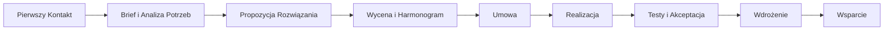

# Proces Współpracy z ECM Digital

## Wprowadzenie

W ECM Digital wierzymy, że sukces każdego projektu zależy od efektywnej współpracy między naszym zespołem a klientem. Wypracowaliśmy sprawdzone procesy, które zapewniają transparentność, wysoką jakość realizacji oraz terminowe dostarczanie projektów.

Nasz proces współpracy został dostosowany do specyfiki różnych typów projektów, zachowując jednocześnie spójne standardy komunikacji i zarządzania projektami.

## Ogólny Schemat Współpracy

### Kluczowe Zasady Współpracy

- **Transparentność** - Regularne raportowanie postępów i otwarta komunikacja
- **Elastyczność** - Dostosowanie procesu do specyfiki projektu i potrzeb klienta
- **Jakość** - Wieloetapowe testowanie i kontrola jakości na każdym etapie
- **Terminowość** - Dotrzymywanie ustalonych terminów i proaktywne zarządzanie ryzykiem
- **Partnerstwo** - Traktowanie klienta jako partnera w osiąganiu wspólnych celów

## Procesy dla Poszczególnych Usług

### [Strony Internetowe](strony-www/)
Szczegółowy proces tworzenia stron internetowych - od analizy potrzeb po wdrożenie i wsparcie.

### [Sklepy Shopify](sklepy-shopify/)
Kompleksowy proces budowy sklepów internetowych na platformie Shopify.

### [Prototypy MVP](prototypy-mvp/)
Zwinny proces tworzenia prototypów i produktów minimalnie wykonalnych.

### [Audyty UX](audyty-ux/)
Metodyczny proces przeprowadzania audytów użyteczności i doświadczenia użytkownika.

## Narzędzia Komunikacji

### Zarządzanie Projektami
- **Jira/Trello** - Śledzenie zadań i postępów
- **Slack/Microsoft Teams** - Bieżąca komunikacja
- **Zoom/Google Meet** - Spotkania i prezentacje

### Dokumentacja i Współpraca
- **Confluence/Notion** - Dokumentacja projektowa
- **Figma/Adobe XD** - Współpraca nad projektami
- **GitHub/GitLab** - Zarządzanie kodem

### Raportowanie
- **Cotygodniowe raporty** - Status projektu, postępy, następne kroki
- **Miesięczne przeglądy** - Analiza KPI, feedback, planowanie
- **Raporty na żądanie** - Szczegółowe analizy konkretnych aspektów

## Zarządzanie Zmianami

### Proces Zgłaszania Zmian
1. **Identyfikacja potrzeby** - Klient lub zespół identyfikuje potrzebę zmiany
2. **Analiza wpływu** - Ocena wpływu na zakres, czas i budżet
3. **Propozycja rozwiązania** - Przedstawienie opcji realizacji
4. **Akceptacja** - Formalne zatwierdzenie zmiany przez klienta
5. **Implementacja** - Realizacja zatwierdzonej zmiany

### Typy Zmian
- **Drobne modyfikacje** - Realizowane w ramach bieżącego zakresu
- **Średnie zmiany** - Wymagające analizy wpływu i akceptacji
- **Duże zmiany** - Mogące wpłynąć na harmonogram i budżet projektu

## Kontrola Jakości

### Wewnętrzne Procesy QA
- **Code Review** - Przegląd kodu przez senior developerów
- **Testy funkcjonalne** - Weryfikacja wszystkich funkcjonalności
- **Testy wydajnościowe** - Optymalizacja szybkości działania
- **Testy bezpieczeństwa** - Sprawdzenie zabezpieczeń

### Testy z Klientem
- **Testy UAT** - User Acceptance Testing z udziałem klienta
- **Feedback sessions** - Sesje zbierania opinii i uwag
- **Iteracyjne poprawki** - Wprowadzanie zmian na podstawie testów

## Wsparcie Posprzedażowe

### Okres Gwarancji
- **30 dni** - Bezpłatne poprawki błędów wykrytych po wdrożeniu
- **Szkolenia** - Przeszkolenie zespołu klienta z obsługi systemu
- **Dokumentacja** - Przekazanie kompletnej dokumentacji technicznej

### Długoterminowe Wsparcie
- **Pakiety wsparcia** - Różne poziomy wsparcia technicznego
- **Rozwój produktu** - Planowanie i realizacja kolejnych etapów
- **Konsultacje** - Doradztwo w zakresie rozwoju biznesu online

## Kontakt

Masz pytania dotyczące naszego procesu współpracy? Skontaktuj się z nami:

- **Email**: hello@ecm-digital.com
- **Telefon**: +48 535330323
- **Formularz kontaktowy**: [Skontaktuj się z nami](../kontakt/)

---

*Proces współpracy ECM Digital - Twój partner w realizacji projektów cyfrowych*