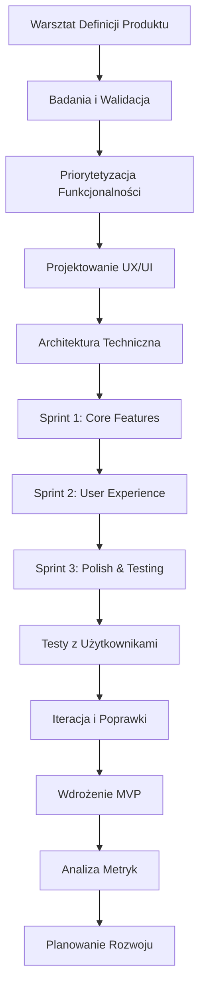

# Proces Tworzenia Prototypów MVP

## Wprowadzenie

Proces tworzenia prototypów MVP (Minimum Viable Product) w ECM Digital został zaprojektowany dla szybkiej walidacji pomysłów biznesowych. Stosujemy metodologie Lean Startup i Design Thinking, aby w krótkim czasie dostarczyć funkcjonalny produkt gotowy do testów z użytkownikami.

## Diagram Procesu

## Szczegółowy Opis Etapów

### 1. Warsztat Definicji Produktu (2-3 dni)

**Cel**: Zdefiniowanie wizji produktu, problemów użytkowników i hipotez biznesowych.

**Działania**:
- Design Thinking workshop
- Problem-Solution Fit
- Definicja Value Proposition
- Identyfikacja użytkowników docelowych
- Określenie success metrics

**Deliverables**:
- Product Vision Statement
- Problem Statement
- User Personas
- Value Proposition Canvas
- Success Metrics (KPI)

### 2. Badania i Walidacja (3-5 dni)

**Cel**: Walidacja założeń biznesowych i zrozumienie potrzeb użytkowników.

**Działania**:
- Wywiady z potencjalnymi użytkownikami
- Analiza konkurencji
- Badanie rynku docelowego
- Walidacja hipotez biznesowych
- Analiza feasibility technicznej

**Deliverables**:
- Raport z wywiadów użytkowników
- Analiza konkurencyjna
- Walidacja hipotez
- Technical feasibility study
- Rekomendacje strategiczne

### 3. Priorytetyzacja Funkcjonalności (1-2 dni)

**Cel**: Określenie minimalnego zestawu funkcjonalności dla MVP.

**Działania**:
- Tworzenie User Stories
- Mapowanie User Journey
- Priorytetyzacja MoSCoW
- Planowanie release'ów
- Oszacowanie effort'u

**Deliverables**:
- Product Backlog
- User Story Mapping
- MVP Feature Set
- Release Roadmap
- Effort Estimation###
 4. Projektowanie UX/UI (3-5 dni)

**Cel**: Stworzenie intuicyjnego interfejsu użytkownika dla MVP.

**Działania**:
- Tworzenie wireframes
- Projektowanie user flow
- Tworzenie prototypu interaktywnego
- Design system dla MVP
- Testowanie użyteczności

**Deliverables**:
- Wireframes kluczowych ekranów
- Interactive prototype
- UI Design System
- User Flow Diagrams
- Usability test results

### 5. Architektura Techniczna (2-3 dni)

**Cel**: Zaprojektowanie skalowalnej architektury technicznej.

**Działania**:
- Wybór stack'u technologicznego
- Projektowanie architektury systemu
- Planowanie bazy danych
- Strategia deployment'u
- Plan bezpieczeństwa

**Deliverables**:
- Technical Architecture Document
- Database Schema
- Technology Stack Decision
- Deployment Strategy
- Security Plan

### 6. Sprint 1: Core Features (1-2 tygodnie)

**Cel**: Implementacja podstawowych funkcjonalności MVP.

**Działania**:
- Setup środowiska deweloperskiego
- Implementacja core business logic
- Podstawowy interfejs użytkownika
- Integracja z bazą danych
- Podstawowe testy jednostkowe

**Deliverables**:
- Działające core features
- Basic UI implementation
- Database integration
- Unit tests
- Sprint demo

### 7. Sprint 2: User Experience (1-2 tygodnie)

**Cel**: Implementacja pełnego doświadczenia użytkownika.

**Działania**:
- Implementacja kompletnego UI
- User authentication
- Error handling
- Responsive design
- Integration testing

**Deliverables**:
- Complete UI implementation
- User management system
- Error handling
- Responsive interface
- Integration tests

### 8. Sprint 3: Polish & Testing (1 tydzień)

**Cel**: Finalizacja MVP i przygotowanie do testów użytkowników.

**Działania**:
- Bug fixing i optymalizacja
- Performance optimization
- Security testing
- User acceptance testing
- Deployment preparation

**Deliverables**:
- Polished MVP
- Performance optimizations
- Security audit
- UAT results
- Deployment ready version

### 9. Testy z Użytkownikami (3-5 dni)

**Cel**: Walidacja MVP z rzeczywistymi użytkownikami.

**Działania**:
- Rekrutacja testerów
- Przeprowadzenie sesji testowych
- Zbieranie feedbacku
- Analiza zachowań użytkowników
- Identyfikacja obszarów poprawy

**Deliverables**:
- User testing sessions
- Feedback compilation
- User behavior analysis
- Improvement recommendations
- Priority fixes list

### 10. Iteracja i Poprawki (3-5 dni)

**Cel**: Implementacja krytycznych poprawek na podstawie testów.

**Działania**:
- Priorytetyzacja feedbacku
- Implementacja krytycznych poprawek
- Dodatkowe testy
- Optymalizacja UX
- Przygotowanie do launch'u

**Deliverables**:
- Updated MVP version
- Critical fixes implemented
- Additional testing
- UX improvements
- Launch-ready product

### 11. Wdrożenie MVP (1-2 dni)

**Cel**: Uruchomienie MVP w środowisku produkcyjnym.

**Działania**:
- Deployment na serwer produkcyjny
- Konfiguracja monitoringu
- Setup analytics
- Przygotowanie dokumentacji
- Launch communication

**Deliverables**:
- Live MVP application
- Monitoring setup
- Analytics configuration
- User documentation
- Launch announcement

### 12. Analiza Metryk (ciągły proces)

**Cel**: Monitorowanie performance'u MVP i zbieranie danych.

**Działania**:
- Monitoring user engagement
- Analiza conversion rates
- Tracking key metrics
- User feedback collection
- Performance monitoring

**Deliverables**:
- Weekly metrics reports
- User engagement analysis
- Conversion tracking
- Feedback compilation
- Performance reports

### 13. Planowanie Rozwoju (1-2 dni)

**Cel**: Określenie kierunku dalszego rozwoju produktu.

**Działania**:
- Analiza wyników MVP
- Planowanie kolejnych features
- Roadmap development
- Resource planning
- Investment recommendations

**Deliverables**:
- MVP results analysis
- Product roadmap v2
- Feature prioritization
- Resource requirements
- Investment proposal

## Przykładowy Harmonogram

### MVP Standardowy (Web/Mobile App)
**Całkowity czas realizacji: 6-8 tygodni**

| Tydzień | Etapy | Zaangażowanie Klienta |
|---------|-------|----------------------|
| 1 | Warsztat, Badania, Priorytetyzacja | Wysoki - warsztaty, wywiady |
| 2 | UX/UI Design, Architektura | Średni - feedback na prototypy |
| 3-4 | Sprint 1 & 2: Development | Niski - cotygodniowe demo |
| 5 | Sprint 3, Testy użytkowników | Wysoki - testy UAT |
| 6 | Iteracja, Wdrożenie | Średni - akceptacja zmian |
| 7-8 | Analiza, Planowanie rozwoju | Wysoki - strategia rozwoju |

### MVP Zaawansowany (Platform/SaaS)
**Całkowity czas realizacji: 8-12 tygodni**

| Faza | Czas | Opis |
|------|------|------|
| Discovery & Design | 2-3 tygodnie | Badania, projektowanie |
| Development | 4-6 tygodni | 3-4 sprinty rozwoju |
| Testing & Launch | 2-3 tygodnie | Testy, iteracja, wdrożenie |
| Analysis & Planning | 1 tydzień | Analiza wyników, roadmap |

## Metodologie i Frameworki

### Lean Startup
- **Build-Measure-Learn** - Cykl iteracyjny
- **Validated Learning** - Nauka oparta na danych
- **Innovation Accounting** - Metryki dla startupów
- **Pivot or Persevere** - Decyzje strategiczne

### Design Thinking
- **Empathize** - Zrozumienie użytkowników
- **Define** - Definicja problemu
- **Ideate** - Generowanie rozwiązań
- **Prototype** - Szybkie prototypowanie
- **Test** - Testowanie z użytkownikami

### Agile/Scrum
- **Sprinty 1-2 tygodniowe** - Krótkie iteracje
- **Daily standups** - Codzienne synchronizacje
- **Sprint reviews** - Prezentacje postępów
- **Retrospectives** - Ciągłe doskonalenie

## Kluczowe Metryki MVP

### Product-Market Fit Metrics
- **Net Promoter Score (NPS)** - Satysfakcja użytkowników
- **Product-Market Fit Score** - Dopasowanie do rynku
- **Customer Satisfaction (CSAT)** - Zadowolenie klientów
- **Feature Usage** - Wykorzystanie funkcjonalności

### Business Metrics
- **Customer Acquisition Cost (CAC)** - Koszt pozyskania klienta
- **Lifetime Value (LTV)** - Wartość życiowa klienta
- **Monthly Recurring Revenue (MRR)** - Miesięczne przychody
- **Churn Rate** - Wskaźnik odejść

### Technical Metrics
- **Page Load Time** - Szybkość ładowania
- **Uptime** - Dostępność systemu
- **Error Rate** - Częstotliwość błędów
- **API Response Time** - Czas odpowiedzi API## Stack
 Technologiczny dla MVP

### Frontend
- **React/Vue.js** - Szybki development UI
- **Next.js/Nuxt.js** - Full-stack frameworks
- **Tailwind CSS** - Rapid styling
- **TypeScript** - Type safety

### Backend
- **Node.js/Express** - Szybki development API
- **Python/FastAPI** - Data-heavy applications
- **Firebase/Supabase** - Backend-as-a-Service
- **Serverless** - AWS Lambda, Vercel Functions

### Database
- **PostgreSQL** - Relational data
- **MongoDB** - Document-based
- **Firebase Firestore** - Real-time database
- **Redis** - Caching i sessions

### Hosting & Deployment
- **Vercel/Netlify** - Frontend hosting
- **Railway/Render** - Full-stack deployment
- **AWS/Google Cloud** - Scalable infrastructure
- **Docker** - Containerization

## Kluczowe Punkty Kontrolne

### Milestone 1: Product Definition
- Zatwierdzona wizja produktu
- Zwalidowane hipotezy biznesowe
- Określone success metrics

### Milestone 2: Design & Architecture
- Zatwierdzony prototyp interaktywny
- Określona architektura techniczna
- Priorytetyzacja funkcjonalności

### Milestone 3: Core MVP
- Działające podstawowe funkcjonalności
- Zaimplementowany core user flow
- Podstawowe testy przeprowadzone

### Milestone 4: Complete MVP
- Pełna funkcjonalność MVP
- Pozytywne testy użytkowników
- Gotowość do wdrożenia

### Milestone 5: Launch & Analysis
- Wdrożony MVP w produkcji
- Skonfigurowane metryki
- Plan dalszego rozwoju

## Komunikacja i Raportowanie

### Daily Standups (podczas sprintów)
- Co zostało zrobione wczoraj
- Co będzie robione dzisiaj
- Jakie są blokery

### Sprint Reviews (co 1-2 tygodnie)
- Demo nowych funkcjonalności
- Feedback od stakeholderów
- Planowanie następnego sprintu

### Weekly Reports
- Postęp względem roadmapy
- Kluczowe metryki
- Ryzyka i mitigation plans
- Następne kroki

### Narzędzia Współpracy
- **Figma** - Design collaboration
- **Jira/Linear** - Task management
- **Slack/Discord** - Team communication
- **Loom** - Async video updates
- **GitHub** - Code collaboration

## Wsparcie Post-MVP

### Immediate Support (30 dni)
- Bug fixes i critical issues
- Performance monitoring
- User support
- Basic analytics setup

### Growth Phase Support
- Feature development
- A/B testing
- Performance optimization
- Scaling infrastructure

### Long-term Partnership
- Product strategy consulting
- Technical architecture evolution
- Team augmentation
- Fundraising support

## Typowe Wyzwania i Rozwiązania

### Scope Creep
- **Problem**: Rozrastanie się zakresu MVP
- **Rozwiązanie**: Sztywne trzymanie się MVP definition

### Technical Debt
- **Problem**: Szybki development vs. jakość kodu
- **Rozwiązanie**: Balansowanie speed vs. maintainability

### User Feedback Overload
- **Problem**: Za dużo feedbacku do implementacji
- **Rozwiązanie**: Priorytetyzacja oparta na impact vs. effort

### Market Timing
- **Problem**: Za wczesne lub za późne wejście na rynek
- **Rozwiązanie**: Continuous market validation

## Success Stories

### FinTech Payment App
- **Timeline**: 8 tygodni
- **Result**: 1000+ early adopters w pierwszym miesiącu
- **Key Learning**: Prostota UX kluczowa w fintech

### EdTech Learning Platform
- **Timeline**: 10 tygodni
- **Result**: Partnership z 3 szkołami w pierwszym kwartale
- **Key Learning**: Teacher feedback równie ważny jak student feedback

### HealthTech Telemedicine
- **Timeline**: 12 tygodni
- **Result**: 500+ konsultacji w pierwszych 2 miesiącach
- **Key Learning**: Compliance requirements muszą być w MVP

## Cennik MVP

### MVP Basic (4-6 tygodni)
- **Zakres**: Simple web/mobile app
- **Team**: 2-3 developers + designer
- **Cena**: €15,000 - €25,000

### MVP Standard (6-8 tygodni)
- **Zakres**: Complex web app z integracjami
- **Team**: 3-4 developers + designer + PM
- **Cena**: €25,000 - €40,000

### MVP Premium (8-12 tygodni)
- **Zakres**: Platform/SaaS z custom features
- **Team**: 4-6 developers + designer + PM
- **Cena**: €40,000 - €70,000

### MVP Enterprise (10-16 tygodni)
- **Zakres**: Enterprise solution z compliance
- **Team**: 6+ developers + architect + PM
- **Cena**: €70,000+

---

*Proces tworzenia prototypów MVP ECM Digital - Od pomysłu do działającego produktu w 6-8 tygodni*