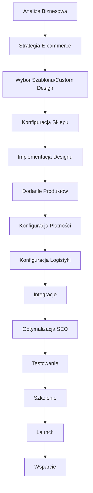

# Proces Tworzenia Sklepów Shopify

## Wprowadzenie

Proces tworzenia sklepów internetowych na platformie Shopify w ECM Digital został zoptymalizowany dla maksymalizacji konwersji i efektywności sprzedaży online. Łączymy najlepsze praktyki e-commerce z możliwościami platformy Shopify.

## Diagram Procesu

## Szczegółowy Opis Etapów

### 1. Analiza Biznesowa (2-3 dni)

**Cel**: Zrozumienie modelu biznesowego, produktów i strategii sprzedaży.

**Działania**:
- Analiza modelu biznesowego
- Badanie grupy docelowej
- Analiza konkurencji
- Określenie celów sprzedażowych
- Planowanie struktury produktów

**Deliverables**:
- Dokument analizy biznesowej
- Analiza konkurencji
- Buyer personas
- Strategia produktowa
- KPI i cele sprzedażowe

### 2. Strategia E-commerce (1-2 dni)

**Cel**: Opracowanie strategii sprzedaży online i customer journey.

**Działania**:
- Mapowanie ścieżki klienta
- Strategia konwersji
- Planowanie kampanii marketingowych
- Strategia retention
- Planowanie cross-sell/up-sell

**Deliverables**:
- Customer journey map
- Strategia konwersji
- Plan marketingowy
- Strategia retention
- Roadmapa rozwoju

### 3. Wybór Szablonu/Custom Design (2-4 dni)

**Cel**: Określenie podejścia wizualnego - szablon premium vs custom design.

**Działania**:
- Analiza dostępnych szablonów
- Ocena potrzeb customizacji
- Projektowanie custom elementów
- Przygotowanie brandingu
- Planowanie responsywności

**Deliverables**:
- Wybrany szablon lub custom design
- Branding guidelines
- Mockupy kluczowych stron
- Plan customizacji
- Specyfikacja techniczna### 
4. Konfiguracja Sklepu (1-2 dni)

**Cel**: Podstawowa konfiguracja sklepu Shopify i ustawienia administracyjne.

**Działania**:
- Utworzenie konta Shopify
- Konfiguracja podstawowych ustawień
- Ustawienie podatków i walut
- Konfiguracja stref wysyłki
- Ustawienie polityk sklepu

**Deliverables**:
- Skonfigurowany sklep Shopify
- Ustawienia administracyjne
- Polityki sklepu
- Konfiguracja podatków
- Strefy wysyłkowe

### 5. Implementacja Designu (3-7 dni)

**Cel**: Wdrożenie projektu wizualnego i customizacja szablonu.

**Działania**:
- Instalacja i konfiguracja szablonu
- Customizacja Liquid templates
- Implementacja custom CSS/JS
- Optymalizacja responsywności
- Integracja brandingu

**Deliverables**:
- Zaimplementowany design
- Custom kod Liquid
- Responsywny interfejs
- Zintegrowany branding
- Dokumentacja zmian

### 6. Dodanie Produktów (2-5 dni)

**Cel**: Import i konfiguracja katalogu produktów.

**Działania**:
- Import produktów z plików CSV
- Optymalizacja zdjęć produktów
- Konfiguracja wariantów
- Ustawienie kategorii i kolekcji
- Optymalizacja opisów SEO

**Deliverables**:
- Kompletny katalog produktów
- Zoptymalizowane zdjęcia
- Skonfigurowane warianty
- Struktura kategorii
- Opisy SEO-friendly

### 7. Konfiguracja Płatności (1-2 dni)

**Cel**: Integracja systemów płatności i konfiguracja bramek.

**Działania**:
- Konfiguracja Shopify Payments
- Integracja dodatkowych bramek
- Ustawienie walut i kursów
- Konfiguracja podatków
- Testowanie płatności

**Deliverables**:
- Działające bramki płatności
- Konfiguracja walut
- Ustawienia podatkowe
- Testy transakcji
- Dokumentacja płatności

### 8. Konfiguracja Logistyki (1-3 dni)

**Cel**: Ustawienie opcji wysyłki i integracji z kurierami.

**Działania**:
- Konfiguracja stref wysyłki
- Integracja z kurierami
- Ustawienie kosztów dostawy
- Konfiguracja punktów odbioru
- Automatyzacja etykiet

**Deliverables**:
- Skonfigurowane opcje wysyłki
- Integracje kurierskie
- Kalkulatory kosztów
- Punkty odbioru
- Automatyzacja logistyki

### 9. Integracje (2-4 dni)

**Cel**: Połączenie z zewnętrznymi systemami i narzędziami.

**Działania**:
- Integracja z Google Analytics
- Konfiguracja Facebook Pixel
- Integracja z email marketingiem
- Połączenie z CRM
- Integracja z systemami magazynowymi

**Deliverables**:
- Działające integracje
- Konfiguracja analityki
- Tracking konwersji
- Automatyzacja marketingu
- Synchronizacja danych

### 10. Optymalizacja SEO (2-3 dni)

**Cel**: Optymalizacja sklepu pod kątem wyszukiwarek.

**Działania**:
- Optymalizacja meta tagów
- Konfiguracja URL-i
- Implementacja schema markup
- Optymalizacja szybkości
- Konfiguracja sitemap

**Deliverables**:
- Zoptymalizowane meta tagi
- SEO-friendly URL-e
- Schema markup
- Szybki sklep
- Sitemap XML

### 11. Testowanie (3-5 dni)

**Cel**: Kompleksowe testowanie funkcjonalności sklepu.

**Działania**:
- Testy procesu zakupowego
- Testowanie płatności
- Testy responsywności
- Testowanie integracji
- Testy wydajnościowe

**Deliverables**:
- Raport z testów
- Lista poprawek
- Zoptymalizowany sklep
- Dokumentacja testów
- Akceptacja klienta

### 12. Szkolenie (1-2 dni)

**Cel**: Przeszkolenie zespołu klienta z obsługi sklepu Shopify.

**Działania**:
- Szkolenie z panelu administracyjnego
- Zarządzanie produktami
- Obsługa zamówień
- Analityka i raporty
- Marketing i promocje

**Deliverables**:
- Materiały szkoleniowe
- Instrukcje obsługi
- Dostęp do panelu
- Plan wsparcia
- Kontakty techniczne

### 13. Launch (1 dzień)

**Cel**: Oficjalne uruchomienie sklepu.

**Działania**:
- Przełączenie na plan płatny
- Konfiguracja domeny
- Ostateczne testy
- Monitoring launch'u
- Komunikacja o uruchomieniu

**Deliverables**:
- Działający sklep
- Skonfigurowana domena
- Monitoring działania
- Plan promocji launch'u
- Dokumentacja wdrożenia

### 14. Wsparcie (30 dni gwarancji)

**Cel**: Zapewnienie bezproblemowego działania po uruchomieniu.

**Działania**:
- Monitoring sprzedaży
- Wsparcie techniczne
- Optymalizacja konwersji
- Analiza wyników
- Planowanie rozwoju

**Deliverables**:
- Raport z pierwszego miesiąca
- Optymalizacje konwersji
- Analiza sprzedaży
- Rekomendacje rozwoju
- Plan długoterminowego wsparcia#
# Przykładowy Harmonogram

### Sklep Standardowy (Szablon Premium + Customizacja)
**Całkowity czas realizacji: 4-6 tygodni**

| Tydzień | Etapy | Zaangażowanie Klienta |
|---------|-------|----------------------|
| 1 | Analiza, Strategia, Wybór szablonu | Wysoki - warsztaty, decyzje |
| 2 | Konfiguracja, Implementacja designu | Średni - feedback na design |
| 3 | Produkty, Płatności, Logistyka | Wysoki - dostarczenie danych |
| 4 | Integracje, SEO, Testowanie | Średni - testy UAT |
| 5-6 | Szkolenie, Launch, Wsparcie | Wysoki - szkolenia, monitoring |

### Sklep Zaawansowany (Custom Design + Integracje)
**Całkowity czas realizacji: 6-10 tygodni**

| Faza | Czas | Opis |
|------|------|------|
| Strategia i Design | 2-3 tygodnie | Analiza, custom design |
| Implementacja | 3-4 tygodnie | Rozwój funkcjonalności |
| Integracje i Testy | 2-2 tygodnie | Systemy zewnętrzne, testy |
| Launch i Wsparcie | 1 tydzień | Uruchomienie, szkolenia |

### Sklep Enterprise (B2B + Custom Apps)
**Całkowity czas realizacji: 8-12 tygodni**

| Faza | Czas | Opis |
|------|------|------|
| Analiza i Architektura | 2-3 tygodnie | Szczegółowa analiza B2B |
| Custom Development | 4-6 tygodni | Aplikacje, integracje |
| Testowanie i Optymalizacja | 2-3 tygodnie | Kompleksowe testy |
| Wdrożenie i Wsparcie | 1 tydzień | Launch enterprise |

## Kluczowe Punkty Kontrolne

### Milestone 1: Strategia E-commerce
- Zatwierdzona strategia biznesowa
- Wybrane podejście techniczne
- Określone cele sprzedażowe

### Milestone 2: Design i Konfiguracja
- Zatwierdzony design sklepu
- Skonfigurowana podstawa techniczna
- Przygotowane zasoby produktowe

### Milestone 3: Funkcjonalności Core
- Działający proces zakupowy
- Skonfigurowane płatności i logistyka
- Zaimportowane produkty

### Milestone 4: Integracje i Optymalizacja
- Działające integracje zewnętrzne
- Zoptymalizowane SEO
- Przeprowadzone testy

### Milestone 5: Launch Ready
- Pozytywne testy UAT
- Przeszkolony zespół klienta
- Gotowość do uruchomienia

## Specyficzne Wymagania Shopify

### Limity i Ograniczenia
- **Produkty**: Do 10,000 produktów (plan Basic)
- **Warianty**: Maksymalnie 100 wariantów na produkt
- **Pliki**: Limit 20MB na plik
- **Bandwidth**: Unlimited w planach płatnych

### Najlepsze Praktyki
- **Optymalizacja obrazów**: WebP, kompresja
- **Szybkość ładowania**: Minimalizacja kodu, CDN
- **Mobile-first**: Responsywny design
- **SEO**: Structured data, meta tagi
- **Konwersja**: A/B testing, optymalizacja checkout

### Koszty Dodatkowe
- **Plan Shopify**: Od $29/miesiąc
- **Aplikacje**: $0-$500/miesiąc
- **Szablon premium**: $100-$350
- **Custom development**: Według wyceny
- **Prowizje transakcyjne**: 2.4-2.9% + 30¢

## Komunikacja i Raportowanie

### Cotygodniowe Raporty
- Postęp implementacji
- Status integracji
- Wyniki testów
- Następne kroki

### Kluczowe Spotkania
- **E-commerce Strategy Workshop** - Strategia sprzedaży
- **Design Review** - Przegląd projektu
- **Product Import Session** - Import produktów
- **UAT Testing** - Testy z klientem
- **Launch Planning** - Przygotowanie uruchomienia

### Narzędzia Współpracy
- **Shopify Partner Dashboard** - Dostęp do sklepu
- **Figma/Adobe XD** - Projekty i mockupy
- **Slack/Teams** - Bieżąca komunikacja
- **Google Sheets** - Dane produktowe
- **Loom** - Nagrania instruktażowe

## Wsparcie Posprzedażowe

### Pakiety Wsparcia Shopify
- **Basic**: Wsparcie techniczne, aktualizacje
- **Growth**: Optymalizacja konwersji, A/B testy
- **Scale**: Rozwój funkcjonalności, integracje

### Usługi Dodatkowe
- **Shopify Plus Migration** - Przejście na plan enterprise
- **Custom Apps Development** - Dedykowane aplikacje
- **Marketing Automation** - Integracje marketingowe
- **Performance Optimization** - Optymalizacja wydajności

---

*Proces tworzenia sklepów Shopify ECM Digital - Maksymalizujemy Twoją sprzedaż online*