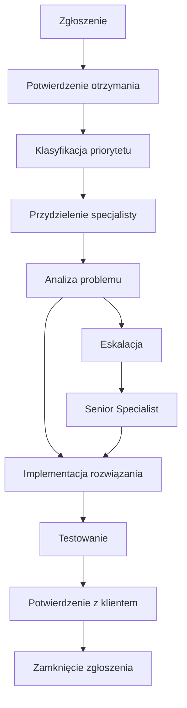

# Gwarancje Poziomu Usług (SLA) - ECM Digital

## Wprowadzenie

Service Level Agreement (SLA) to formalna umowa określająca standardy jakości usług wsparcia i utrzymania oferowanych przez ECM Digital. Dokument ten precyzyjnie definiuje nasze zobowiązania wobec klientów oraz procedury postępowania w różnych sytuacjach.

## Parametry SLA według Pakietów

### Tabela Porównawcza SLA

| Parametr | Basic | Standard | Premium |
|---|---|---|---|
| **Czas reakcji na zgłoszenie** | 48h | 24h | 4h |
| **Czas reakcji - awaria krytyczna** | 48h | 24h | 2h |
| **Godziny wsparcia** | Pn-Pt 8:00-16:00 | Pn-Pt 8:00-18:00 | 24/7 (krytyczne) |
| **Gwarancja dostępności** | 99.0% | 99.5% | 99.9% |
| **Maksymalny czas niedostępności/miesiąc** | 7.2h | 3.6h | 43min |
| **Czas rozwiązania - problem prosty** | 5 dni roboczych | 3 dni robocze | 1 dzień roboczy |
| **Czas rozwiązania - problem złożony** | 10 dni roboczych | 7 dni roboczych | 3 dni robocze |
| **Kanały komunikacji** | Email | Email + Telefon | Email + Telefon + Slack |
| **Język wsparcia** | PL, EN | PL, EN | PL, EN |
| **Eskalacja** | Poziom 2 | Poziom 3 | Poziom 4 |

---

## Definicje i Klasyfikacja

### Klasyfikacja Priorytetów Zgłoszeń

#### 🔴 Priorytet Krytyczny (P1)
**Definicja**: Całkowita niedostępność usługi lub utrata danych
**Przykłady**:
- Strona/aplikacja całkowicie niedostępna
- Utrata danych lub backup
- Naruszenie bezpieczeństwa
- Awaria płatności w sklepie online

**SLA**:
- Basic: Reakcja 48h, rozwiązanie 5 dni
- Standard: Reakcja 24h, rozwiązanie 3 dni  
- Premium: Reakcja 2h, rozwiązanie 24h

#### 🟡 Priorytet Wysoki (P2)
**Definicja**: Znaczące ograniczenie funkcjonalności
**Przykłady**:
- Wolne ładowanie strony (>5s)
- Niefunkcjonujące formularze
- Problemy z SEO
- Błędy w wyświetlaniu na urządzeniach mobilnych

**SLA**:
- Basic: Reakcja 48h, rozwiązanie 7 dni
- Standard: Reakcja 24h, rozwiązanie 5 dni
- Premium: Reakcja 4h, rozwiązanie 2 dni

#### 🟢 Priorytet Średni (P3)
**Definicja**: Drobne problemy nie wpływające na funkcjonalność
**Przykłady**:
- Drobne błędy wizualne
- Aktualizacje treści
- Optymalizacje wydajności
- Instalacja wtyczek

**SLA**:
- Basic: Reakcja 48h, rozwiązanie 10 dni
- Standard: Reakcja 24h, rozwiązanie 7 dni
- Premium: Reakcja 4h, rozwiązanie 3 dni

#### 🔵 Priorytet Niski (P4)
**Definicja**: Zapytania informacyjne i konsultacje
**Przykłady**:
- Pytania o funkcjonalności
- Konsultacje techniczne
- Prośby o dokumentację
- Planowanie rozwoju

**SLA**:
- Basic: Reakcja 48h, rozwiązanie według uzgodnień
- Standard: Reakcja 24h, rozwiązanie według uzgodnień
- Premium: Reakcja 4h, rozwiązanie według uzgodnień

### Definicja Dostępności

**Dostępność** = (Całkowity czas - Czas niedostępności) / Całkowity czas × 100%

**Planowane przerwy** (maintenance) nie są wliczane do czasu niedostępności, pod warunkiem:
- Powiadomienie minimum 48h wcześniej
- Wykonanie w godzinach o najmniejszym ruchu
- Czas trwania nie dłuższy niż 4h miesięcznie

---

## Procedury Wsparcia

### Proces Zgłaszania Problemów

#### 1. Kanały Zgłoszeń
- **Email**: wsparcie@ecmdigital.pl (wszystkie pakiety)
- **Telefon**: +48 123 456 789 (Standard, Premium)
- **Formularz online**: [Portal wsparcia](https://support.ecmdigital.pl)
- **Slack/Teams**: Tylko pakiet Premium

#### 2. Informacje Wymagane w Zgłoszeniu
- Opis problemu
- Kroki do reprodukcji
- Zrzuty ekranu (jeśli dotyczy)
- Priorytet według oceny klienta
- Dane kontaktowe
- URL strony/aplikacji

#### 3. Potwierdzenie Zgłoszenia
- Automatyczne potwierdzenie otrzymania (do 15 minut)
- Nadanie numeru zgłoszenia (ticket ID)
- Wstępna klasyfikacja priorytetu
- Przydzielenie do odpowiedniego specjalisty

### Proces Rozwiązywania Problemów

### Procedura Eskalacji

#### Poziom 1: First Line Support
- Podstawowe problemy techniczne
- Aktualizacje treści
- Standardowe konfiguracje

#### Poziom 2: Technical Support
- Złożone problemy techniczne
- Integracje i customizacje
- Problemy wydajnościowe

#### Poziom 3: Senior Technical Support
- Krytyczne awarie systemu
- Problemy bezpieczeństwa
- Architekturalne zmiany

#### Poziom 4: Management Escalation (Premium)
- Problemy biznesowe
- Konflikty SLA
- Strategiczne decyzje

### Komunikacja i Raportowanie

#### Częstotliwość Komunikacji
- **P1 (Krytyczny)**: Co 2h do rozwiązania
- **P2 (Wysoki)**: Codziennie
- **P3 (Średni)**: Co 2 dni robocze
- **P4 (Niski)**: Tygodniowo

#### Raporty Statusu
- **Basic**: Na żądanie
- **Standard**: Miesięczne podsumowanie
- **Premium**: Miesięczne raporty + alerty w czasie rzeczywistym

---

## Gwarancje i Rekompensaty

### Gwarancja Dostępności

#### Rekompensaty za Niedotrzymanie SLA Dostępności

| Dostępność Rzeczywista | Basic | Standard | Premium |
|---|---|---|---|
| 98.0% - 98.9% | - | 10% zwrotu | 15% zwrotu |
| 97.0% - 97.9% | - | 25% zwrotu | 30% zwrotu |
| 96.0% - 96.9% | 10% zwrotu | 50% zwrotu | 50% zwrotu |
| < 96.0% | 25% zwrotu | 100% zwrotu | 100% zwrotu |

### Gwarancja Czasów Reakcji

#### Rekompensaty za Opóźnienia w Reakcji

| Opóźnienie | Rekompensata |
|---|---|
| 2x SLA | 10% zwrotu za miesiąc |
| 3x SLA | 25% zwrotu za miesiąc |
| 5x SLA | 50% zwrotu za miesiąc |

### Warunki Rekompensaty
- Rekompensata w formie kredytu na kolejne miesiące
- Maksymalna rekompensata: 100% opłaty miesięcznej
- Wyłączenia: siła wyższa, ataki DDoS, problemy po stronie klienta
- Zgłoszenie rekompensaty w ciągu 30 dni

---

## Wyłączenia z SLA

### Przypadki Wyłączone z Gwarancji

#### Siła Wyższa
- Klęski żywiołowe
- Ataki terrorystyczne
- Wojny i konflikty zbrojne
- Pandemie i epidemie

#### Problemy Zewnętrzne
- Awarie dostawców internetu
- Problemy z DNS
- Ataki DDoS przekraczające ochronę
- Awarie centrów danych

#### Problemy po Stronie Klienta
- Nieprawidłowe konfiguracje wprowadzone przez klienta
- Instalacja nieautoryzowanego oprogramowania
- Przekroczenie limitów zasobów
- Niepłacenie faktur

#### Planowane Przerwy
- Maintenance z 48h wyprzedzeniem
- Aktualizacje bezpieczeństwa
- Migracje i ulepszenia infrastruktury
- Maksymalnie 4h miesięcznie

---

## Monitoring i Metryki

### Narzędzia Monitoringu

#### Dostępność
- **Pingdom**: Monitoring z 5 lokalizacji globalnych
- **UptimeRobot**: Backup monitoring
- **StatusPage**: Publiczny status serwisów

#### Wydajność
- **New Relic**: Monitoring aplikacji
- **Google PageSpeed**: Analiza wydajności
- **GTmetrix**: Szczegółowe raporty ładowania

#### Bezpieczeństwo
- **Sucuri**: Monitoring malware i zagrożeń
- **Wordfence**: Ochrona WordPress
- **SSL Labs**: Monitoring certyfikatów

### Publiczny Status Page

Dostępny pod adresem: [status.ecmdigital.pl](https://status.ecmdigital.pl)

**Zawiera**:
- Aktualny status wszystkich serwisów
- Historia incydentów
- Planowane maintenance
- Metryki dostępności w czasie rzeczywistym

---

## FAQ - Najczęściej Zadawane Pytania

### Ogólne

**Q: Czy SLA obowiązuje od pierwszego dnia?**
A: Tak, SLA obowiązuje od momentu aktywacji pakietu wsparcia.

**Q: Jak zgłosić problem w weekend?**
A: Pakiet Premium: telefon 24/7 dla krytycznych. Pozostałe: email, odpowiedź w pierwszy dzień roboczy.

**Q: Czy mogę zmienić priorytet zgłoszenia?**
A: Tak, ale ostateczną klasyfikację ustala nasz zespół na podstawie wpływu na biznes.

### Techniczne

**Q: Co się dzieje, gdy przekroczę limit zasobów?**
A: Otrzymasz powiadomienie i propozycję upgrade'u. Tymczasowo zwiększymy limity.

**Q: Czy backup jest testowany?**
A: Standard i Premium: tak, miesięcznie. Basic: na żądanie.

**Q: Jak długo przechowujecie backup?**
A: Basic: 3 miesiące, Standard: 6 miesięcy, Premium: 12 miesięcy.

### Finansowe

**Q: Kiedy mogę ubiegać się o rekompensatę?**
A: W ciągu 30 dni od incydentu, po przesłaniu szczegółowego raportu.

**Q: Czy rekompensata to zwrot pieniędzy?**
A: Nie, to kredyt na kolejne miesiące wsparcia.

**Q: Czy są dodatkowe opłaty za przekroczenie SLA?**
A: Nie, nie pobieramy dodatkowych opłat. Oferujemy rekompensaty za niedotrzymanie.

---

## Kontakt ws. SLA

### Zespół SLA Management
- **Email**: sla@ecmdigital.pl
- **Telefon**: +48 123 456 789 (wew. 2)
- **Godziny**: Poniedziałek-Piątek 8:00-18:00

### Eskalacja SLA
W przypadku problemów z dotrzymaniem SLA:
1. Skontaktuj się z zespołem SLA Management
2. Przedstaw szczegóły problemu i oczekiwania
3. Otrzymasz odpowiedź w ciągu 4h roboczych
4. Plan naprawczy w ciągu 24h

### Przeglądy SLA
- **Miesięczne**: Automatyczne raporty dla wszystkich klientów
- **Kwartalne**: Szczegółowa analiza i optymalizacja (Premium)
- **Roczne**: Przegląd i aktualizacja warunków SLA

---

## Aktualizacje SLA

**Wersja**: 2.1  
**Data ostatniej aktualizacji**: 15 stycznia 2024  
**Następny przegląd**: 15 lipca 2024

### Historia Zmian
- **v2.1** (15.01.2024): Dodano monitoring SSL, rozszerzono definicje priorytetów
- **v2.0** (01.09.2023): Wprowadzono pakiet Premium, nowe metryki dostępności
- **v1.5** (15.03.2023): Aktualizacja czasów reakcji, dodano procedury eskalacji
- **v1.0** (01.01.2023): Pierwsza wersja SLA

---

*ECM Digital - Gwarancja jakości na najwyższym poziomie*