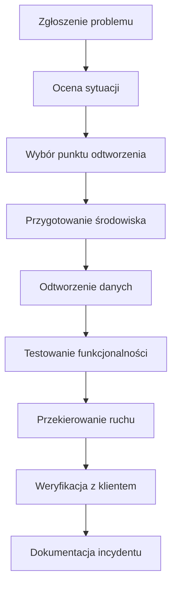
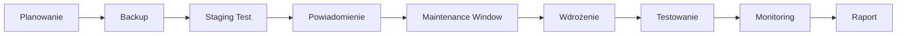

# Utrzymanie Techniczne - ECM Digital

## Wprowadzenie

Utrzymanie techniczne to kluczowy element zapewniający długoterminową stabilność, bezpieczeństwo i wydajność Twojego rozwiązania cyfrowego. W ECM Digital oferujemy kompleksowe usługi utrzymania technicznego, które obejmują monitoring, aktualizacje, backup, optymalizację oraz proaktywne zarządzanie infrastrukturą.

Nasze podejście do utrzymania technicznego opiera się na trzech filarach:
- **Proaktywność** - zapobiegamy problemom zanim wystąpią
- **Automatyzacja** - minimalizujemy ryzyko błędu ludzkiego
- **Transparentność** - regularnie informujemy o stanie systemu

---

## Zakres Usług Utrzymania Technicznego

### 🔧 Monitoring i Bezpieczeństwo

#### Monitoring 24/7
- **Dostępność serwisu**: Sprawdzanie co 5-60 minut (zależnie od pakietu)
- **Wydajność**: Monitoring czasu odpowiedzi i ładowania stron
- **Zasoby serwera**: CPU, RAM, przestrzeń dyskowa, transfer
- **Bazy danych**: Wydajność zapytań, rozmiar, optymalizacja
- **SSL/TLS**: Ważność certyfikatów, konfiguracja bezpieczeństwa
- **Aplikacje mobilne**: Monitoring API, crash reporting, performance metrics
- **E-commerce**: Monitoring procesów płatności, dostępności koszyka, integracji

#### Bezpieczeństwo
- **Skanowanie malware**: Codzienne/tygodniowe/miesięczne (zależnie od pakietu)
- **Monitoring zagrożeń**: Analiza logów pod kątem podejrzanej aktywności
- **Firewall**: Konfiguracja i zarządzanie regułami bezpieczeństwa
- **Aktualizacje bezpieczeństwa**: Natychmiastowe wdrażanie krytycznych łatek
- **Penetration testing**: Kwartalne testy bezpieczeństwa (Premium)

#### Alerty i Powiadomienia
- **Email**: Powiadomienia o problemach i statusie
- **SMS**: Alerty krytyczne (Standard, Premium)
- **Slack/Teams**: Integracja z narzędziami komunikacji (Premium)
- **Dashboard**: Dostęp do panelu monitoringu w czasie rzeczywistym

### 💾 Backup i Odtwarzanie

#### Strategie Backup

**Pakiet Basic**:
- Miesięczny backup pełny
- Przechowywanie przez 3 miesiące
- Lokalizacja: Europa
- Odtwarzanie: 48h

**Pakiet Standard**:
- Tygodniowy backup pełny + codzienny przyrostowy
- Przechowywanie przez 6 miesięcy
- Lokalizacja: Europa + USA
- Testowanie backupów: miesięcznie
- Odtwarzanie: 24h

**Pakiet Premium**:
- Codzienny backup pełny + backup w czasie rzeczywistym
- Przechowywanie przez 12 miesięcy
- Lokalizacja: Europa + USA + Azja
- Automatyczne testowanie backupów
- Point-in-time recovery
- Odtwarzanie: 4h

#### Procedury Odtwarzania



#### Typy Backup
- **Pełny**: Kompletna kopia wszystkich danych
- **Przyrostowy**: Tylko zmiany od ostatniego backup
- **Różnicowy**: Zmiany od ostatniego backup pełnego
- **Snapshot**: Migawka systemu w określonym momencie
- **Replikacja**: Synchronizacja w czasie rzeczywistym

### ⚡ Optymalizacja Wydajności

#### Monitoring Wydajności
- **Core Web Vitals**: LCP, FID, CLS
- **Time to First Byte (TTFB)**: Czas odpowiedzi serwera
- **Page Load Time**: Całkowity czas ładowania
- **Database Performance**: Analiza wolnych zapytań
- **Resource Usage**: Wykorzystanie CPU, RAM, I/O

#### Optymalizacje
- **Cache'owanie**: Konfiguracja cache na różnych poziomach
- **CDN**: Content Delivery Network dla statycznych zasobów
- **Kompresja**: Gzip/Brotli dla plików tekstowych
- **Minifikacja**: CSS, JavaScript, HTML
- **Optymalizacja obrazów**: WebP, lazy loading, responsive images
- **Database tuning**: Optymalizacja zapytań i indeksów

#### Narzędzia Optymalizacji
- **Redis/Memcached**: Cache w pamięci
- **Varnish**: HTTP accelerator
- **Cloudflare**: CDN i optymalizacja
- **ImageOptim**: Automatyczna optymalizacja obrazów
- **Critical CSS**: Inline krytycznego CSS

### 🔄 Aktualizacje i Maintenance

#### Harmonogram Aktualizacji

**Aktualizacje Krytyczne (Bezpieczeństwo)**:
- Wdrażanie: Natychmiast po wydaniu
- Testowanie: Na środowisku staging
- Powiadomienie: Po wdrożeniu
- Rollback: Dostępny w ciągu 1h

**Aktualizacje Standardowe**:
- Harmonogram: Pierwszy wtorek miesiąca
- Testowanie: 48h na staging
- Powiadomienie: 7 dni wcześniej
- Okno maintenance: 2:00-6:00 (minimalne obciążenie)

**Aktualizacje Główne (Major)**:
- Planowanie: Kwartalne
- Testowanie: 2 tygodnie na staging
- Powiadomienie: 30 dni wcześniej
- Konsultacje z klientem: Obowiązkowe

#### Procedura Aktualizacji



#### Typy Aktualizacji
- **System operacyjny**: Kernel, biblioteki systemowe
- **Serwer WWW**: Apache, Nginx, IIS
- **Bazy danych**: MySQL, PostgreSQL, MongoDB
- **Języki programowania**: PHP, Node.js, Python
- **CMS/Framework**: WordPress, Drupal, Laravel
- **Wtyczki/Moduły**: Rozszerzenia i dodatki
- **Certyfikaty SSL**: Automatyczne odnowienie

### 📊 Raportowanie i Analityka

#### Raporty Miesięczne

**Pakiet Basic**:
- Podstawowe metryki dostępności
- Podsumowanie wykonanych prac
- Rekomendacje (jeśli występują problemy)

**Pakiet Standard**:
- Szczegółowe metryki wydajności
- Analiza trendów
- Podsumowanie aktualizacji i zmian
- Plan działań na kolejny miesiąc

**Pakiet Premium**:
- Kompleksowa analiza biznesowa
- Benchmarking z konkurencją
- Prognozy i rekomendacje rozwoju
- Executive summary dla zarządu
- Custom metryki i KPI

#### Przykładowy Raport Miesięczny

```
=== RAPORT UTRZYMANIA TECHNICZNEGO ===
Okres: Styczeń 2024
Klient: Przykładowa Firma Sp. z o.o.
Pakiet: Standard

METRYKI DOSTĘPNOŚCI:
✅ Uptime: 99.8% (cel: 99.5%)
✅ Średni czas odpowiedzi: 1.2s (cel: <2s)
✅ Incydenty: 1 (planowane maintenance)

BEZPIECZEŃSTWO:
✅ Skanowanie malware: 0 zagrożeń
✅ Aktualizacje bezpieczeństwa: 3 wdrożone
✅ SSL: Ważny do 15.08.2024

WYDAJNOŚĆ:
✅ Page Speed Score: 92/100 (+5 vs poprzedni miesiąc)
✅ Core Web Vitals: Wszystkie w zieleni
⚠️ Database: 2 wolne zapytania zoptymalizowane

BACKUP:
✅ Backup tygodniowy: 4/4 udane
✅ Test odtwarzania: Przeprowadzony 15.01
✅ Przechowywanie: 6 miesięcy

WYKONANE PRACE:
- Aktualizacja WordPress do 6.4.2
- Optymalizacja 2 wolnych zapytań SQL
- Instalacja wtyczki cache
- Konfiguracja CDN dla obrazów

REKOMENDACJE:
1. Rozważenie upgrade PHP do wersji 8.2
2. Implementacja lazy loading dla obrazów
3. Optymalizacja CSS (redukcja o ~30KB)

PLAN NA LUTY:
- Aktualizacja wtyczek (5.02)
- Implementacja WebP dla obrazów
- Przegląd bezpieczeństwa
```

### 🛠️ Narzędzia i Technologie

#### Monitoring
- **Pingdom**: Monitoring dostępności z wielu lokalizacji
- **New Relic**: APM i monitoring wydajności aplikacji
- **Datadog**: Infrastruktura i logi
- **UptimeRobot**: Backup monitoring
- **StatusPage**: Publiczny status serwisów

#### Backup
- **Duplicati**: Automatyczne backup z szyfrowaniem
- **Restic**: Szybkie i bezpieczne backup
- **AWS S3**: Przechowywanie w chmurze
- **Google Cloud Storage**: Alternatywna lokalizacja
- **rsync**: Synchronizacja plików

#### Bezpieczeństwo
- **Sucuri**: Firewall aplikacji webowych
- **Wordfence**: Ochrona WordPress
- **Fail2Ban**: Ochrona przed atakami brute force
- **ClamAV**: Skanowanie antywirusowe
- **OSSEC**: System wykrywania włamań

#### Optymalizacja
- **Redis**: Cache w pamięci
- **Varnish**: HTTP cache
- **Cloudflare**: CDN i optymalizacja
- **ImageOptim**: Optymalizacja obrazów
- **PageSpeed Insights**: Analiza wydajności

---

## Procedury i Harmonogramy

### Harmonogram Maintenance

#### Cotygodniowe (Niedziela 2:00-4:00)
- Aktualizacje bezpieczeństwa
- Optymalizacja baz danych
- Czyszczenie logów i cache
- Sprawdzenie backup

#### Comiesięczne (Pierwszy wtorek 2:00-6:00)
- Aktualizacje systemu
- Przegląd wydajności
- Test procedur backup
- Analiza logów bezpieczeństwa

#### Kwartalne (Uzgodnione z klientem)
- Główne aktualizacje
- Przegląd architektury
- Penetration testing (Premium)
- Planowanie rozwoju

### Procedury Awaryjne

#### Awaria Krytyczna (P1)
1. **Wykrycie** (monitoring automatyczny lub zgłoszenie)
2. **Powiadomienie** zespołu (SMS + email)
3. **Pierwsza reakcja** (w ciągu 2-48h zależnie od pakietu)
4. **Diagnoza** i ocena wpływu
5. **Plan naprawczy** i komunikacja z klientem
6. **Implementacja** rozwiązania
7. **Testowanie** i weryfikacja
8. **Raport** post-mortem

#### Procedura Rollback
1. **Identyfikacja** problemu po aktualizacji
2. **Ocena** możliwości szybkiej naprawy vs rollback
3. **Backup** aktualnego stanu (jeśli możliwe)
4. **Przywrócenie** poprzedniej wersji
5. **Testowanie** funkcjonalności
6. **Komunikacja** z klientem
7. **Analiza** przyczyn i plan naprawczy

---

## Przykłady Raportów

### Raport Incydentu

```
=== RAPORT INCYDENTU ===
ID: INC-2024-001
Data: 15.01.2024 14:30-16:45
Klient: Przykładowa Firma
Priorytet: P1 (Krytyczny)

OPIS PROBLEMU:
Całkowita niedostępność strony głównej
Błąd 500 - Internal Server Error

PRZYCZYNA:
Przepełnienie przestrzeni dyskowej na serwerze
Logi aplikacji zajęły 95% dostępnego miejsca

DZIAŁANIA NAPRAWCZE:
14:30 - Wykrycie przez monitoring
14:35 - Powiadomienie zespołu
14:40 - Pierwsza diagnoza
15:00 - Identyfikacja przyczyny
15:15 - Czyszczenie logów (uwolnienie 2GB)
15:30 - Przywrócenie dostępności
16:00 - Konfiguracja rotacji logów
16:45 - Pełne przywrócenie funkcjonalności

ZAPOBIEGANIE:
- Implementacja automatycznej rotacji logów
- Monitoring przestrzeni dyskowej z alertami
- Zwiększenie częstotliwości czyszczenia

WPŁYW:
- Czas niedostępności: 2h 15min
- Szacowana utrata ruchu: 150 użytkowników
- Wpływ na SLA: Tak (99.8% vs 99.9% cel)

REKOMPENSATA:
10% kredytu za styczeń zgodnie z SLA
```

### Raport Wydajności

```
=== RAPORT WYDAJNOŚCI ===
Okres: Styczeń 2024
Strona: www.przykład.pl

CORE WEB VITALS:
✅ LCP (Largest Contentful Paint): 1.8s (cel: <2.5s)
✅ FID (First Input Delay): 45ms (cel: <100ms)
⚠️ CLS (Cumulative Layout Shift): 0.15 (cel: <0.1)

METRYKI ŁADOWANIA:
- Time to First Byte: 0.8s
- First Contentful Paint: 1.2s
- Speed Index: 2.1s
- Total Blocking Time: 150ms

ANALIZA ZASOBÓW:
- HTML: 45KB (zoptymalizowany)
- CSS: 120KB (możliwa redukcja o 30KB)
- JavaScript: 280KB (możliwa redukcja o 50KB)
- Obrazy: 1.2MB (zoptymalizowane WebP)

REKOMENDACJE:
1. Usunięcie nieużywanego CSS (-30KB)
2. Code splitting dla JavaScript (-50KB)
3. Optymalizacja layoutu (poprawa CLS)
4. Implementacja preload dla krytycznych zasobów

PLAN OPTYMALIZACJI:
Luty 2024:
- Audit CSS i usunięcie nieużywanych reguł
- Implementacja lazy loading dla obrazów poniżej fold
- Optymalizacja krytycznego CSS (inline)

Marzec 2024:
- Code splitting głównego bundle JavaScript
- Implementacja service worker dla cache
- Optymalizacja fontów (font-display: swap)
```

---

## Wsparcie dla Różnych Typów Projektów

### 🌐 Strony Internetowe i Sklepy Shopify

#### Zakres Wsparcia Technicznego
- **Aktualizacje**: CMS, wtyczki, motywy, biblioteki JavaScript
- **Backup**: Automatyczne kopie zapasowe plików i baz danych
- **Monitoring**: Dostępność, wydajność, bezpieczeństwo, SEO
- **Bezpieczeństwo**: Skanowanie malware, aktualizacje bezpieczeństwa, firewall
- **Drobne modyfikacje**: Zmiany tekstów, obrazów, stylów CSS, dodawanie treści

#### Specyficzne dla Shopify
- **Aktualizacje aplikacji**: Monitoring i aktualizacja zainstalowanych aplikacji
- **Integracje**: Utrzymanie połączeń z systemami płatności, logistyki, CRM
- **Optymalizacja konwersji**: Monitoring wskaźników sprzedaży, A/B testing
- **Zgodność z przepisami**: RODO, prawo konsumenckie, regulacje e-commerce
- **Raportowanie sprzedaży**: Miesięczne raporty wydajności sklepu

#### Przykładowe Działania Utrzymaniowe
- Aktualizacja WordPress z 6.3 do 6.4 (czas: 2h, testowanie: 4h)
- Optymalizacja bazy danych (redukcja rozmiaru o 30%, poprawa wydajności o 15%)
- Instalacja i konfiguracja wtyczki cache (poprawa Page Speed o 20 punktów)
- Naprawa błędu w formularzu kontaktowym (czas reakcji: 2h, naprawa: 1h)
- Dodanie nowej sekcji na stronie głównej (projekt: 1h, implementacja: 2h)

### 🚀 Prototypy MVP - Ścieżka Rozwoju i Skalowania

#### Faza Post-MVP: Analiza i Planowanie
Po wdrożeniu MVP oferujemy kompleksowe wsparcie w dalszym rozwoju produktu:

**Analiza Danych i Metryk**:
- Monitoring user engagement, retention, conversion rates
- Analiza ścieżek użytkownika i punktów odpadania
- A/B testing nowych funkcjonalności
- Zbieranie i analiza feedbacku użytkowników

**Priorytetyzacja Rozwoju**:
- Warsztat product roadmap z wykorzystaniem danych
- Analiza konkurencji i trendów rynkowych
- Ocena technicznego długu i potrzeb refaktoringu
- Planowanie budżetu i zasobów na kolejne iteracje

#### Skalowanie Techniczne
**Architektura i Infrastruktura**:
- Migracja z monolitu do mikrousług (jeśli potrzebna)
- Implementacja load balancingu i auto-scaling
- Optymalizacja baz danych i wprowadzenie cache'owania
- Implementacja CDN i optymalizacja zasobów statycznych

**Przykładowa Ścieżka Rozwoju MVP**:
```
MVP (Miesiąc 1-3)
├── Podstawowe funkcjonalności
├── Proste UI/UX
└── Minimalna infrastruktura

Iteracja 1 (Miesiąc 4-6)
├── Analiza danych z MVP
├── 3-5 nowych funkcjonalności
├── Optymalizacja UX
└── Skalowanie infrastruktury

Iteracja 2 (Miesiąc 7-9)
├── Zaawansowane funkcjonalności
├── Integracje z zewnętrznymi systemami
├── Mobile app (jeśli potrzebna)
└── Automatyzacja procesów

Produkt Dojrzały (Miesiąc 10+)
├── Pełna funkcjonalność
├── Zaawansowana analityka
├── Skalowalna architektura
└── Ciągłe optymalizacje
```

**Wsparcie Techniczne dla MVP**:
- **Monitoring wydajności**: Real-time alerting, performance metrics
- **Backup i disaster recovery**: Automatyczne backup, procedury odtwarzania
- **Bezpieczeństwo**: Penetration testing, security audits, compliance
- **Aktualizacje**: Framework updates, security patches, dependency management
- **Skalowanie**: Load testing, capacity planning, infrastructure optimization

#### Modele Współpracy Post-MVP
- **Retainer miesięczny**: Stałe wsparcie + budżet na rozwój
- **Sprint-based development**: Dwutygodniowe sprinty z nowymi funkcjonalnościami
- **Equity partnership**: Długoterminowa współpraca z udziałem w sukcesie
- **Technical advisory**: Konsultacje strategiczne i techniczne

### 🎨 Implementacja Rekomendacji z Audytów UX

#### Proces Implementacji Rekomendacji

**Faza 1: Priorytetyzacja (1-2 tygodnie)**
- Analiza wszystkich rekomendacji z audytu UX
- Ocena wpływu na biznes (high/medium/low impact)
- Oszacowanie nakładu pracy (effort estimation)
- Utworzenie matrycy priorytetów (impact vs effort)
- Konsultacje z klientem i ustalenie kolejności

**Faza 2: Planowanie Implementacji (1 tydzień)**
- Szczegółowe specyfikacje techniczne
- Mockupy i prototypy dla zmian UI
- Plan testów A/B (jeśli applicable)
- Harmonogram wdrożenia
- Definicja metryk sukcesu

**Faza 3: Implementacja (2-8 tygodni)**
- Iteracyjne wdrażanie zmian
- Testowanie na środowisku staging
- Code review i quality assurance
- Przygotowanie dokumentacji
- User acceptance testing

**Faza 4: Wdrożenie i Monitoring (1-2 tygodnie)**
- Wdrożenie na produkcję
- Monitoring metryk wydajności
- A/B testing (jeśli applicable)
- Zbieranie feedbacku użytkowników
- Raportowanie rezultatów

#### Przykłady Implementacji Rekomendacji

**Rekomendacja**: Uproszczenie procesu rejestracji (zmniejszenie z 5 do 3 kroków)
- **Nakład pracy**: 40 godzin
- **Czas realizacji**: 2 tygodnie
- **Oczekiwany rezultat**: Wzrost konwersji rejestracji o 25%
- **Metryki**: Conversion rate, drop-off rate, time to complete

**Rekomendacja**: Redesign strony produktu (lepsze zdjęcia, opis, CTA)
- **Nakład pracy**: 60 godzin
- **Czas realizacji**: 3 tygodnie
- **Oczekiwany rezultat**: Wzrost add-to-cart rate o 15%
- **Metryki**: CTR, bounce rate, time on page, conversion rate

**Rekomendacja**: Implementacja live chat (wsparcie klientów w czasie rzeczywistym)
- **Nakład pracy**: 80 godzin
- **Czas realizacji**: 4 tygodnie
- **Oczekiwany rezultat**: Redukcja cart abandonment o 20%
- **Metryki**: Chat engagement, resolution time, customer satisfaction

#### Modele Rozliczenia Implementacji
- **Fixed Price**: Ustalona cena za konkretne rekomendacje
- **Time & Material**: Rozliczenie godzinowe z miesięcznym limitem
- **Success Fee**: Wynagrodzenie uzależnione od osiągnięcia metryk
- **Retainer**: Miesięczna opłata za ciągłe optymalizacje UX

#### Wsparcie Post-Implementacyjne
- **Monitoring metryk**: Śledzenie wpływu zmian przez 3 miesiące
- **Iteracyjne optymalizacje**: Drobne poprawki na podstawie danych
- **Raportowanie**: Miesięczne raporty z rezultatami
- **Konsultacje**: Dostęp do UX ekspertów w razie pytań
- **Follow-up audit**: Kolejny audyt po 6 miesiącach (opcjonalnie)

---

## Kontakt Techniczny

### Zespół Utrzymania Technicznego
- **Email**: tech@ecmdigital.pl
- **Telefon**: +48 123 456 789 (wew. 3)
- **Godziny**: 24/7 dla Premium, 8:00-18:00 dla pozostałych
- **Slack**: #tech-support (Premium)

### Zgłaszanie Problemów Technicznych
1. **Portal wsparcia**: [support.ecmdigital.pl](https://support.ecmdigital.pl)
2. **Email**: Szczegółowy opis + logi + zrzuty ekranu
3. **Telefon**: Tylko dla problemów krytycznych
4. **Monitoring**: Automatyczne wykrywanie i powiadomienia

### Planowanie Maintenance
- **Email**: maintenance@ecmdigital.pl
- **Wyprzedzenie**: Minimum 48h dla standardowych, 7 dni dla głównych
- **Okna czasowe**: Uzgadniane indywidualnie
- **Komunikacja**: Email + SMS + status page

---

## FAQ Techniczne

**Q: Jak często są wykonywane backup?**
A: Basic: miesięcznie, Standard: tygodniowo + codziennie przyrostowy, Premium: codziennie + real-time.

**Q: Czy mogę otrzymać kopię backup?**
A: Tak, na żądanie możemy dostarczyć kopię backup w formacie ZIP lub SQL dump.

**Q: Jak długo trwa odtworzenie z backup?**
A: Basic: 48h, Standard: 24h, Premium: 4h. Czas może się różnić w zależności od rozmiaru danych.

**Q: Czy aktualizacje mogą wpłynąć na funkcjonalność?**
A: Wszystkie aktualizacje są testowane na środowisku staging. W razie problemów mamy procedury rollback.

**Q: Jak mogę monitorować wydajność mojej strony?**
A: Zapewniamy dostęp do dashboardu monitoringu oraz miesięczne raporty wydajności.

**Q: Czy oferujecie wsparcie dla custom aplikacji?**
A: Tak, nasze zespół może wspierać aplikacje napisane w PHP, Node.js, Python i innych technologiach.

---

## Dodatkowe Przykłady Raportów

### Raport Optymalizacji MVP

```
=== RAPORT OPTYMALIZACJI MVP ===
Projekt: FinTech Payment App
Okres: Q1 2024
Pakiet: Premium + Development Retainer

METRYKI BIZNESOWE:
📈 Daily Active Users: 2,500 (+67% vs Q4 2023)
📈 Transaction Volume: €125,000/dzień (+45% vs Q4 2023)
📈 User Retention (7-day): 68% (+12% vs Q4 2023)
⚠️ Average Session Time: 3.2min (-8% vs Q4 2023)

WYDAJNOŚĆ TECHNICZNA:
✅ API Response Time: 180ms (cel: <200ms)
✅ App Crash Rate: 0.02% (cel: <0.1%)
✅ Database Query Time: 45ms (cel: <50ms)
⚠️ Mobile App Size: 28MB (cel: <25MB)

ZREALIZOWANE OPTYMALIZACJE:
1. Implementacja Redis cache dla API (redukcja response time o 40%)
2. Optymalizacja zapytań SQL (3 wolne zapytania zoptymalizowane)
3. Wprowadzenie lazy loading w mobile app
4. Implementacja push notifications (wzrost retention o 15%)
5. A/B test nowego onboarding flow (wzrost completion rate o 22%)

PLAN ROZWOJU Q2 2024:
- Implementacja biometric authentication
- Integracja z Apple Pay/Google Pay
- Wprowadzenie dark mode
- Optymalizacja rozmiaru aplikacji mobilnej
- Implementacja advanced analytics

BUDŻET WYKORZYSTANY:
Development: 180h / 200h (90%)
Infrastructure: €2,400 / €3,000 (80%)
Third-party services: €800 / €1,000 (80%)

REKOMENDACJE:
1. Zwiększenie budżetu infrastruktury o 20% (wzrost ruchu)
2. Implementacja CDN dla statycznych zasobów
3. Rozważenie migracji do microservices (skalowanie)
```

### Raport Implementacji Rekomendacji UX

```
=== RAPORT IMPLEMENTACJI REKOMENDACJI UX ===
Klient: E-commerce Fashion Store
Projekt: Redesign checkout process
Okres implementacji: Luty-Marzec 2024

ZAIMPLEMENTOWANE REKOMENDACJE:

1. ✅ Uproszczenie procesu checkout (5→3 kroki)
   - Nakład: 45 godzin
   - Rezultat: Cart abandonment ↓ 23% (68%→45%)
   - ROI: +€15,000/miesiąc

2. ✅ Implementacja guest checkout
   - Nakład: 25 godzin  
   - Rezultat: Conversion rate ↑ 18% (2.1%→2.5%)
   - ROI: +€8,500/miesiąc

3. ✅ Optymalizacja formularzy (autofill, walidacja)
   - Nakład: 30 godzin
   - Rezultat: Form completion time ↓ 35% (4.2min→2.7min)
   - ROI: +€5,200/miesiąc

4. ✅ Dodanie progress indicator
   - Nakład: 15 godzin
   - Rezultat: User satisfaction ↑ 28% (7.2→9.2/10)
   - ROI: Jakościowy (retention, reviews)

5. 🔄 Mobile checkout optimization (w trakcie)
   - Nakład: 40 godzin (planowane)
   - Oczekiwany rezultat: Mobile conversion ↑ 25%
   - Termin: Kwiecień 2024

METRYKI PRZED/PO:
                    PRZED    PO      ZMIANA
Conversion Rate:    2.1%     2.5%    +18%
Cart Abandonment:   68%      45%     -23%
Avg. Order Value:   €85      €92     +8%
Mobile Conversion:  1.8%     2.1%    +17%
Customer Sat.:      7.2/10   9.2/10  +28%

WPŁYW FINANSOWY:
- Miesięczny wzrost przychodów: +€28,700
- Koszt implementacji: €12,500
- ROI: 230% w pierwszym miesiącu
- Payback period: 13 dni

NASTĘPNE KROKI:
- Dokończenie mobile optimization
- A/B test one-click checkout
- Implementacja abandoned cart recovery
- Analiza user journey dla dalszych optymalizacji
```

### Raport Bezpieczeństwa i Compliance

```
=== RAPORT BEZPIECZEŃSTWA I COMPLIANCE ===
Klient: Healthcare Portal
Okres: Q1 2024
Compliance: RODO, HIPAA, ISO 27001

AUDYT BEZPIECZEŃSTWA:
✅ Penetration Testing: Brak krytycznych luk
✅ Vulnerability Scan: 2 średnie luki załatane
✅ Code Security Review: 5 potencjalnych problemów rozwiązanych
✅ Infrastructure Audit: Wszystkie systemy zabezpieczone

ZGODNOŚĆ Z RODO:
✅ Privacy Policy: Zaktualizowana (15.01.2024)
✅ Cookie Consent: Implementacja zgodna z wytycznymi
✅ Data Processing: Wszystkie procesy udokumentowane
✅ User Rights: Implementacja prawa do usunięcia danych
✅ Data Breach Procedures: Procedury przetestowane

BEZPIECZEŃSTWO DANYCH:
✅ Encryption at Rest: AES-256
✅ Encryption in Transit: TLS 1.3
✅ Database Security: Encrypted backups, access logs
✅ API Security: OAuth 2.0, rate limiting, input validation
✅ User Authentication: 2FA mandatory, password policies

MONITORING I ALERTY:
- Failed login attempts: 23 (wszystkie zablokowane)
- Suspicious API calls: 5 (zweryfikowane jako legalne)
- Malware scans: 0 zagrożeń wykrytych
- SSL certificate: Ważny do 15.08.2024 (auto-renewal)

WYKONANE DZIAŁANIA:
1. Aktualizacja wszystkich dependencies (15 pakietów)
2. Implementacja advanced logging
3. Konfiguracja Web Application Firewall
4. Szkolenie zespołu z security best practices
5. Backup encryption upgrade

REKOMENDACJE:
1. Implementacja Security Information and Event Management (SIEM)
2. Regularne security awareness training dla użytkowników
3. Rozważenie bug bounty program
4. Upgrade infrastruktury do zero-trust architecture

CERTYFIKATY I COMPLIANCE:
- ISO 27001: Audit zaplanowany na maj 2024
- HIPAA: Compliance verified, dokumentacja aktualna
- RODO: Pełna zgodność, DPO assigned
- PCI DSS: N/A (brak przetwarzania płatności)
```

---

*ECM Digital - Profesjonalne utrzymanie techniczne na najwyższym poziomie*