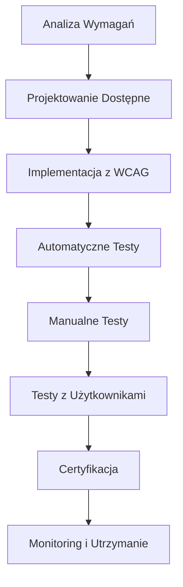

# 🌐 Dostępność Cyfrowa (WCAG 2.1)

## Wprowadzenie

W ECM Digital wierzymy, że internet powinien być dostępny dla wszystkich. Nasze podejście do dostępności cyfrowej opiera się na międzynarodowych standardach WCAG 2.1 (Web Content Accessibility Guidelines) oraz polskich przepisach dotyczących dostępności cyfrowej.

## 📋 Standardy i Wytyczne

### WCAG 2.1 - Poziomy Zgodności

#### **Poziom A (Podstawowy)**
- ✅ Alternatywny tekst dla obrazów
- ✅ Prawidłowa struktura nagłówków (H1-H6)
- ✅ Dostępność z klawiatury
- ✅ Wystarczający kontrast kolorów (4.5:1)
- ✅ Responsywność i skalowanie do 200%

#### **Poziom AA (Standardowy)**
- ✅ Wzmocniony kontrast kolorów (7:1 dla tekstu)
- ✅ Możliwość zatrzymania animacji
- ✅ Brak migających elementów
- ✅ Logiczna kolejność tabulacji
- ✅ Etykiety dla wszystkich pól formularzy

#### **Poziom AAA (Zaawansowany)**
- ✅ Najwyższy kontrast kolorów
- ✅ Wsparcie dla technologii asystujących
- ✅ Alternatywne sposoby nawigacji
- ✅ Pomoc kontekstowa
- ✅ Język zrozumiały dla użytkowników

## 🔧 Nasze Narzędzia i Metodologia

### Narzędzia Testowania Dostępności

#### **Automatyczne Testowanie**
- **axe-core** - Automatyczne wykrywanie problemów dostępności
- **WAVE** - Web Accessibility Evaluation Tool
- **Lighthouse** - Audyt dostępności w Chrome DevTools
- **Pa11y** - Command line accessibility testing tool

#### **Manualne Testowanie**
- **Screen Readers**: NVDA, JAWS, VoiceOver
- **Nawigacja klawiaturą** - Testowanie bez myszy
- **Testowanie kontrastu** - Colour Contrast Analyser
- **Testowanie z użytkownikami** - Osoby z niepełnosprawnościami

### Proces Implementacji

## 📊 Lista Kontrolna WCAG 2.1

### 🎯 Percepcyjność (Perceivable)

#### Alternatywy Tekstowe
- [ ] Wszystkie obrazy mają odpowiedni alt text
- [ ] Obrazy dekoracyjne mają pusty alt=""
- [ ] Kompleksowe obrazy mają szczegółowe opisy
- [ ] Ikony funkcjonalne mają opisowe etykiety

#### Media Czasowe
- [ ] Filmy mają napisy dla niesłyszących
- [ ] Nagrania audio mają transkrypcje
- [ ] Filmy mają audiodeskrypcję
- [ ] Media na żywo mają napisy w czasie rzeczywistym

#### Adaptowalność
- [ ] Treść zachowuje znaczenie bez CSS
- [ ] Kolejność czytania jest logiczna
- [ ] Instrukcje nie opierają się tylko na wyglądzie
- [ ] Orientacja ekranu nie jest zablokowana

#### Rozróżnialność
- [ ] Kontrast tekstu wynosi minimum 4.5:1
- [ ] Kontrast dużego tekstu wynosi minimum 3:1
- [ ] Tekst można powiększyć do 200% bez utraty funkcjonalności
- [ ] Obrazy tekstu są unikane (gdy to możliwe)

### ⌨️ Operacyjność (Operable)

#### Dostępność z Klawiatury
- [ ] Wszystkie funkcje dostępne z klawiatury
- [ ] Brak pułapek klawiatury
- [ ] Fokus jest widoczny
- [ ] Skróty klawiszowe nie kolidują z technologiami asystującymi

#### Wystarczający Czas
- [ ] Użytkownicy mogą wyłączyć limity czasowe
- [ ] Automatyczne odświeżanie można zatrzymać
- [ ] Sesje można przedłużyć
- [ ] Ostrzeżenia przed wygaśnięciem sesji

#### Napady i Reakcje Fizyczne
- [ ] Brak treści migających więcej niż 3 razy na sekundę
- [ ] Animacje można wyłączyć
- [ ] Brak wzorców mogących wywołać napady

#### Nawigacja
- [ ] Użytkownicy mogą ominąć powtarzające się treści
- [ ] Strony mają opisowe tytuły
- [ ] Kolejność fokusa jest logiczna
- [ ] Cel linków jest jasny z kontekstu

### 🧠 Zrozumiałość (Understandable)

#### Czytelność
- [ ] Język strony jest określony
- [ ] Język części tekstu jest określony
- [ ] Trudne słowa są wyjaśnione
- [ ] Skróty są rozwinięte przy pierwszym użyciu

#### Przewidywalność
- [ ] Fokus nie powoduje nieoczekiwanych zmian
- [ ] Zmiana ustawień nie powoduje nieoczekiwanych zmian
- [ ] Nawigacja jest spójna
- [ ] Identyfikacja elementów jest spójna

#### Pomoc przy Wprowadzaniu
- [ ] Błędy są identyfikowane i opisane
- [ ] Etykiety i instrukcje są dostarczone
- [ ] Sugestie błędów są oferowane
- [ ] Błędy w ważnych formularzach można cofnąć

### 🔧 Solidność (Robust)

#### Kompatybilność
- [ ] Kod jest poprawny i zgodny ze standardami
- [ ] Elementy mają unikalne ID
- [ ] Technologie asystujące są wspierane
- [ ] Status i właściwości są przekazywane

## 🏆 Certyfikacja i Zgodność

### Polskie Przepisy
- **Ustawa o dostępności cyfrowej** (2019)
- **Rozporządzenie w sprawie Krajowych Ram Interoperacyjności**
- **Dyrektywa UE 2016/2102** o dostępności cyfrowej

### Proces Certyfikacji
1. **Audyt wstępny** - Analiza obecnego stanu
2. **Plan działań** - Harmonogram poprawek
3. **Implementacja** - Wprowadzenie zmian
4. **Testowanie** - Weryfikacja zgodności
5. **Certyfikat** - Potwierdzenie zgodności z WCAG 2.1
6. **Monitoring** - Ciągłe sprawdzanie dostępności

## 💰 Cennik Usług Dostępności

### 🔍 Audyt Dostępności
| Zakres | Czas realizacji | Cena |
|--------|----------------|------|
| **Audyt Express** (do 5 stron) | 3-5 dni | 2 500 - 4 000 PLN |
| **Audyt Standard** (do 20 stron) | 1-2 tygodnie | 5 000 - 8 000 PLN |
| **Audyt Kompleksowy** (cała witryna) | 2-3 tygodnie | 8 000 - 15 000 PLN |
| **Audyt Korporacyjny** (platforma) | 3-4 tygodnie | 15 000 - 25 000 PLN |

### 🛠️ Implementacja Dostępności
| Usługa | Opis | Cena |
|--------|------|------|
| **Poprawki Podstawowe** | Poziom WCAG 2.1 A | 3 000 - 8 000 PLN |
| **Poprawki Standardowe** | Poziom WCAG 2.1 AA | 8 000 - 15 000 PLN |
| **Poprawki Zaawansowane** | Poziom WCAG 2.1 AAA | 15 000 - 25 000 PLN |
| **Redesign z Dostępnością** | Kompleksowe przeprojektowanie | 20 000 - 50 000 PLN |

### 📋 Certyfikacja i Wsparcie
| Usługa | Opis | Cena |
|--------|------|------|
| **Certyfikat Zgodności** | Oficjalne potwierdzenie WCAG 2.1 | 2 000 - 5 000 PLN |
| **Monitoring Miesięczny** | Regularne sprawdzanie dostępności | 800 - 1 500 PLN/mies |
| **Szkolenia Zespołu** | Warsztaty z dostępności cyfrowej | 2 500 - 5 000 PLN |
| **Konsultacje Eksperckie** | Wsparcie przy implementacji | 300 - 500 PLN/h |

## 📚 Zasoby i Dokumentacja

### Oficjalne Wytyczne
- [WCAG 2.1 Guidelines](https://www.w3.org/WAI/WCAG21/quickref/)
- [Polskie wytyczne dostępności](https://www.gov.pl/web/dostepnosc-cyfrowa)
- [European Accessibility Act](https://ec.europa.eu/social/main.jsp?catId=1202)

### Narzędzia Deweloperskie
- [axe DevTools](https://www.deque.com/axe/devtools/)
- [WAVE Browser Extension](https://wave.webaim.org/extension/)
- [Colour Contrast Analyser](https://www.tpgi.com/color-contrast-checker/)
- [Screen Reader Testing Guide](https://webaim.org/articles/screenreader_testing/)

### Szkolenia i Certyfikaty
- **IAAP Certification** - Międzynarodowa certyfikacja dostępności
- **Deque University** - Kursy online z dostępności
- **WebAIM Training** - Praktyczne szkolenia z WCAG

## 🎯 Korzyści z Dostępności

### Biznesowe
- 📈 **Większy zasięg** - Dostęp dla 15% populacji z niepełnosprawnościami
- 🏆 **Lepsza reputacja** - Odpowiedzialność społeczna firmy
- ⚖️ **Zgodność prawna** - Spełnienie wymagań ustawowych
- 💰 **ROI** - Zwrot z inwestycji przez większą grupę użytkowników

### Techniczne
- 🚀 **Lepsza SEO** - Struktura dostępna dla robotów
- 📱 **Responsywność** - Lepsze działanie na urządzeniach mobilnych
- ⚡ **Wydajność** - Optymalizacja kodu i zasobów
- 🔧 **Łatwiejsze utrzymanie** - Czysty, semantyczny kod

### Społeczne
- 🤝 **Inkluzywność** - Równy dostęp do informacji
- 🌍 **Społeczna odpowiedzialność** - Budowanie lepszego internetu
- 💪 **Empowerment** - Umożliwienie samodzielności użytkownikom
- 🎓 **Edukacja** - Podnoszenie świadomości dostępności

## 📞 Kontakt

Potrzebujesz pomocy z dostępnością cyfrową? Skontaktuj się z naszymi ekspertami:

- 📧 **Email**: accessibility@ecm-digital.com
- 📱 **Telefon**: +48 535 330 323
- 💬 **Konsultacje**: Bezpłatna 30-minutowa konsultacja
- 🗓️ **Spotkanie**: Umów się na audyt dostępności

---

*ECM Digital - Tworzymy internet dostępny dla wszystkich* 🌐♿