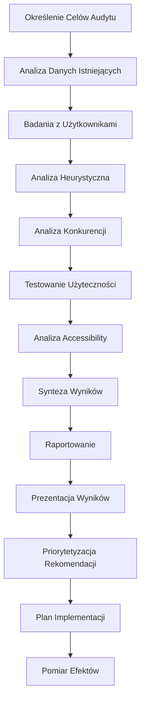

# Proces Przeprowadzania Audytów UX

## Wprowadzenie

Proces audytu UX w ECM Digital został opracowany w oparciu o najlepsze praktyki badań użytkowników i analizy doświadczenia użytkownika. Łączymy metody heurystyczne, badania ilościowe i jakościowe, aby dostarczyć kompleksową analizę i actionable rekomendacje.

## Diagram Procesu

## Szczegółowy Opis Etapów

### 1. Określenie Celów Audytu (1 dzień)

**Cel**: Zdefiniowanie zakresu audytu i kluczowych pytań badawczych.

**Działania**:
- Warsztat z klientem
- Definicja celów biznesowych
- Określenie scope'u audytu
- Identyfikacja kluczowych user journey
- Ustalenie success metrics

**Deliverables**:
- Dokument celów audytu
- Scope definition
- Key research questions
- Success metrics
- Timeline i harmonogram

### 2. Analiza Danych Istniejących (2-3 dni)

**Cel**: Zrozumienie obecnej sytuacji na podstawie dostępnych danych.

**Działania**:
- Analiza Google Analytics
- Przegląd heatmap i session recordings
- Analiza conversion funnels
- Przegląd customer feedback
- Analiza support tickets

**Deliverables**:
- Analytics audit report
- User behavior analysis
- Conversion analysis
- Pain points identification
- Data-driven insights

### 3. Badania z Użytkownikami (3-5 dni)

**Cel**: Zrozumienie potrzeb, motywacji i frustracji użytkowników.

**Działania**:
- Rekrutacja uczestników badania
- Przeprowadzenie wywiadów
- Obserwacja zachowań
- Analiza user journey
- Identyfikacja personas

**Deliverables**:
- User interview transcripts
- User personas update
- Journey maps
- Pain points analysis
- User needs assessment### 
4. Analiza Heurystyczna (2-3 dni)

**Cel**: Ocena interfejsu według uznanych zasad użyteczności.

**Działania**:
- Analiza według heurystyk Nielsena
- Ocena zgodności z best practices
- Analiza information architecture
- Przegląd navigation patterns
- Ocena visual hierarchy

**Deliverables**:
- Heuristic evaluation report
- Usability issues catalog
- Severity ratings
- Best practices comparison
- UI/UX recommendations

### 5. Analiza Konkurencji (1-2 dni)

**Cel**: Benchmarking względem konkurencji i industry standards.

**Działania**:
- Identyfikacja kluczowych konkurentów
- Analiza competitive features
- Porównanie user experience
- Identyfikacja best practices
- Gap analysis

**Deliverables**:
- Competitive analysis report
- Feature comparison matrix
- UX benchmarking
- Industry best practices
- Opportunity identification

### 6. Testowanie Użyteczności (3-4 dni)

**Cel**: Obserwacja rzeczywistych interakcji użytkowników z interfejsem.

**Działania**:
- Przygotowanie scenariuszy testowych
- Rekrutacja uczestników
- Przeprowadzenie sesji testowych
- Analiza task completion rates
- Identyfikacja usability issues

**Deliverables**:
- Usability test protocol
- Session recordings
- Task success metrics
- Usability issues report
- User behavior insights

### 7. Analiza Accessibility (1-2 dni)

**Cel**: Ocena dostępności dla użytkowników z niepełnosprawnościami.

**Działania**:
- Audit zgodności z WCAG 2.1
- Testowanie z screen readers
- Analiza keyboard navigation
- Sprawdzenie color contrast
- Ocena alternative text

**Deliverables**:
- WCAG compliance report
- Accessibility issues list
- Screen reader testing results
- Keyboard navigation audit
- Remediation recommendations

### 8. Synteza Wyników (2-3 dni)

**Cel**: Połączenie wszystkich wyników w spójną analizę.

**Działania**:
- Triangulacja danych z różnych źródeł
- Identyfikacja głównych problemów
- Grupowanie podobnych issues
- Ocena impact vs effort
- Przygotowanie executive summary

**Deliverables**:
- Comprehensive findings report
- Issues prioritization matrix
- Impact assessment
- Root cause analysis
- Executive summary

### 9. Raportowanie (2-3 dni)

**Cel**: Przygotowanie kompleksowego raportu z audytu.

**Działania**:
- Strukturyzacja wyników
- Tworzenie wizualizacji
- Przygotowanie rekomendacji
- Dokumentacja best practices
- Przygotowanie prezentacji

**Deliverables**:
- Comprehensive UX audit report
- Visual documentation
- Actionable recommendations
- Implementation roadmap
- Presentation materials

### 10. Prezentacja Wyników (1 dzień)

**Cel**: Przedstawienie wyników audytu zespołowi klienta.

**Działania**:
- Prezentacja kluczowych findings
- Omówienie rekomendacji
- Sesja Q&A
- Dyskusja o priorytetach
- Planowanie next steps

**Deliverables**:
- Presentation delivery
- Q&A session notes
- Stakeholder feedback
- Priority alignment
- Next steps agreement

### 11. Priorytetyzacja Rekomendacji (1 dzień)

**Cel**: Ustalenie kolejności implementacji rekomendacji.

**Działania**:
- Workshop priorytetyzacyjny
- Impact vs effort analysis
- Resource requirements assessment
- Timeline planning
- Quick wins identification

**Deliverables**:
- Prioritized recommendations
- Implementation timeline
- Resource requirements
- Quick wins list
- Long-term roadmap

### 12. Plan Implementacji (1-2 dni)

**Cel**: Stworzenie szczegółowego planu wdrożenia rekomendacji.

**Działania**:
- Detailed implementation planning
- Resource allocation
- Timeline development
- Success metrics definition
- Risk assessment

**Deliverables**:
- Implementation plan
- Resource allocation plan
- Detailed timeline
- Success metrics framework
- Risk mitigation plan

### 13. Pomiar Efektów (ciągły proces)

**Cel**: Monitorowanie wpływu wprowadzonych zmian.

**Działania**:
- Baseline metrics establishment
- A/B testing setup
- Performance monitoring
- User feedback collection
- ROI calculation

**Deliverables**:
- Baseline metrics report
- A/B testing results
- Performance improvements
- User satisfaction metrics
- ROI analysis

## Metodologie i Frameworki

### Heurystyki Nielsena
1. **Visibility of system status** - Informowanie o stanie systemu
2. **Match between system and real world** - Zgodność z rzeczywistością
3. **User control and freedom** - Kontrola użytkownika
4. **Consistency and standards** - Spójność i standardy
5. **Error prevention** - Zapobieganie błędom
6. **Recognition rather than recall** - Rozpoznawanie vs. przypominanie
7. **Flexibility and efficiency** - Elastyczność i efektywność
8. **Aesthetic and minimalist design** - Estetyka i minimalizm
9. **Help users recognize, diagnose, and recover from errors** - Obsługa błędów
10. **Help and documentation** - Pomoc i dokumentacja

### WCAG 2.1 Guidelines
- **Perceivable** - Informacje dostępne dla zmysłów
- **Operable** - Interfejs możliwy do obsługi
- **Understandable** - Informacje i UI zrozumiałe
- **Robust** - Treść interpretowalna przez różne technologie

### Design Thinking Process
- **Empathize** - Zrozumienie użytkowników
- **Define** - Definicja problemów
- **Ideate** - Generowanie rozwiązań
- **Prototype** - Prototypowanie rozwiązań
- **Test** - Testowanie z użytkownikami## Prz
ykładowy Harmonogram

### Audyt Standardowy (Strona/Aplikacja)
**Całkowity czas realizacji: 3-4 tygodnie**

| Tydzień | Etapy | Zaangażowanie Klienta |
|---------|-------|----------------------|
| 1 | Cele, Analiza danych, Badania użytkowników | Wysoki - warsztaty, dostęp do danych |
| 2 | Analiza heurystyczna, Konkurencja, Testy | Średni - rekrutacja uczestników |
| 3 | Accessibility, Synteza, Raportowanie | Niski - przegląd draft'ów |
| 4 | Prezentacja, Priorytetyzacja, Plan | Wysoki - warsztaty, decyzje |

### Audyt Zaawansowany (Platforma/E-commerce)
**Całkowity czas realizacji: 4-6 tygodni**

| Faza | Czas | Opis |
|------|------|------|
| Research & Analysis | 2 tygodnie | Pogłębione badania, analiza danych |
| Evaluation & Testing | 2 tygodnie | Kompleksowe testy, accessibility |
| Synthesis & Reporting | 1-2 tygodnie | Analiza, raportowanie |
| Planning & Handoff | 1 tydzień | Prezentacja, planowanie |

### Audyt Enterprise (Kompleksowy System)
**Całkowity czas realizacji: 6-8 tygodni**

| Faza | Czas | Opis |
|------|------|------|
| Discovery & Research | 2-3 tygodnie | Szczegółowe badania, stakeholder interviews |
| Comprehensive Evaluation | 3-4 tygodnie | Multi-method evaluation |
| Analysis & Strategy | 1-2 tygodnie | Strategiczne rekomendacje |
| Implementation Planning | 1 tydzień | Szczegółowy plan wdrożenia |

## Narzędzia i Technologie

### Analytics & Data
- **Google Analytics** - Web analytics
- **Hotjar/FullStory** - Heatmaps, session recordings
- **Mixpanel/Amplitude** - Product analytics
- **Crazy Egg** - Click tracking
- **Google Search Console** - Search performance

### User Research
- **UserTesting** - Remote usability testing
- **Lookback** - Live user interviews
- **Maze** - Unmoderated testing
- **Optimal Workshop** - Card sorting, tree testing
- **SurveyMonkey** - User surveys

### Accessibility Testing
- **WAVE** - Web accessibility evaluation
- **axe DevTools** - Automated accessibility testing
- **Colour Contrast Analyser** - Color contrast checking
- **NVDA/JAWS** - Screen reader testing
- **Lighthouse** - Performance and accessibility audit

### Design & Prototyping
- **Figma** - Design collaboration
- **Miro** - Collaborative whiteboarding
- **Whimsical** - User flows, wireframes
- **InVision** - Prototyping
- **Principle** - Interaction design

## Typy Audytów UX

### Quick UX Audit (1-2 tygodnie)
- **Zakres**: Heuristic evaluation + basic analytics
- **Deliverables**: Issues list, quick wins
- **Cena**: €3,000 - €5,000

### Standard UX Audit (3-4 tygodnie)
- **Zakres**: Comprehensive evaluation + user testing
- **Deliverables**: Full report, implementation plan
- **Cena**: €8,000 - €15,000

### Premium UX Audit (4-6 tygodni)
- **Zakres**: Multi-method research + strategic recommendations
- **Deliverables**: Strategic roadmap, detailed specifications
- **Cena**: €15,000 - €25,000

### Enterprise UX Audit (6-8 tygodni)
- **Zakres**: Comprehensive system evaluation + organizational recommendations
- **Deliverables**: Enterprise strategy, change management plan
- **Cena**: €25,000+

## Kluczowe Metryki Audytu

### Usability Metrics
- **Task Success Rate** - Procent ukończonych zadań
- **Time on Task** - Czas wykonania zadania
- **Error Rate** - Częstotliwość błędów
- **System Usability Scale (SUS)** - Ogólna użyteczność
- **Net Promoter Score (NPS)** - Satysfakcja użytkowników

### Business Metrics
- **Conversion Rate** - Wskaźnik konwersji
- **Bounce Rate** - Wskaźnik odrzuceń
- **Page Views per Session** - Zaangażowanie
- **Average Session Duration** - Czas sesji
- **Customer Satisfaction (CSAT)** - Zadowolenie klientów

### Technical Metrics
- **Page Load Time** - Szybkość ładowania
- **Core Web Vitals** - Metryki wydajności Google
- **Accessibility Score** - Wynik dostępności
- **Mobile Usability** - Użyteczność mobilna
- **SEO Score** - Optymalizacja wyszukiwarek

## Deliverables Audytu UX

### Executive Summary (2-3 strony)
- Kluczowe findings
- Business impact
- High-level recommendations
- ROI projections

### Detailed Report (20-50 stron)
- Methodology overview
- Detailed findings
- Evidence (screenshots, data)
- Prioritized recommendations
- Implementation timeline

### Visual Documentation
- Annotated screenshots
- User journey maps
- Wireframes/mockups
- Before/after comparisons
- Video highlights

### Implementation Materials
- Detailed specifications
- Design system recommendations
- Technical requirements
- Testing protocols
- Success metrics framework

## Komunikacja i Raportowanie

### Weekly Updates
- Progress against timeline
- Key findings preview
- Stakeholder interviews status
- Next week priorities

### Milestone Reviews
- **Research Complete** - Findings preview
- **Analysis Complete** - Draft recommendations
- **Report Draft** - Full report review
- **Final Presentation** - Results and next steps

### Stakeholder Engagement
- **Kick-off Workshop** - Goals alignment
- **Mid-point Check-in** - Progress review
- **Findings Preview** - Early insights
- **Final Presentation** - Results and planning

## Post-Audit Support

### Implementation Support (30 dni)
- Clarification of recommendations
- Design specification support
- Implementation guidance
- Success metrics setup

### Follow-up Evaluation (3-6 miesięcy)
- Impact measurement
- A/B testing results
- User satisfaction tracking
- ROI calculation

### Ongoing Partnership
- Quarterly UX reviews
- Continuous improvement consulting
- User research support
- Design system evolution

---

*Proces audytów UX ECM Digital - Odkrywamy potencjał Twojego produktu cyfrowego*