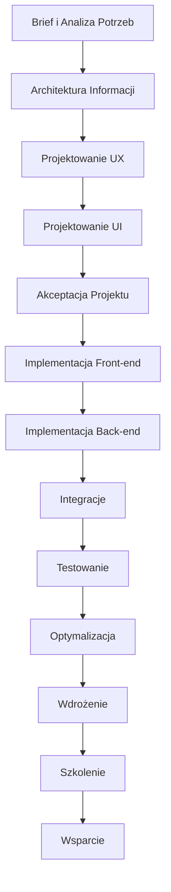

# Proces Tworzenia Stron Internetowych

## Wprowadzenie

Proces tworzenia stron internetowych w ECM Digital został wypracowany na podstawie setek zrealizowanych projektów. Łączy najlepsze praktyki z branży z naszym doświadczeniem, zapewniając wysoką jakość, terminowość i satysfakcję klienta.

## Diagram Procesu

## Szczegółowy Opis Etapów

### 1. Brief i Analiza Potrzeb (1-2 dni)

**Cel**: Zrozumienie celów biznesowych, grupy docelowej i wymagań technicznych.

**Działania**:
- Warsztat strategiczny z klientem
- Analiza konkurencji
- Definicja celów i KPI
- Określenie grupy docelowej
- Analiza wymagań technicznych

**Deliverables**:
- Dokument briefu projektowego
- Analiza konkurencji
- Persona użytkowników
- Mapa wymagań funkcjonalnych

### 2. Architektura Informacji (2-3 dni)

**Cel**: Stworzenie logicznej struktury treści i nawigacji.

**Działania**:
- Inwentaryzacja treści
- Tworzenie mapy strony
- Projektowanie struktury nawigacji
- Planowanie ścieżek użytkownika

**Deliverables**:
- Mapa strony (sitemap)
- Schemat nawigacji
- User journey maps
- Wireframes kluczowych stron### 3.
 Projektowanie UX (3-5 dni)

**Cel**: Stworzenie intuicyjnego i funkcjonalnego doświadczenia użytkownika.

**Działania**:
- Tworzenie szczegółowych wireframes
- Projektowanie interakcji
- Planowanie responsywności
- Optymalizacja konwersji

**Deliverables**:
- Szczegółowe wireframes
- Prototyp interaktywny
- Specyfikacja UX
- Plan testów użyteczności

### 4. Projektowanie UI (4-6 dni)

**Cel**: Stworzenie atrakcyjnego wizualnie interfejsu zgodnego z brandingiem.

**Działania**:
- Tworzenie koncepcji wizualnej
- Projektowanie systemu designu
- Tworzenie mockupów
- Przygotowanie zasobów graficznych

**Deliverables**:
- Koncepcja wizualna
- System designu
- Mockupy wszystkich stron
- Zasoby graficzne

### 5. Akceptacja Projektu (1-2 dni)

**Cel**: Zatwierdzenie projektu przez klienta przed implementacją.

**Działania**:
- Prezentacja projektu
- Zbieranie feedbacku
- Wprowadzanie poprawek
- Finalna akceptacja

**Deliverables**:
- Prezentacja projektu
- Lista poprawek
- Zaakceptowany projekt
- Specyfikacja techniczna

### 6. Implementacja Front-end (5-10 dni)

**Cel**: Kodowanie interfejsu użytkownika zgodnie z projektem.

**Działania**:
- Konfiguracja środowiska
- Kodowanie HTML/CSS
- Implementacja JavaScript
- Optymalizacja responsywności

**Deliverables**:
- Responsywny front-end
- Zoptymalizowany kod
- Dokumentacja techniczna
- Testy kompatybilności

### 7. Implementacja Back-end (3-8 dni)

**Cel**: Stworzenie funkcjonalności serwerowej i systemu zarządzania treścią.

**Działania**:
- Konfiguracja serwera
- Implementacja CMS
- Tworzenie API
- Konfiguracja bazy danych

**Deliverables**:
- Funkcjonalny back-end
- Panel administracyjny
- API endpoints
- Dokumentacja techniczna

### 8. Integracje (2-5 dni)

**Cel**: Połączenie z zewnętrznymi systemami i usługami.

**Działania**:
- Integracja z Google Analytics
- Konfiguracja SEO
- Integracja z social media
- Połączenie z systemami klienta

**Deliverables**:
- Działające integracje
- Konfiguracja analityki
- Optymalizacja SEO
- Testy integracji### 
9. Testowanie (3-5 dni)

**Cel**: Zapewnienie wysokiej jakości i bezbłędnego działania strony.

**Działania**:
- Testy funkcjonalne
- Testy wydajnościowe
- Testy bezpieczeństwa
- Testy UAT z klientem

**Deliverables**:
- Raport z testów
- Lista poprawek
- Zoptymalizowana strona
- Akceptacja klienta

### 10. Optymalizacja (2-3 dni)

**Cel**: Maksymalizacja wydajności i pozycjonowania strony.

**Działania**:
- Optymalizacja szybkości
- Optymalizacja SEO
- Optymalizacja obrazów
- Konfiguracja cache

**Deliverables**:
- Zoptymalizowana strona
- Raport wydajności
- Konfiguracja SEO
- Dokumentacja optymalizacji

### 11. Wdrożenie (1-2 dni)

**Cel**: Uruchomienie strony na produkcyjnym serwerze.

**Działania**:
- Konfiguracja hostingu
- Migracja danych
- Konfiguracja domeny
- Testy produkcyjne

**Deliverables**:
- Działająca strona
- Konfiguracja serwera
- Backup danych
- Dokumentacja wdrożenia

### 12. Szkolenie (1 dzień)

**Cel**: Przeszkolenie zespołu klienta z obsługi strony.

**Działania**:
- Szkolenie z CMS
- Przekazanie dokumentacji
- Instrukcje aktualizacji
- Sesja Q&A

**Deliverables**:
- Materiały szkoleniowe
- Instrukcje obsługi
- Kontakty wsparcia
- Plan dalszej współpracy

### 13. Wsparcie (30 dni gwarancji)

**Cel**: Zapewnienie bezproblemowego działania po wdrożeniu.

**Działania**:
- Monitoring działania
- Poprawki błędów
- Wsparcie techniczne
- Konsultacje

**Deliverables**:
- Raport z monitoringu
- Poprawki błędów
- Dokumentacja wsparcia
- Plan długoterminowego wsparcia

## Przykładowy Harmonogram

### Projekt Standardowy (Strona Korporacyjna)
**Całkowity czas realizacji: 6-8 tygodni**

| Tydzień | Etapy | Zaangażowanie Klienta |
|---------|-------|----------------------|
| 1 | Brief, Architektura Informacji | Wysoki - warsztaty, feedback |
| 2 | Projektowanie UX | Średni - przegląd wireframes |
| 3 | Projektowanie UI | Średni - feedback na mockupy |
| 4 | Akceptacja, Start implementacji | Wysoki - akceptacja projektu |
| 5-6 | Implementacja | Niski - cotygodniowe update'y |
| 7 | Testowanie, Optymalizacja | Wysoki - testy UAT |
| 8 | Wdrożenie, Szkolenie | Wysoki - szkolenie zespołu |

### Projekt Zaawansowany (Portal/Platforma)
**Całkowity czas realizacji: 10-14 tygodni**

| Faza | Czas | Opis |
|------|------|------|
| Analiza i Projektowanie | 3-4 tygodnie | Szczegółowa analiza, prototypowanie |
| Implementacja | 5-7 tygodni | Rozwój funkcjonalności |
| Testowanie i Optymalizacja | 2-3 tygodnie | Kompleksowe testy |
| Wdrożenie i Wsparcie | 1 tydzień | Launch i szkolenia |

## Kluczowe Punkty Kontrolne

### Milestone 1: Akceptacja Architektury Informacji
- Zatwierdzona mapa strony
- Zaakceptowane wireframes
- Określone wymagania techniczne

### Milestone 2: Akceptacja Projektu Wizualnego
- Zatwierdzony design system
- Zaakceptowane mockupy
- Przygotowane zasoby graficzne

### Milestone 3: Zakończenie Implementacji
- Działająca strona na serwerze testowym
- Zaimplementowane wszystkie funkcjonalności
- Przeprowadzone testy wewnętrzne

### Milestone 4: Akceptacja UAT
- Pozytywne testy użytkownika
- Wprowadzone poprawki
- Gotowość do wdrożenia

### Milestone 5: Wdrożenie Produkcyjne
- Działająca strona na serwerze produkcyjnym
- Przeprowadzone szkolenia
- Przekazana dokumentacja

## Komunikacja i Raportowanie

### Cotygodniowe Raporty
- Status realizacji zadań
- Postęp względem harmonogramu
- Zidentyfikowane ryzyka
- Następne kroki

### Spotkania Projektowe
- **Kick-off** - Start projektu
- **Design Review** - Przegląd projektów
- **Development Review** - Przegląd implementacji
- **UAT Session** - Testy z klientem
- **Go-Live** - Wdrożenie

### Kanały Komunikacji
- **Email** - Formalna komunikacja
- **Slack/Teams** - Bieżąca komunikacja
- **Zoom/Meet** - Spotkania i prezentacje
- **Jira/Trello** - Śledzenie zadań

---

*Proces tworzenia stron internetowych ECM Digital - Profesjonalne podejście do każdego projektu*